# MoistureController — System Overview

This is the top-level plan for the whole system. It defines **what the parts are, what each is responsible for, and how they talk to each other**. Implementation details live in the spec file of each component's subfolder:

| Component | Folder | Spec |
|---|---|---|
| Plant device (ESP32 firmware) | [`firmware/`](firmware/) | [`Firmware_Specs.md`](firmware/Firmware_Specs.md) |
| Cloud backend (API, users, households, rules, cloud broker) | [`server/`](server/) | [`Server_Specs.md`](server/Server_Specs.md) |
| Home hub (optional local agent: broker + rules, outbound only) | [`hub/`](hub/) | [`Hub_Specs.md`](hub/Hub_Specs.md) |
| Firebase project (login, push, web hosting) | [`firebase/`](firebase/) | [`Firebase_Specs.md`](firebase/Firebase_Specs.md) |
| MQTT broker configuration (cloud + hub) | [`broker/`](broker/) | [`Broker_Specs.md`](broker/Broker_Specs.md) |
| Client app (Flutter: web + mobile) | [`app/`](app/) | [`App_Specs.md`](app/App_Specs.md) |
| Shared interfaces | [`contracts/`](contracts/) | [`mqtt.md`](contracts/mqtt.md) (device ↔ backend), [`hub.md`](contracts/hub.md) (hub ↔ cloud), [`ble.md`](contracts/ble.md) (app ↔ device pairing), `api.yaml` *(generated)* |

If this document and a component spec disagree about *how* something is implemented, the component spec wins. If they disagree about *what a component is responsible for* or *how components talk to each other*, this document wins and the spec gets fixed.

---

## 1. Goal

Monitor soil moisture (and later other values) of plants with small battery-powered devices, show the data in an app, and water plants either manually from the app or automatically based on rules.

**Primary user stories**

- I can see the current moisture of each plant and its history.
- I can water a plant from the app, and I can see whether the device actually did it.
- I can set a rule like *"if moisture < 30 %, water for 10 s, at most once every 6 h"*.
- I get told when a device is offline, its battery is low, or a sensor looks broken.
- I can change which sensor/pump is plugged into which pin of a device without reflashing it.
- I can have several households (home, office, parents' garden …) and switch between them in the app.
- I can share a household with other people and decide what they are allowed to do.
- Optionally I put a small **home hub** (a Raspberry Pi or any Linux box with Docker) next to my plants, so watering keeps working when the internet is down.

---

## 2. System architecture

**One cloud, optional hubs.** Everything about people — accounts, households, memberships, roles, invites — and the app's API live in one place: our cloud backend. A home hub is an optional *agent* for one household: it runs the local MQTT broker and the watering rules, and connects **outbound** to the cloud. Nothing is ever exposed from a user's home.

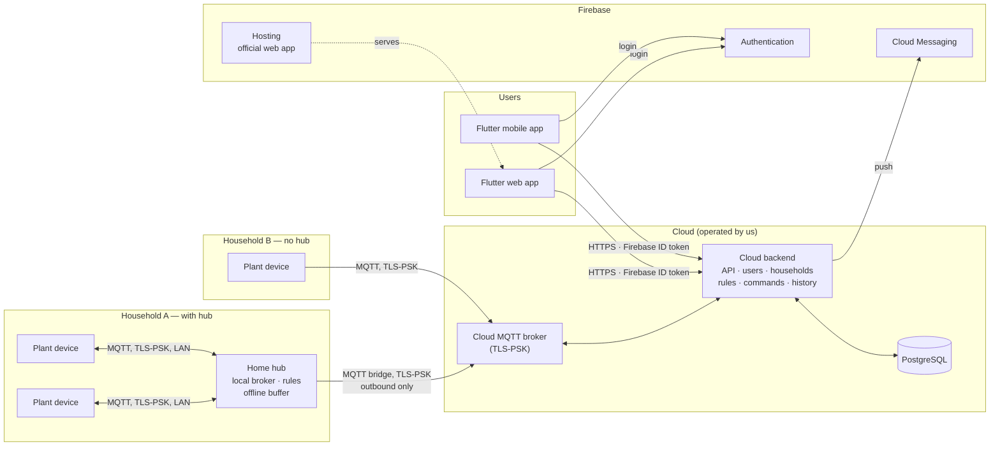

### Core architectural rules

1. **Devices only speak MQTT, clients only speak the API.** The app never connects to a broker. The cloud backend is the only bridge between users and devices. This keeps auth, validation and history in one place, and lets the MQTT topic scheme change without touching the app.
2. **Devices are asleep most of the time.** Nothing can reach a device in deep sleep. Every interaction with a device is **asynchronous**: the backend records an intent, and the device picks it up the next time it wakes (minutes later). The whole stack — API design and app UI included — must treat "pending until the device wakes" as a normal state, not an error.
3. **The cloud is the source of truth for intent; the device is the source of truth for reality.** The cloud stores *desired* state (config, commands, rules), the device reports *actual* state (readings, config it is really running, command results). The app shows both, and where they differ.
4. **The device stays dumb and safe.** Business logic (rules, schedules, thresholds) runs in the cloud or on the hub. The device measures, reports, executes commands, and enforces hard safety limits locally (e.g. maximum pump run time) so a bad command can never flood a plant.
5. **One trust boundary for people.** Users log in via Firebase and talk only to the cloud backend, which we operate. There are no user accounts, logins or user-facing endpoints anywhere else — not on hubs, not on devices.
6. **Hubs are agents, not servers.** A hub has no inbound ports (except MQTT on the LAN for its devices), no users and no web pages. It authenticates to the cloud with its own key and can only reach the MQTT topics of its own household's devices.
7. **Everything on the wire is encrypted.** All MQTT connections — device ↔ hub, device ↔ cloud, hub ↔ cloud — use TLS with per-client pre-shared keys; all HTTP is HTTPS.
8. **Every request is scoped to a household.** Every API call that touches data names a household, and the backend checks membership + role before doing anything.

---

## 3. Users, households and hubs

### 3.1 Concepts

| Concept | Meaning |
|---|---|
| **User** | A person with a Firebase account. |
| **Household** | The unit of ownership and sharing. Contains devices, plants, rules, history. Lives in the cloud backend. |
| **Membership** | A user's role in one household. A user can be member of many households, a household can have many members. |
| **Invite** | One-time code with a role and an expiry, created by an admin, shared as a link/QR. |
| **Hub** | Optional agent at the household's location. Belongs to exactly one household; **a household has at most one hub**. Runs the local broker for all of that household's devices, executes its rules locally, buffers data while offline. A second location (e.g. a garden shed with its own WiFi) is a second household, shared with the same people. |
| **Gateway** | Where a household's devices connect: the **hub** (LAN) if the household has one, otherwise the **cloud broker** (internet). |

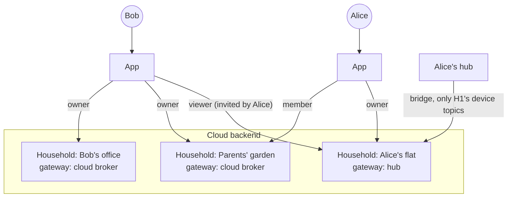

### 3.2 Roles

Per household; a user has exactly one role per household. Enforced by the cloud backend on every request.

| Action | Owner | Admin | Member | Viewer |
|---|:-:|:-:|:-:|:-:|
| See plants, readings, history, alerts | ✔ | ✔ | ✔ | ✔ |
| Water manually, cancel commands | ✔ | ✔ | ✔ | |
| Create/edit plants and rules | ✔ | ✔ | ✔ | |
| Add/remove/configure devices, add/remove the hub | ✔ | ✔ | | |
| Invite members, change roles (up to Member), remove members/viewers | ✔ | ✔ | | |
| Promote/demote admins, rename/delete household, transfer ownership, export data | ✔ | | | |

Exactly one owner per household.

### 3.3 Login and API access

- The user signs in with **Firebase** (e-mail, Google, Apple) — always online.
- The app sends its **Firebase ID token** to the cloud backend with every request. The backend is the only party that ever receives it and we operate it, so no token exchange is needed.
- The backend verifies the token, then checks membership + role for the household in the URL.
- **Sensitive actions** (delete household, transfer ownership, export, remove the hub, change admin roles) additionally require a **recent login** (≤ 5 min, from the token's `auth_time`) and a check against Firebase for revoked sessions. The app asks the user to re-authenticate first.
- The web app runs only on the **official origin** (Firebase Hosting); the API accepts browser requests only from there.

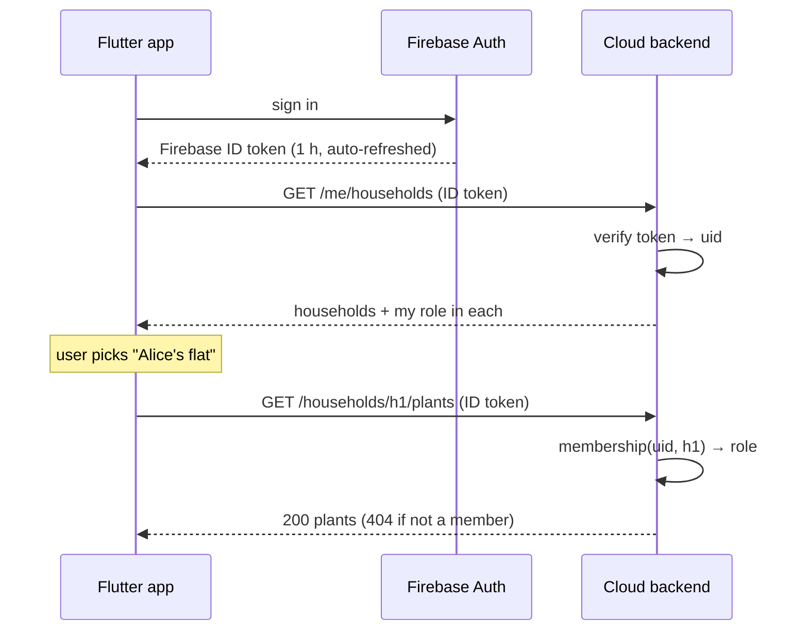

### 3.4 Sharing a household (invites)

An admin creates an **invite** with a role; the app shows it as a link and QR code pointing to the official app: `https://app.<our-domain>/join#c=<code>` (the code after `#` never reaches any server log).

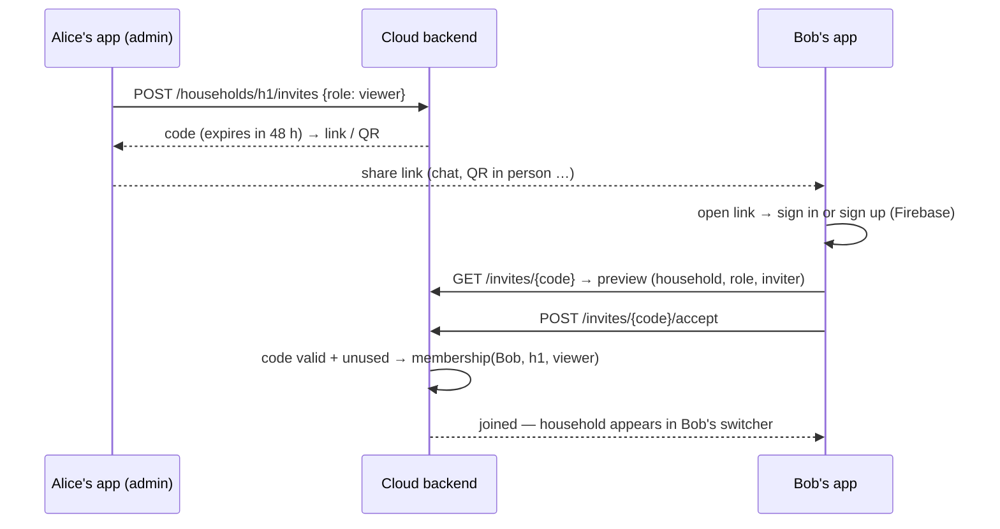

- Invites are single-use, expire, and can be revoked. Opening the link (GET) never consumes an invite; only the explicit accept does.
- Removing a member takes effect on the next request.

### 3.5 With or without a hub

| | Without hub | With hub |
|---|---|---|
| Devices connect to | Cloud broker over the internet | Hub's broker on the LAN |
| Encryption | TLS-PSK | TLS-PSK (same firmware code path) |
| Wake window | TLS-PSK handshake is cheap (no public-key math); the internet round trips add some time | Shortest: LAN round trips only |
| Rules run | In the cloud | **On the hub** — keep watering without internet |
| Manual watering / config from the app | Cloud → cloud broker → device | Cloud → bridge → hub broker → device |
| Internet down at the plants | Devices can't report; no automatic watering (device safety limits only) | Hub keeps collecting data and running rules; data and results are uploaded when the connection returns |
| Our cloud down | Nothing works remotely | Same for the app; the hub keeps watering |
| Setup effort | None | Run the hub (Docker on any Linux box), enroll it in the app (§3.7) |

Moving a household from "no hub" to "hub" (or back) means re-pairing each device to the new gateway (button + BLE, §3.8); history, plants and rules stay where they are — in the cloud.

### 3.6 What happens without internet

- **With a hub:** devices, data collection and rules keep running on the hub. The app can't reach the household (it only talks to the cloud). Anyone with shell access to the hub can check status and trigger watering via the hub CLI (`mc-hub status`, `mc-hub water <plant> <seconds>`). Everything the hub did is uploaded when the connection returns.
- **Without a hub:** devices keep sleeping and waking; each wake without a connection buffers its readings (a few cycles, firmware spec); there is no automatic watering until the connection is back.
- **Logins** always need internet (Firebase). There is no local login anywhere.

### 3.7 Adding a hub (enrollment)

Device-code style pairing, like signing in a TV: the hub never needs any inbound connection, and the user never types a secret into the hub.

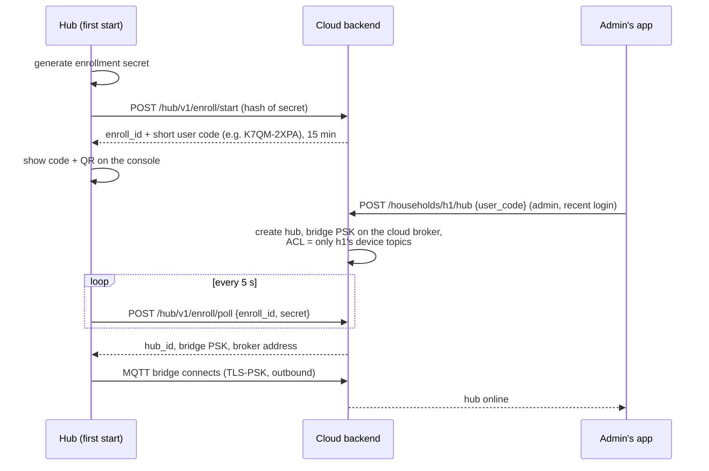

Details: [`contracts/hub.md`](contracts/hub.md), [`hub/Hub_Specs.md`](hub/Hub_Specs.md).

### 3.8 Device identity and pairing

- **Device IDs are random and assigned by the cloud** when an admin adds a device. The chip's MAC address is not an identity (it is visible over Bluetooth and often printed on the board).
- Every device has a **proof-of-possession code (PoP)** generated when it is flashed and printed as a QR label. Pairing over BLE requires it, so a neighbour in Bluetooth range cannot take over the device, and the encrypted pairing session keeps the WiFi password and the device's MQTT key from being sniffed.
- A device accepts pairing **only** when unprovisioned or after the BOOT button is held for 3 s (maintenance mode). There is no remote way to open pairing.
- Holding BOOT for 10 s is a factory reset (credentials + config wiped, PoP kept).
- During pairing the app sends the gateway's address and the device's **MQTT pre-shared key** (256 bit, generated by the cloud, never shown to the user).

Protocol: [`contracts/ble.md`](contracts/ble.md).

### 3.9 Security model in one table

| Party | Trusted with | Cannot |
|---|---|---|
| **Cloud backend** (us) | Everything: users, households, all data, Firebase and FCM credentials, all MQTT keys | — |
| **Hub** | Its own household's device topics (read telemetry, send commands/config), its devices' MQTT keys, a read-only copy of that household's plants and rules | See users, other households, or any API; accept inbound connections from the internet |
| **Device** | Its own MQTT topics and key | See any other device |
| **App** | The user's Firebase login | Talk to brokers or hubs (except BLE pairing with a device the user physically holds) |
| **Home network / WiFi** | Nothing | Sniff or inject MQTT (TLS-PSK), reach any login — there is none |

---

## 4. Components and responsibilities

### 4.1 Plant device — `firmware/`

Battery-powered ESP32 running Zephyr. Details: [`Firmware_Specs.md`](firmware/Firmware_Specs.md).

- Wakes on a timer (default ~10 min), reads all configured sensor slots, connects WiFi + MQTT, publishes readings, processes queued commands, goes back to deep sleep.
- Pluggable module slots (moisture sensor, pump, …) configurable at runtime via MQTT.
- Reports its own health on every wake: battery voltage, WiFi RSSI, firmware version, wake reason.
- Enforces local safety limits independent of what the backend says.
- MQTT over **TLS-PSK** to whichever gateway it was paired with — one code path for hub and cloud.

### 4.2 MQTT brokers — `broker/`

Off-the-shelf **Mosquitto**, only configuration. Two deployments:

- **Cloud broker** — public on port 8883 (TLS-PSK). Clients: devices of households without a hub, hub bridges. The backend connects on an internal listener. Keys and ACLs are files written by the backend; the broker reloads them on change.
- **Hub broker** — on the hub, LAN port 8883 (TLS-PSK). Clients: the household's devices and the hub agent. Bridges the household's device topics to the cloud broker.

Both: persistent sessions (queued commands for sleeping devices survive), persistence to disk, PSK identity = client ID = MQTT username, ACL patterns so a device only reaches `mc/v1/<own-id>/…` ([`contracts/mqtt.md`](contracts/mqtt.md)).

### 4.3 Cloud backend — `server/`

Our service, **Python (FastAPI)**, operated by us. Details: [`Server_Specs.md`](server/Server_Specs.md).

| Responsibility | What it means |
|---|---|
| **Accounts & access** | Verifies Firebase ID tokens; households, memberships, roles, invites; recent-login checks for sensitive actions. |
| **Ingest** | Subscribes to all device topics on the cloud broker (direct devices and bridged ones), validates, stores history, tracks online state. |
| **Device & hub registry** | Devices, hubs, their MQTT keys and ACLs on the cloud broker; hands device keys to hubs through the hub channel. |
| **Command queue** | Turns API requests into MQTT commands with ID and expiry, tracks them until acked or expired. |
| **Config sync** | Desired vs. reported device config; the household snapshot for its hub. |
| **Rules** | Evaluates rules for households **without** a hub. For hub households it only records what the hub reports. |
| **Alerts & push** | Offline, battery, sensor errors, failed commands → in-app list + FCM push (the backend holds the FCM credentials). |
| **API** | REST + Server-Sent Events for the app. All data endpoints scoped `/households/{id}/…`. Hub enrollment endpoints. |

### 4.4 Home hub — `hub/`

Optional. **Docker Compose on any 64-bit Linux box** (Raspberry Pi 3B+/4/5, a NAS with Docker, an old PC; ≥ 1 GB RAM): Mosquitto + the hub agent (Python, sharing the rules and contract code with the backend). Details: [`Hub_Specs.md`](hub/Hub_Specs.md).

- Local broker for the household's devices; bridge to the cloud broker (outbound TLS-PSK, queues in both directions while offline).
- Receives the household snapshot (plants, rules, device limits) from the cloud; runs the **same rules engine** as the cloud; reports every rule decision and rule-created command.
- Installs/removes device keys on its broker when the cloud asks.
- CLI for local status and manual watering with shell access.

### 4.5 Client app — `app/`

**Flutter**, one codebase for web and Android/iOS. Talks to Firebase (login) and to the cloud backend only. The web build is served only from the official origin on Firebase Hosting.

- Login and a **household switcher**.
- Household management: members, roles, invites (link/QR), accept invite, add/remove hub (enter/scan the hub's code).
- Dashboard: all plants of the current household, current moisture, battery, online state, hub state.
- Plant detail: history chart, water-now button, rules.
- Device detail: slot configuration, wake interval, health.
- Clearly shows **pending** actions ("Watering queued — device next expected ~14:32") and "hub offline — data will arrive later".
- Push notifications (FCM).
- **Device pairing over BLE** (mobile app only).

### 4.6 Firebase project — `firebase/`

Only managed services, no own code. Details: [`Firebase_Specs.md`](firebase/Firebase_Specs.md).

- **Authentication** — the only login.
- **Cloud Messaging** — push, sent by the cloud backend.
- **Hosting** — official web app, `/join` invite links, mobile app-link files.

### 4.7 Shared contracts — `contracts/`

- **[`mqtt.md`](contracts/mqtt.md)** — device ↔ backend (via hub or cloud broker): connection and keys, topics, payloads, QoS/retain, command and config semantics.
- **[`hub.md`](contracts/hub.md)** — hub ↔ cloud: enrollment, bridge topics, household snapshot, key requests, rule reports.
- **[`ble.md`](contracts/ble.md)** — app ↔ device pairing.
- **`api.yaml`** — OpenAPI between backend and app. **Code-first:** generated from FastAPI, committed, and the Dart client is generated from it.

Shared Python code (contract models, rules engine, command checks, pin rules) lives in one package, [`core/`](core/), used by both backend and hub, so rules behave identically wherever they run.

---

## 5. Domain model (conceptual)

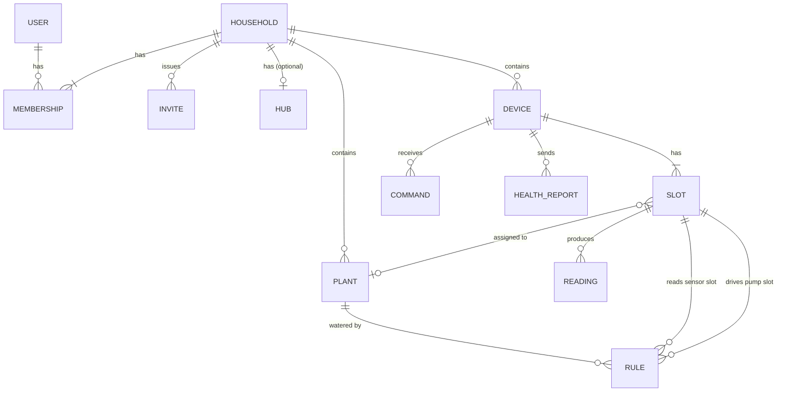

- **User** — Firebase identity; the backend stores its UID, display name, verified e-mail.
- **Household** — unit of ownership and sharing; everything below belongs to exactly one household.
- **Membership** — (user, household, role), role ∈ owner / admin / member / viewer.
- **Invite** — one-time code with role and expiry, created by an admin.
- **Hub** — optional agent of one household; has a bridge key and a status.
- **Device** — one ESP32, random ID and MQTT key assigned by the cloud; connects to the household's gateway.
- **Slot** — one physical connector/pin on a device with a module type. Desired vs. reported config.
- **Plant** — linked to a sensor slot and optionally a pump slot. *Users think in plants, devices think in slots — the backend maps between them.*
- **Reading** — timestamped value from a sensor slot.
- **Command** — a request sent to a device with a lifecycle (§6.4); created by a user, the cloud rules engine or the hub.
- **Rule** — automation attached to a plant; executed by the hub if the household has one, otherwise by the cloud.
- **Health report** — battery, RSSI, firmware version, per wake.

---

## 6. Key flows

### 6.1 Device wake cycle (summary)

Full detail in the firmware spec; shown here because every other flow depends on it.

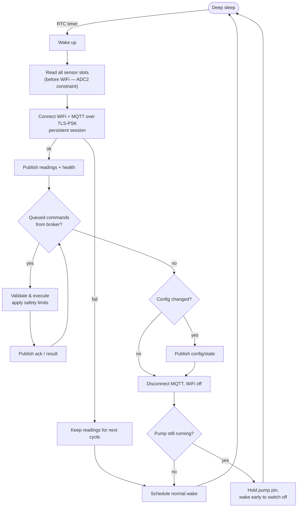

### 6.2 Sensor reading → app (household with hub)

Without a hub the same flow applies, minus the hub: the device publishes directly to the cloud broker and the cloud runs the rules.

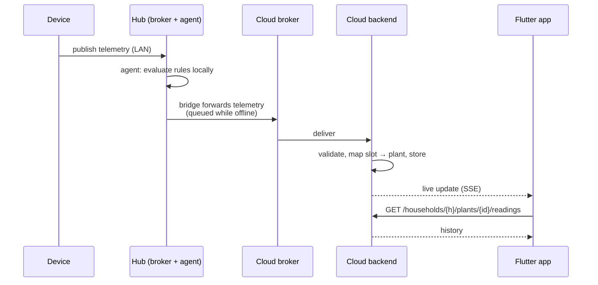

### 6.3 Manual watering (household with hub)

The app gets an answer **immediately** ("queued"); the real result arrives **minutes later** when the device wakes.

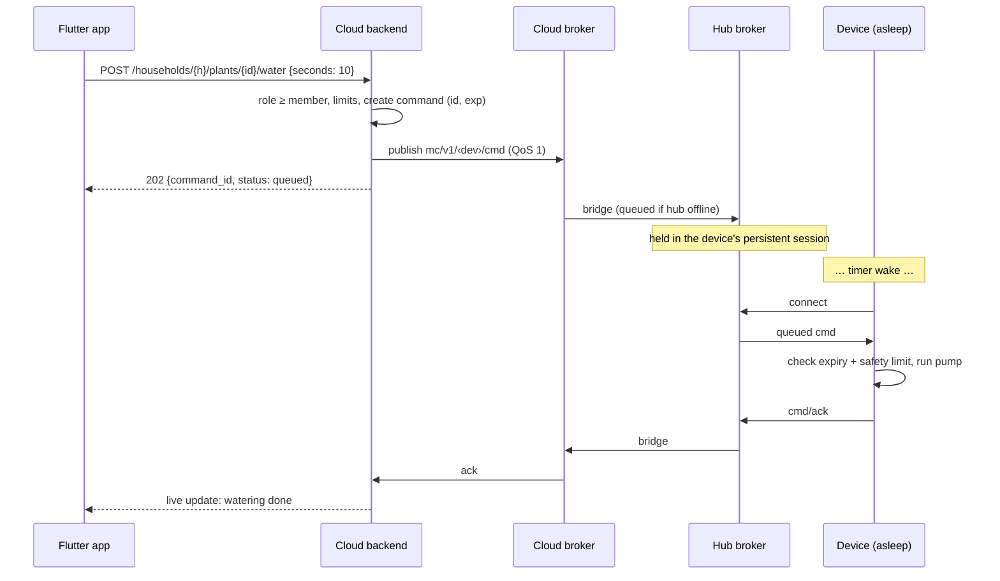

### 6.4 Command lifecycle


Because an MQTT message cannot be taken back once the broker has queued it, **every command carries an ID and an expiry**, and the device ignores expired commands. "Cancel" is best effort: a cancel command only helps if it arrives before the device has executed the original one (D7).

### 6.5 Automatic watering (rule)

Runs on the **hub** if the household has one (works offline), otherwise in the **cloud**. Same code, same decisions.

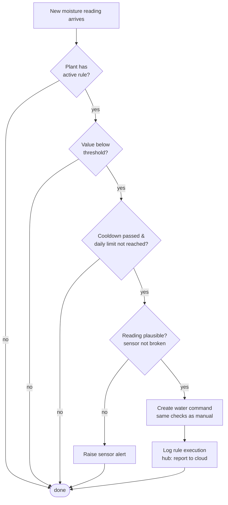

Because the device measures first and only then receives commands, a rule triggered by a reading is executed on the **next** wake — acceptable for plants.

### 6.6 Changing a device's configuration

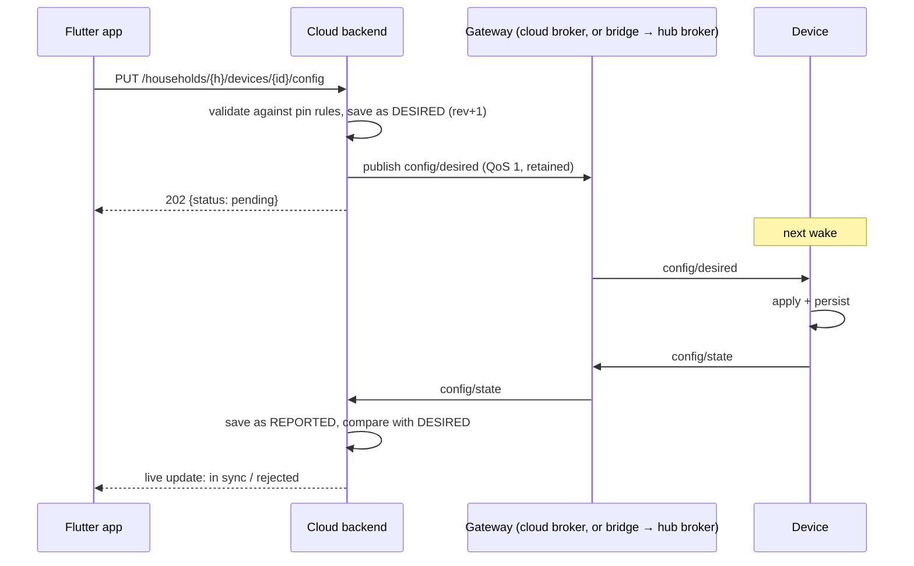

### 6.7 Adding a new device

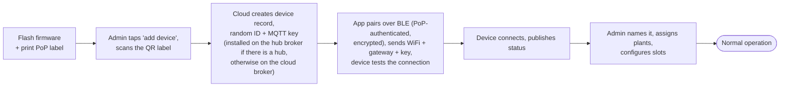

---

## 7. Cross-cutting concerns

| Topic | Direction |
|---|---|
| **Security** | One trust boundary for people: Firebase login, cloud backend only (§3.9). HTTPS for all HTTP; TLS-PSK for all MQTT, including on the LAN. Per-device and per-hub keys + ACLs. Recent-login check for sensitive actions. The only listening port in a user's home is the hub's MQTT port on the LAN. |
| **Time** | Devices have no reliable clock right after wake; they sync via SNTP when needed (contract). The backend accepts device timestamps within a plausibility window, otherwise uses receive time. Hub-buffered data keeps its original timestamps. |
| **Offline detection** | Backend knows each device's wake interval → *late* / *offline*. For hub households, "hub offline" is shown instead of marking every device offline. |
| **Power** | Every feature is judged by what it adds to the wake window. TLS-PSK keeps encryption cheap; a hub additionally avoids internet round trips. |
| **Safety** | Hard maximum pump duration and minimum pause, enforced on the device *and* wherever commands are created (cloud and hub). |
| **Deployment** | Cloud: one Docker Compose stack (Caddy, backend, Mosquitto, PostgreSQL). **Development and first operation on a Raspberry Pi at home, later the same stack on a cloud VM** (D32); provider still open (§10). Hub: Docker Compose on any 64-bit Linux box, multi-arch images (arm64 + amd64). Web app on Firebase Hosting. Mobile via the stores. |
| **Privacy** | All household data is stored in our cloud (EU region). A hub does not change that — it adds local execution, not local-only storage. Owners can export their household's data. |
| **Observability** | Every command and rule decision is logged (including where it ran). Device health history is kept to analyse battery drain. |
| **Updates (later)** | OTA firmware updates — not in v1, keep the flash layout (MCUboot) in mind. Hub updates via `docker compose pull`; the cloud tells the admin when the hub is outdated. |

---

## 8. Repository layout

```
MoistureController/
├── PROJECT.md              ← this file
├── contracts/
│   ├── mqtt.md             ← device ↔ backend
│   ├── hub.md              ← hub ↔ cloud
│   ├── ble.md              ← app ↔ device pairing
│   └── api.yaml            ← OpenAPI (backend ↔ app), generated
├── firmware/               ← Zephyr / ESP32
├── core/                   ← shared Python package: contract models, rules engine, command checks, pin rules
├── server/                 ← cloud backend (FastAPI) + cloud docker-compose
├── hub/                    ← hub agent + hub docker-compose
├── broker/                 ← Mosquitto configs (cloud + hub)
├── firebase/               ← Firebase config (auth, hosting)
└── app/                    ← Flutter (web + mobile)
```

---

## 9. Milestones (whole system)

Each milestone ends with something working end-to-end. The hub comes last because it is optional — everything before it works with devices talking to the cloud broker directly.

| # | Milestone | Firmware | Broker | Backend | Hub | App |
|---|---|---|---|---|---|---|
| **M1** | Readings on a screen | Always-on, one moisture sensor, credentials via Kconfig | Cloud broker running locally, plain TCP (dev only) | Ingest + store + `GET` readings; one fixed household, household-scoped URLs from day one | — | Single screen: list + chart |
| **M2** | Water from the app | Pump driver, `cmd` + ack | Persistent sessions | Command queue + lifecycle | — | Water button, pending state |
| **M3** | Battery life | Deep sleep, health report, **TLS-PSK** | PSK listener | Late/offline detection | — | Battery + last seen |
| **M4** | Configure remotely | `config/desired` / `config/state` | — | Desired vs. reported config | — | Slot config UI |
| **M5** | Automation | Local safety limits | — | Rules engine (in `core/`), alerts, FCM push | — | Rule editor, push |
| **M6** | Accounts & sharing | BLE pairing | Key/ACL files managed by the backend, deployed on the cloud VM | Firebase auth, households, roles, invites, device creation, rate limiting | — | Login, household switcher, invites, BLE onboarding |
| **M7** | Home hub | — | Hub broker + bridge | Hub enrollment, hub channel, snapshot, rule reports | Agent: enrollment, bridge, local rules, CLI | Add/remove hub, hub state |

---

## 10. Decisions

Last change 2026-09-28 (architecture reworked to "cloud + optional hub agent", D23; open points D29–D31). Change only deliberately, and update this table when you do.

| # | Topic | Decision | Consequences |
|---|---|---|---|
| D1 | Backend language | **Python + FastAPI** | Mature MQTT and data libraries; OpenAPI generated for free; the Dart client is generated from it (§4.7). Hub agent in Python too, sharing `core/`. |
| D2 | Database | **PostgreSQL in the cloud, SQLite on the hub** | The cloud is multi-tenant and central, so a real database server; the hub only keeps a small local state. Both via SQLAlchemy + Alembic. |
| D4 | Live updates | **Server-Sent Events** | One-way push over HTTP, usable from Flutter web and mobile. Everything the app sends goes through REST. |
| D5 | Provisioning | **BLE from the Flutter app** | BLE stack in the firmware (flash/RAM, BLE + WiFi coexistence must be verified early), pairing protocol (D17), BLE flow in the app. **Mobile only.** Until M6, credentials come from Kconfig. |
| D6 | Rules | **Run on the hub if there is one, otherwise in the cloud — same code** | Watering keeps working offline with a hub. Rules are edited in the app and stored in the cloud; the hub gets a read-only copy. |
| D7 | Commands | **Expiry + best-effort cancel** | Every command has `id` + `exp`; device drops expired ones. Cancel = follow-up cancel command, no guarantee. |
| D8 | Notifications | **Firebase Cloud Messaging, sent by the cloud backend** | FCM credentials only in the cloud. Web push depends on browser support; in-app alert list as fallback. |
| D9 | Tenancy | **Users ↔ households many-to-many, all in the cloud** | Household switcher is just a list from the API. |
| D10 | Identity | **Firebase Authentication, always online; the cloud verifies Firebase ID tokens directly** | One trust boundary, no token exchange. No login without internet — anywhere. |
| D11 | Roles | **Owner / Admin / Member / Viewer** per household | Matrix in §3.2, enforced by the backend on every request. |
| D12 | Sharing | **Invite link / QR to the official app** (`/join#c=<code>`), one-time code + role + expiry | No addresses involved at all. |
| D13 | Identity provider | **Firebase Authentication** | Ready Flutter SDK (e-mail, Google, Apple); no own password handling. |
| D17 | Device identity & pairing | **Cloud-assigned random device IDs; BLE pairing authenticated by a PoP code on the device label, only on first boot or after a button press** | Label-printing step when flashing; encrypted session protocol ([`contracts/ble.md`](contracts/ble.md)). |
| D23 | Architecture | **Cloud control plane + optional home hub as an outbound-only agent** | Replaces self-hosted home servers. Removes port forwarding, home-server logins, emergency login, per-server tokens, instance registry, push relay, directory, import. We operate the cloud for everyone; all data is stored there. |
| D24 | Hub ↔ cloud channel | **Mosquitto bridge** (hub broker → cloud broker), plus a few hub-specific topics | Reuses persistent sessions and offline queueing in both directions; the backend handles bridged devices exactly like direct ones ([`contracts/hub.md`](contracts/hub.md)). |
| D25 | Hub enrollment | **Device-code flow**: hub shows a short code, admin enters it in the app | No inbound connection to the hub, no secrets typed into the hub. |
| D26 | Local access without internet | **None via the app; hub CLI with shell access** | No local login surface at all. |
| D27 | Data export | **Owner-only export (backup / GDPR); no import** | Data never moves between servers, so import isn't needed. |
| D28 | Sensitive actions | **Recent login (≤ 5 min) + revocation check** | Delete household, transfer ownership, export, remove hub, admin role changes. |
| D29 | MQTT encryption | **TLS-PSK for every MQTT connection** (device ↔ hub, device ↔ cloud, hub bridge ↔ cloud); 256-bit key per client, identity = client ID | Handshake without public-key math (ms instead of ~1 s on the ESP32), one firmware code path, no certificates on devices. No forward secrecy: a leaked key exposes that client's recorded traffic — acceptable for sensor data. Keys delivered only via the encrypted BLE pairing (devices) or enrollment (hubs). |
| D30 | Hubs per household | **At most one** | Simple routing: one gateway per household. A second location = a second household with the same members. |
| D31 | Hub hardware | **Any 64-bit Linux with Docker** (multi-arch images arm64 + amd64), ≥ 1 GB RAM | Raspberry Pi 3B+/4/5, NAS, old PC. A ready-to-flash Pi image may come later. |
| D32 | Where the cloud stack runs first | **On a Raspberry Pi at home for development and testing; moved to a cloud VM later with the same Docker Compose stack** | Devices and hubs are always paired with **hostnames** (`api.` / `mqtt.<domain>`), never IPs, so the move is a DNS change — no re-pairing. The API is exposed via Cloudflare Tunnel (no port forwarding); devices on the LAN reach the broker directly. Migration = backup/restore (Server_Specs §13.4). |

**Superseded by D23** (kept for history): D3 home server first · D14 router port forwarding · D15 emergency login · D16 export/import between servers · D18 home-server exposure hardening · D19 per-server tokens · D20 push relay · D21 official web origin as a fix for home servers (the official origin itself stays, §3.3) · D22 directory in Firestore.

### Still open

- **Cloud hosting provider** for the later move (D32). The stack is a plain Docker Compose setup, so the provider doesn't affect any code. Candidates: Oracle Cloud *Always Free* (Frankfurt, arm64 like the Pi, free), Hetzner (Germany, ~€4–5/month).
