# MoistureController — System Overview

This is the top-level plan for the whole system. It defines **what the parts are, what each is responsible for, and how they talk to each other**. Implementation details live in the spec file of each component's subfolder:

| Component | Folder | Spec |
|---|---|---|
| Plant device (ESP32 firmware) | [`firmware/`](firmware/) | [`Firmware_Specs.md`](firmware/Firmware_Specs.md) |
| **Gateway** — at home: talks to the devices, runs rules locally, buffers while offline | [`gateway/`](gateway/) | [`Gateway_Specs.md`](gateway/Gateway_Specs.md) |
| **API server** — central: app API, households, roles, history, commands, gateway endpoint | [`api/`](api/) | [`Api_Specs.md`](api/Api_Specs.md) |
| **Database** — PostgreSQL, used only by the API server | (part of the API stack) | [`Api_Specs.md`](api/Api_Specs.md) §4 |
| MQTT broker configuration (inside the gateway stack) | [`broker/`](broker/) | [`Broker_Specs.md`](broker/Broker_Specs.md) |
| Firebase project (login, push delivery, web hosting) | [`firebase/`](firebase/) | [`Firebase_Specs.md`](firebase/Firebase_Specs.md) |
| Client app (Flutter: web + mobile) | [`app/`](app/) | [`App_Specs.md`](app/App_Specs.md) |
| Shared interfaces | [`contracts/`](contracts/) | [`mqtt.md`](contracts/mqtt.md) (device ↔ gateway), [`gateway_api.md`](contracts/gateway_api.md) (gateway ↔ API), [`ble.md`](contracts/ble.md) (app ↔ device pairing), `api.yaml` *(generated, API ↔ app)* |

If this document and a component spec disagree about *how* something is implemented, the component spec wins. If they disagree about *what a component is responsible for* or *how components talk to each other*, this document wins and the spec gets fixed.

Architecture history: v1 "cloud + optional hub" (D23, 2026-09-28) → **v2 "gateway + central API" (D33, 2026-09-29)**. A short-lived draft "LAN-only hub" was discarded before it was committed.

---

## 1. Goal

Monitor soil moisture (and later other values) of plants with small battery-powered devices, show the data in an app, and water plants either manually from the app or automatically based on rules.

**Primary user stories**

- I can see the current moisture of each plant and its history — from anywhere.
- I can water a plant from the app, and I can see whether the device actually did it.
- I can set a rule like *"if moisture < 30 %, water for 10 s, at most once every 6 h"*, and it keeps working when the internet is down.
- I get told when a device is offline, its battery is low, or a sensor looks broken.
- I can change which sensor/pump is plugged into which pin of a device without reflashing it.
- I can have several households (home, office, parents' garden …) and switch between them in the app.
- I can share a household with other people and decide what they are allowed to do.
- Later, other kinds of devices (Zigbee, LoRaWAN, …) can join the same household through the same gateway.

---

## 2. System architecture

**Three parts plus Firebase.** At home, a **gateway** (Docker on a PC or Raspberry Pi) speaks to the edge devices and runs their rules. Centrally, one **API server** with its **PostgreSQL database** holds households, users' roles, history and the app's API. **Firebase** handles login. The gateway only makes **outbound** connections; nothing at home is exposed.

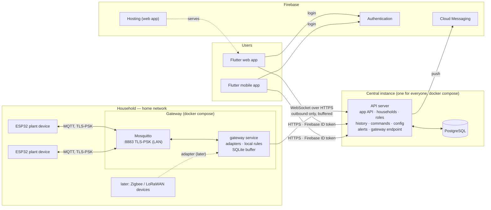

### Core architectural rules

1. **Devices talk only to their gateway; apps talk only to the API server; the database talks only to the API server.** No app ever connects to a gateway or a broker; no gateway ever touches the database.
2. **The gateway is protocol-agnostic towards the API.** Each device technology is an *adapter* inside the gateway (ESP32 over MQTT today; Zigbee, LoRaWAN, … later). Whatever the radio, the gateway sends the API the same normalized device messages (D37).
3. **Devices are asleep most of the time.** Every interaction with a device is **asynchronous**: the API records an intent, the gateway queues it, the device picks it up on its next wake. API and app treat "pending until the device wakes" as a normal state.
4. **The API server is the source of truth for intent; the device for reality.** The API stores *desired* state (config, commands, rules), the device reports *actual* state (readings, running config, command results). The app shows both, and where they differ.
5. **Rules run on the gateway** (D36). The API stores and edits them and sends them down; the gateway evaluates them locally and reports every decision. Watering keeps working without internet.
6. **The device stays dumb and safe.** It measures, reports, executes commands and enforces hard safety limits locally. The gateway checks commands again before sending them.
7. **One trust boundary for people.** Users log in via Firebase and talk only to the API server, which checks membership and role on every request. Gateways and devices have no users, logins or user-facing endpoints.
8. **Gateways connect out, never in.** A gateway has no inbound ports except MQTT on the LAN for its devices. It authenticates to the API with its own credential and can only act for its own household.
9. **Everything on the wire is encrypted.** Device ↔ gateway: MQTT with TLS-PSK; gateway ↔ API and app ↔ API: HTTPS/WSS.

---

## 3. Users, households and gateways

### 3.1 Concepts

| Concept | Meaning |
|---|---|
| **User** | A person with a Firebase account. |
| **Household** | The unit of ownership and sharing. Contains a gateway, devices, plants, rules, history. Lives in the API server's database. |
| **Membership** | A user's role in one household. Users ↔ households is many-to-many. |
| **Invite** | One-time code with a role and an expiry, created by an admin, shared as a link/QR. |
| **Gateway** | The household's box at home. **Exactly one per household** (D30); required before devices can be added. A second location (e.g. a garden shed with its own Wi-Fi) is a second household, shared with the same people. |
| **Adapter** | A device technology inside the gateway: `esp32-mqtt` now, others later. |

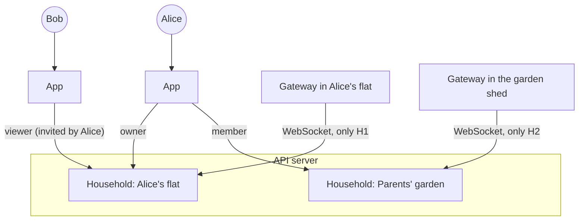

### 3.2 Roles

Per household; enforced by the API server on every request.

| Action | Owner | Admin | Member | Viewer |
|---|:-:|:-:|:-:|:-:|
| See plants, readings, history, alerts | ✔ | ✔ | ✔ | ✔ |
| Water manually, cancel commands | ✔ | ✔ | ✔ | |
| Create/edit plants and rules | ✔ | ✔ | ✔ | |
| Add/remove/configure devices, add/remove/replace the gateway | ✔ | ✔ | | |
| Invite members, change roles (up to Member), remove members/viewers | ✔ | ✔ | | |
| Promote/demote admins, rename/delete household, transfer ownership, export data | ✔ | | | |

Exactly one owner per household.

### 3.3 Login and API access

- The user signs in with **Firebase** (e-mail, Google, Apple) — always online.
- The app sends its **Firebase ID token** to the API server with every request. The API server verifies it, then checks membership + role for the household in the URL.
- **Sensitive actions** (delete household, transfer ownership, export, remove/replace the gateway, change admin roles, delete devices) additionally require a **recent login** (≤ 5 min, token `auth_time`) and a revocation check against Firebase.
- The web app runs only on the **official origin** (Firebase Hosting); the API accepts browser requests only from there.

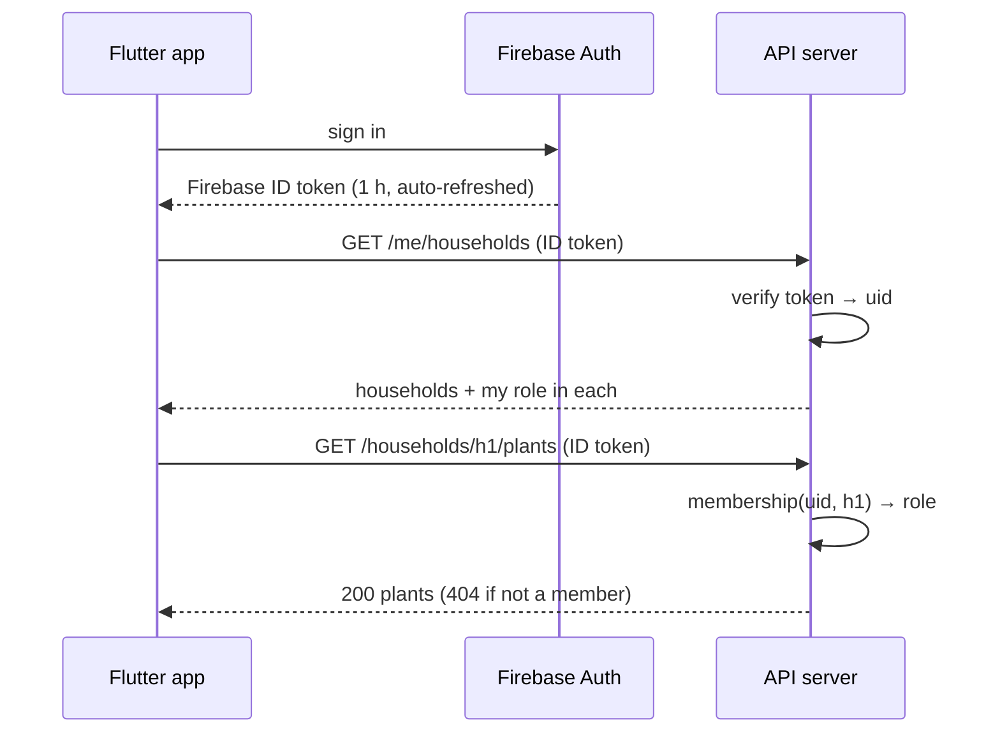

### 3.4 Sharing a household (invites)

An admin creates an **invite** with a role; the app shows it as a link and QR code pointing to the official app: `https://app.<our-domain>/join#c=<code>` (the part after `#` never reaches a server log).

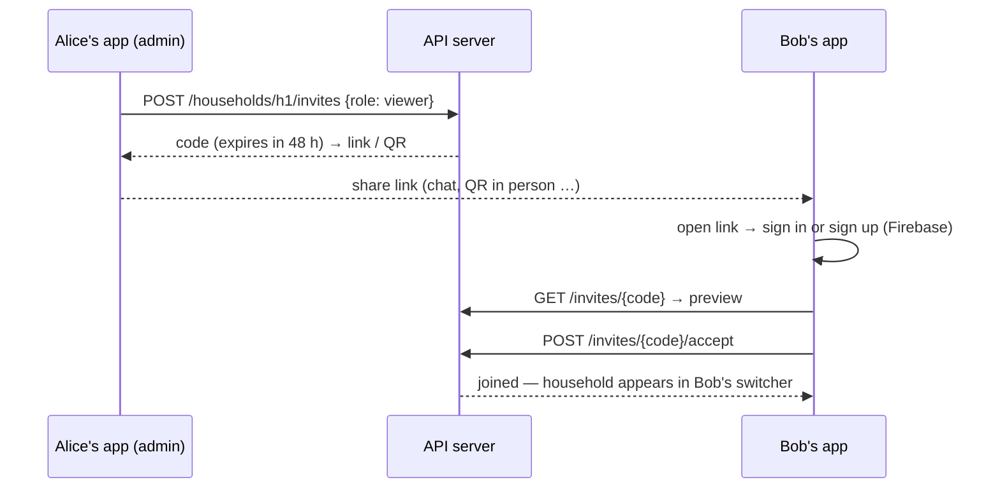

Invites are single-use, expire and can be revoked; opening the link never consumes one.

### 3.5 Adding a gateway (enrollment)

Device-code style, like signing in a TV: the gateway never accepts inbound connections and the user never types a secret into it.

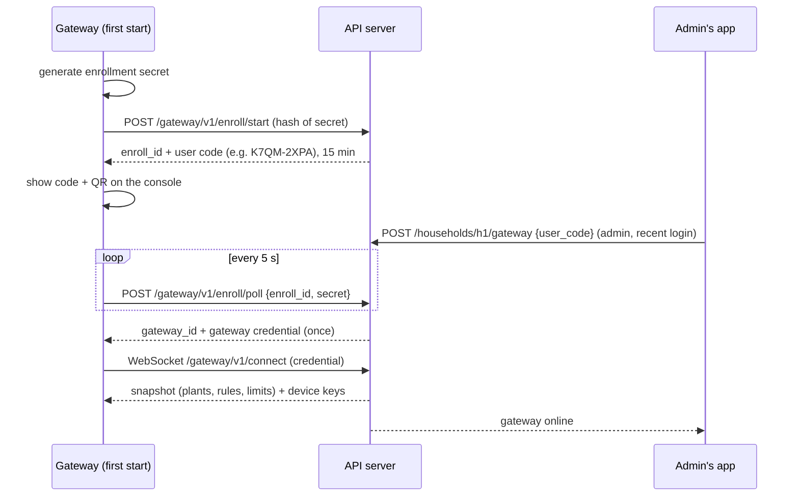

Details: [`contracts/gateway_api.md`](contracts/gateway_api.md).

### 3.6 What happens without internet

| At home, internet down | |
|---|---|
| Devices, data collection, **rules / automatic watering** | Keep running on the gateway (last received rules). |
| Data for the API (readings, command results, rule decisions) | Buffered in the gateway's SQLite and uploaded in order when the connection returns (D34). |
| App (anywhere) | Can't reach the household's live data from the gateway; shows the last data the API has and "gateway offline since …". Manual watering is accepted by the API and delivered when the gateway reconnects (with a warning). |
| Local emergency access | Gateway CLI with shell access (`mc-gateway status`, `mc-gateway water <plant> <seconds>`) — reported to the API later. |
| Logins | Always need internet (Firebase). |

If the **API server** is down, the same applies: gateways keep watering and buffer; apps can't reach anything.

### 3.7 Device identity and pairing

- **Device IDs are random and assigned by the API server** when an admin adds a device. The chip's MAC address is not an identity.
- Every ESP32 device has a **proof-of-possession code (PoP)** generated when it is flashed and printed as a QR label. Pairing over BLE requires it; the encrypted pairing session keeps the Wi-Fi password and the device's MQTT key from being sniffed.
- A device accepts pairing **only** when unprovisioned or after the BOOT button is held for 3 s. Holding BOOT for 10 s is a factory reset (PoP kept).
- During pairing the app sends the **gateway's LAN address** and the device's **MQTT pre-shared key** (256 bit, generated by the API server, delivered to the gateway over the WebSocket, never shown to the user).
- Other device technologies (later) pair the way their standard prescribes (e.g. Zigbee permit-join on the gateway, LoRaWAN keys); the API still assigns the device record.

Protocol: [`contracts/ble.md`](contracts/ble.md).

### 3.8 Security model in one table

| Party | Trusted with | Cannot |
|---|---|---|
| **API server** (us) | Users' memberships, all households' data, Firebase/FCM credentials, device keys (encrypted) | — |
| **Database** | Stores everything; reachable only from the API server | Be reached by gateways, apps or the internet |
| **Gateway** | Its own household: device keys for its broker, the household's rules and plants (read-only copy), commands for its devices | See users, other households or the database; accept inbound connections from the internet |
| **Device** | Its own MQTT topics and key | See any other device |
| **App** | The user's Firebase login | Talk to gateways or brokers (except BLE pairing with a device the user physically holds) |
| **Home network / Wi-Fi** | Nothing | Sniff or inject MQTT (TLS-PSK) |

---

## 4. Components and responsibilities

### 4.1 Plant device — `firmware/`

Battery-powered ESP32 running Zephyr. Details: [`Firmware_Specs.md`](firmware/Firmware_Specs.md).

- Wakes on a timer (default ~10 min), reads all configured sensor slots, connects Wi-Fi + MQTT to its gateway, publishes readings, processes queued commands, goes back to deep sleep.
- Pluggable module slots configurable at runtime via MQTT.
- Reports its own health on every wake.
- Enforces local safety limits independent of what the gateway says.
- MQTT over **TLS-PSK** to the gateway's broker on the LAN.

### 4.2 Gateway — `gateway/`

**Required, one per household.** Docker Compose with two containers (Mosquitto + gateway service) on any 64-bit Linux box (Raspberry Pi 3B+/4/5, NAS, old PC; ≥ 1 GB RAM). Details: [`Gateway_Specs.md`](gateway/Gateway_Specs.md).

| Responsibility | What it means |
|---|---|
| **Device communication** | Adapters per technology. `esp32-mqtt`: Mosquitto on the LAN (TLS-PSK), device keys from the API, persistent sessions queue commands for sleeping devices. |
| **Normalization** | Turns every adapter's traffic into the normalized device messages of [`gateway_api.md`](contracts/gateway_api.md) (for ESP32 devices these are the [`mqtt.md`](contracts/mqtt.md) payloads unchanged). |
| **Uplink** | One outbound WebSocket to the API server; everything up is written to a local SQLite outbox first and deleted only after the API acknowledged it — no data loss while offline. |
| **Local rules** | Evaluates the household's rules (same engine as `core/`) on new readings; creates commands, reports them and every decision up. |
| **Command delivery** | Receives commands and desired configs from the API, checks safety limits again, publishes them to the device (via its adapter). |
| **Enrollment & CLI** | Device-code enrollment; `mc-gateway` CLI for status, local watering and reset. |

### 4.3 MQTT broker — `broker/`

Off-the-shelf **Mosquitto**, only configuration, running inside the gateway stack: TLS-PSK listener on the LAN for ESP32 devices, internal listener for the gateway service. The PSK file is written by the gateway service from the keys the API sends. No cloud broker, no bridge. Details: [`Broker_Specs.md`](broker/Broker_Specs.md).

MQTT stays because the ESP32 firmware speaks it and because it is also the common hand-off for later radios (Zigbee2MQTT, LoRaWAN network servers), which then become further adapters of the same gateway.

### 4.4 API server — `api/`

Our service, **Python (FastAPI)**, one central instance operated by us. Details: [`Api_Specs.md`](api/Api_Specs.md).

| Responsibility | What it means |
|---|---|
| **Accounts & access** | Verifies Firebase ID tokens; households, memberships, roles, invites; recent-login checks. |
| **Gateway endpoint** | Enrollment; the WebSocket for all gateways; acknowledges uploads; sends snapshots, device keys, commands, configs down. |
| **Ingest & history** | Validates normalized device messages, maps slots to plants, stores history, tracks device and gateway online state. |
| **Devices** | Device records, IDs, MQTT keys (encrypted), pairing bundles. |
| **Command queue** | Commands with ID and expiry from the app; records rule-created commands reported by gateways; lifecycle until acked or expired. |
| **Config sync** | Desired vs. reported device config. |
| **Rules (definitions)** | Stores and validates rules, sends them to the gateway in the snapshot, records rule decisions reported by the gateway. |
| **Alerts & push** | Offline, battery, sensor errors, failed commands, gateway offline → in-app list + FCM push. |
| **App API** | REST + Server-Sent Events, all data endpoints scoped `/households/{id}/…`. |

### 4.5 Database

**PostgreSQL**, as a container in the API stack (or a managed PostgreSQL later). Reachable **only** from the API server's container network — no published port, no access from gateways or apps (D35). Schema and migrations are owned by the API server (Alembic). Backups: nightly `pg_dump`.

### 4.6 Client app — `app/`

**Flutter**, one codebase for web and Android/iOS. Talks to Firebase (login) and to the API server only. Details: [`App_Specs.md`](app/App_Specs.md).

- Login and a **household switcher**.
- Household management: members, roles, invites, add/replace/remove the gateway (enter/scan the gateway's code).
- Dashboard, plant detail (history, water now, rules), device detail (slots, health), alerts.
- Clearly shows **pending** actions and "gateway offline since … — data will arrive later".
- Push notifications (FCM). **Device pairing over BLE** (mobile only).

### 4.7 Firebase project — `firebase/`

Managed services only, no own code, free **Spark** plan. Details: [`Firebase_Specs.md`](firebase/Firebase_Specs.md).

- **Authentication** — the only login.
- **Cloud Messaging** — push, sent by the API server.
- **Hosting** — the web app, `/join` invite links, `/gateway` claim links, mobile app-link files.

### 4.8 Shared contracts and code

- **[`mqtt.md`](contracts/mqtt.md)** — ESP32 device ↔ gateway: connection and keys, topics, payloads, command and config semantics.
- **[`gateway_api.md`](contracts/gateway_api.md)** — gateway ↔ API: enrollment, WebSocket framing, acknowledgements and replay, normalized device messages, snapshots, keys, commands.
- **[`ble.md`](contracts/ble.md)** — app ↔ ESP32 device pairing.
- **`api.yaml`** — OpenAPI between API server and app, generated from FastAPI; the Dart client is generated from it.

Shared Python code — contract models, rules engine, command checks, pin rules — lives in [`core/`](core/), used by both the API server and the gateway, so rules and checks behave identically wherever they run.

---

## 5. Domain model (conceptual)

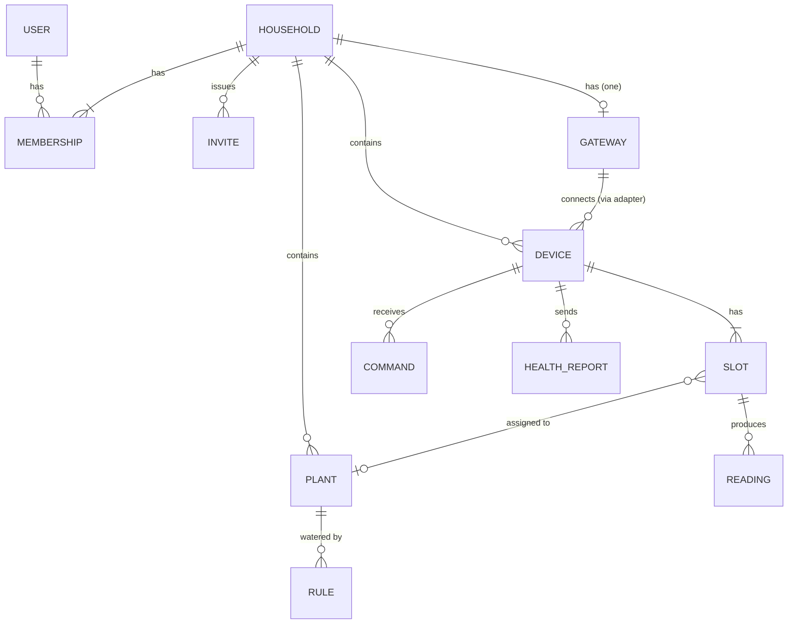

- **User** — Firebase identity; the API stores UID, display name, verified e-mail.
- **Household** — unit of ownership and sharing.
- **Membership** — (user, household, role).
- **Invite** — one-time code with role and expiry.
- **Gateway** — one per household; credential, status, versions, adapters, LAN address for device pairing.
- **Device** — random ID assigned by the API, `adapter` (e.g. `esp32-mqtt`), key for its adapter.
- **Slot** — one physical connector/pin (or a sensor channel of another device type) with a module type. Desired vs. reported config.
- **Plant** — linked to a sensor slot and optionally a pump slot. *Users think in plants, devices think in slots — the API maps between them.*
- **Reading**, **Health report**, **Command**, **Rule** (+ rule executions, always by the gateway), **Alert**.

---

## 6. Key flows

### 6.1 Device wake cycle (ESP32, summary)

Full detail in the firmware spec.

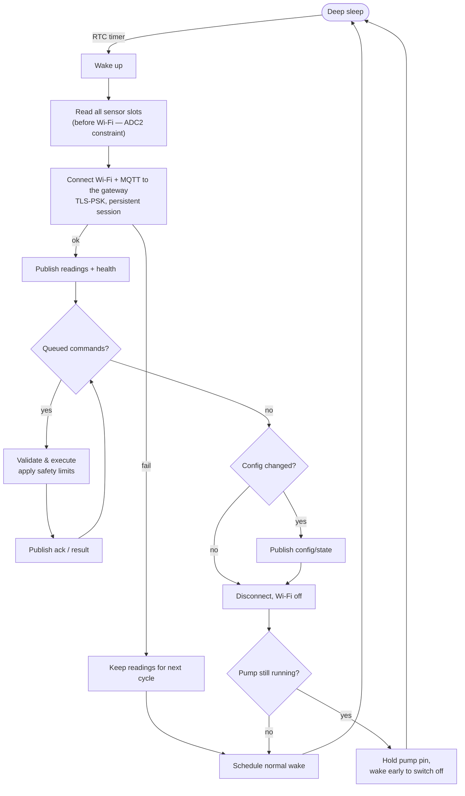

### 6.2 Sensor reading → app

```mermaid
sequenceDiagram
    participant Dev as Device
    participant GW as Gateway
    participant API as API server
    participant DB as PostgreSQL
    participant App as Flutter app

    Dev->>GW: MQTT telemetry (LAN)
    GW->>GW: local rules; write to outbox
    GW->>API: WebSocket: device message (seq n)
    API->>DB: validate, map slot → plant, store
    API-->>GW: ack up to n (outbox entry deleted)
    API-->>App: live update (SSE)
    App->>API: GET /households/{h}/plants/{id}/readings
    API-->>App: history
```

### 6.3 Manual watering

The app gets an answer **immediately** ("queued"); the result arrives **minutes later** when the device wakes.

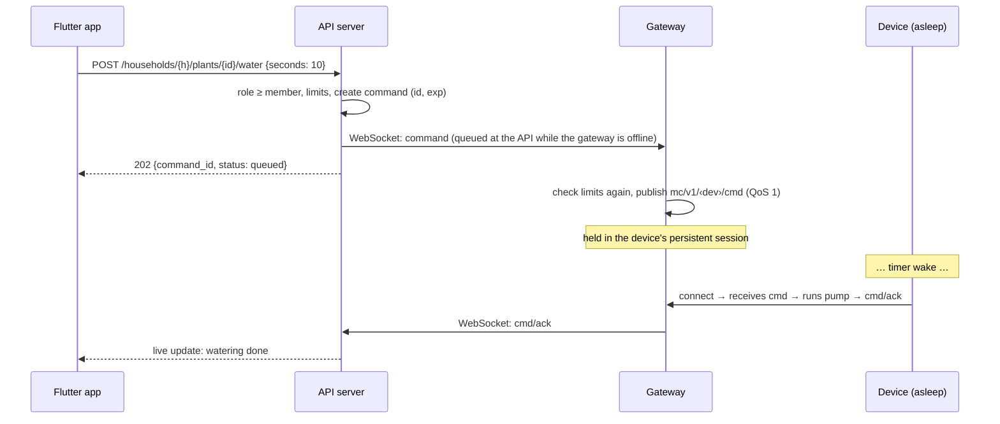

### 6.4 Command lifecycle

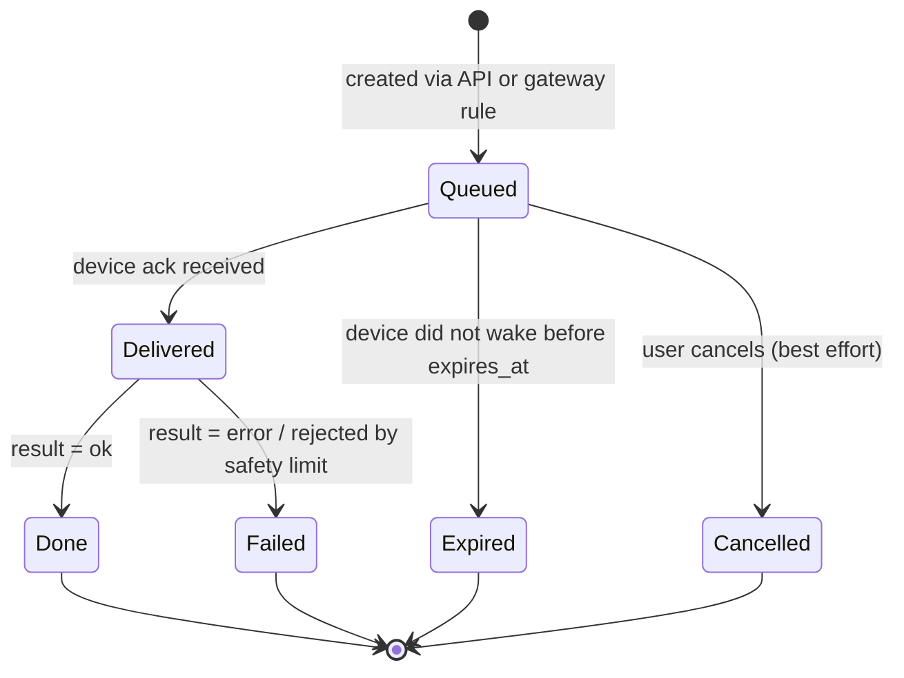

Every command carries an ID and an expiry; the device ignores expired commands. "Cancel" is best effort (D7). While a gateway is offline its commands stay *Queued* at the API; expiry is paused for that household and resumes with a grace period after reconnect.

### 6.5 Automatic watering (rule)

Always on the **gateway** (works offline); the API only stores rules and records decisions.

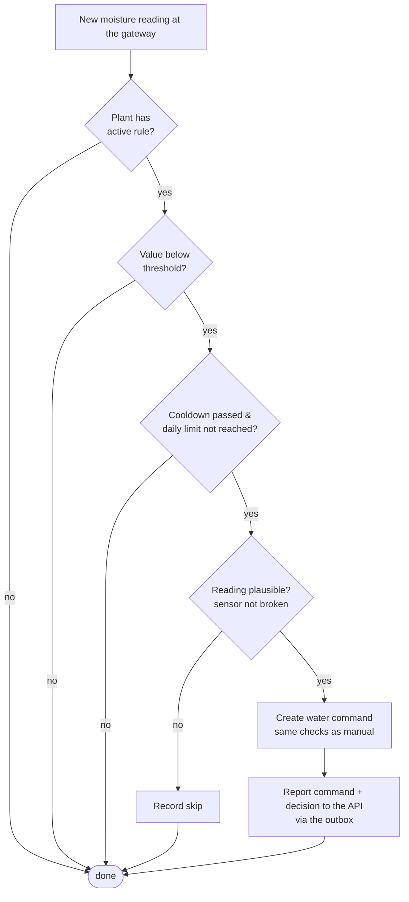

### 6.6 Changing a device's configuration

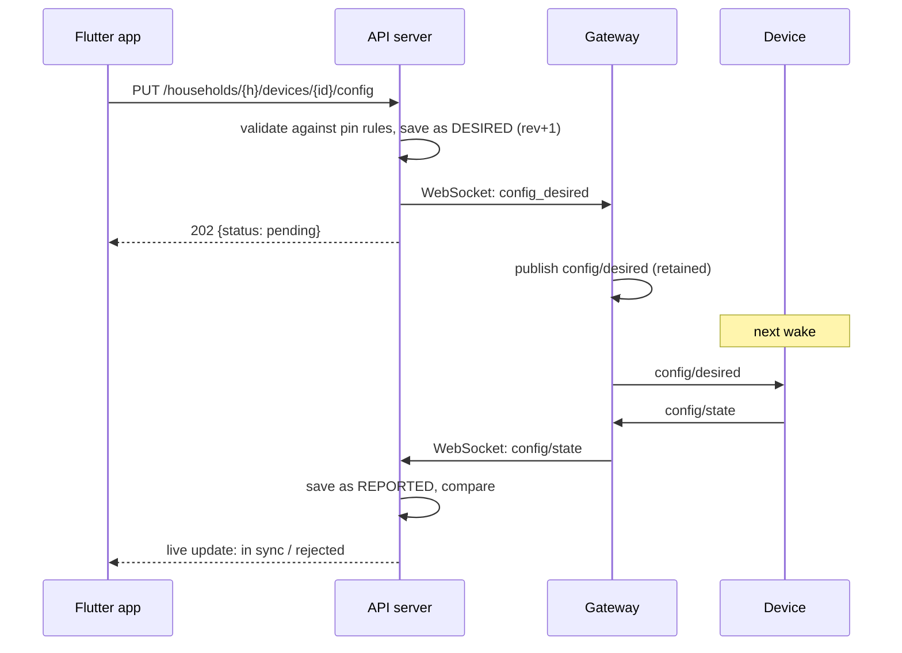

### 6.7 Adding a new ESP32 device

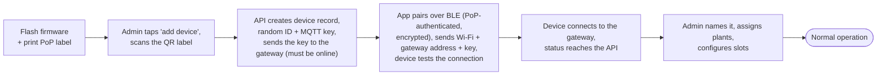

---

## 7. Cross-cutting concerns

| Topic | Direction |
|---|---|
| **Security** | One trust boundary for people (Firebase + API server). HTTPS/WSS for everything over the internet; TLS-PSK for MQTT on the LAN. Gateways authenticate with their own credential and are scoped to one household. The database is reachable only by the API server. Nothing at home listens on the internet. |
| **Time** | Devices sync via SNTP when needed. Device timestamps are kept through the gateway buffer; the API accepts them within a plausibility window extended by the gateway's offline duration. Gateways need NTP and refuse rule commands without a synced clock. |
| **Offline detection** | The API knows each device's wake interval → *late* / *offline*. While a gateway is offline, the app shows "gateway offline" instead of marking every device offline. |
| **Power** | Every device feature is judged by what it adds to the wake window. LAN-only MQTT with TLS-PSK keeps it short. |
| **Safety** | Hard maximum pump duration and minimum pause, enforced on the device, the gateway and the API. |
| **Deployment** | Gateway: Docker Compose (Mosquitto + gateway), multi-arch (arm64 + amd64). Central: Docker Compose (Caddy, API server, PostgreSQL) — **on a Raspberry Pi at home first, later the same stack on a cloud VM** (D32). Web app on Firebase Hosting. Mobile via the stores. |
| **Privacy** | Household data is stored centrally (EU region). Owners can export their household's data. |
| **Observability** | Every command and rule decision is logged with where it ran. Device and gateway health history is kept. |
| **Extensibility** | New device technologies = new gateway adapters + new module/reading types in the contracts; the API and app need no protocol knowledge. |
| **Updates (later)** | OTA firmware updates — not in v1 (keep MCUboot in mind). Gateway updates via `docker compose pull`; the API tells the admin when a gateway is outdated. |

---

## 8. Repository layout

```
MoistureController/
├── PROJECT.md              ← this file
├── contracts/
│   ├── mqtt.md             ← ESP32 device ↔ gateway
│   ├── gateway_api.md      ← gateway ↔ API server
│   ├── ble.md              ← app ↔ device pairing
│   └── api.yaml            ← OpenAPI (API server ↔ app), generated
├── firmware/               ← Zephyr / ESP32
├── core/                   ← shared Python: contract models, rules engine, command checks, pin rules
├── gateway/                ← gateway service + gateway docker-compose (Mosquitto + gateway)
├── api/                    ← API server (FastAPI) + central docker-compose (Caddy, API, PostgreSQL)
├── broker/                 ← Mosquitto image + gateway broker config
├── firebase/               ← Firebase config (auth, hosting)
├── app/                    ← Flutter (web + mobile)
├── server/  (old)          ← code of the former cloud backend → moves to api/ (§11)
└── hub/     (old)          ← code of the former hub agent → moves to gateway/ (§11)
```

---

## 9. Milestones (whole system)

Each milestone ends with something working end-to-end. From the start, devices talk to a gateway and the gateway to the API.

| # | Milestone | Firmware | Gateway | API server | App |
|---|---|---|---|---|---|
| **M1** | Readings on a screen | Always-on, one moisture sensor, credentials via Kconfig | Broker (plain TCP, dev), `esp32-mqtt` adapter, outbox + WebSocket uplink (static dev credential) | Gateway endpoint, ingest, history, `GET` readings; one fixed household | List + chart |
| **M2** | Water from the app | Pump driver, `cmd` + ack | Command delivery | Command queue + lifecycle, SSE | Water button, pending state |
| **M3** | Battery life | Deep sleep, health, **TLS-PSK** | PSK listener, keys from the API | Late/offline, gateway offline handling | Battery, last seen, gateway state |
| **M4** | Configure remotely | `config/desired` / `config/state` | Config relay | Desired vs. reported config | Slot config UI |
| **M5** | Automation | Local safety limits | Local rules, decision + command reports | Rule storage, snapshot, rule executions, alerts, FCM | Rule editor, push |
| **M6** | Accounts & sharing | BLE pairing | Enrollment (device code), CLI | Firebase auth, households, roles, invites, device creation, gateway claim, rate limits; deploy the central stack | Login, household switcher, invites, add gateway, BLE onboarding |
| **M7** | More radios (later) | — | Second adapter (e.g. Zigbee via Zigbee2MQTT) | New module/reading types | Device types in the UI |

Status 2026-09-29: most of M1–M6 exists in the former architecture (`server/` = central backend with a cloud MQTT broker, `hub/` = hub agent with an MQTT bridge) and was tested end-to-end with the device simulator; it moves to the new structure (§11).

---

## 10. Decisions

Last change 2026-09-29 (v2 architecture: gateway + central API, D33–D39). Change only deliberately, and update this table when you do.

| # | Topic | Decision | Consequences |
|---|---|---|---|
| D1 | Server language | **Python + FastAPI** for the API server; gateway in Python too, sharing `core/` | OpenAPI generated for free; the Dart client is generated from it. |
| D2 | Databases | **PostgreSQL centrally (only the API server connects), SQLite on the gateway** (buffer + local state) | Both via SQLAlchemy + Alembic. |
| D4 | Live updates to the app | **Server-Sent Events** | One-way push over HTTP; everything the app sends goes through REST. |
| D5 | Provisioning | **BLE from the Flutter app** (ESP32 devices) | Mobile only. Until M6, credentials come from Kconfig. |
| D7 | Commands | **Expiry + best-effort cancel** | Every command has `id` + `exp`; device drops expired ones. |
| D8 | Notifications | **FCM, sent by the API server** | FCM credentials only on the API server. Web push depends on browser support; in-app alert list as fallback. |
| D9 | Tenancy | **Users ↔ households many-to-many, in the API server's database** | Household switcher is a list from the API. |
| D10 | Identity | **Firebase Authentication; the API verifies Firebase ID tokens directly** | No login without internet. Firebase is only the identity provider; households, members, roles and invites live in our database. |
| D11 | Roles | **Owner / Admin / Member / Viewer** per household | Matrix §3.2, enforced by the API server. |
| D12 | Sharing | **Invite link / QR to the official app** (`/join#c=<code>`), one-time code + role + expiry | |
| D13 | Identity provider | **Firebase Authentication** (Spark plan) | Ready Flutter SDK (e-mail, Google, Apple); no own password handling. |
| D17 | Device identity & pairing | **API-assigned random device IDs; BLE pairing authenticated by a PoP code on the label, only on first boot or after a button press** | [`contracts/ble.md`](contracts/ble.md). |
| D25 | Gateway enrollment | **Device-code flow**: the gateway shows a short code, an admin enters it in the app | No inbound connection to the gateway, no secrets typed into it. (Formerly for hubs.) |
| D26 | Local access without internet | **None via the app; gateway CLI with shell access** | No local login surface at home. |
| D27 | Data export | **Owner-only export; no import** | |
| D28 | Sensitive actions | **Recent login (≤ 5 min) + revocation check** | Delete household, transfer ownership, export, remove/replace gateway, admin role changes, delete devices. |
| D29 | MQTT encryption | **TLS-PSK for every device ↔ gateway MQTT connection**, 256-bit key per device, identity = client ID | Cheap handshake on the ESP32, no certificates on devices; no forward secrecy — acceptable for sensor data. |
| D30 | Gateways per household | **Exactly one** (required for devices) | One place for a household's devices; a second location = a second household. |
| D31 | Gateway hardware | **Any 64-bit Linux with Docker** (arm64 + amd64), ≥ 1 GB RAM | Raspberry Pi 3B+/4/5, NAS, old PC. |
| D32 | Where the central stack runs first | **On a Raspberry Pi at home (Cloudflare Tunnel for `api.<domain>`), later the same Compose stack on a cloud VM** | Gateways and apps only know `api.<domain>`; the move is a DNS change + backup/restore. No public MQTT port anymore. |
| **D33** | Architecture | **Gateway at home + one central API server with PostgreSQL + Firebase for login** | Replaces "cloud + optional hub" (D23). Every household has a gateway; no device talks to the cloud directly; no cloud MQTT broker. |
| **D34** | Gateway ↔ API | **One outbound WebSocket (WSS) per gateway; everything up goes through a local SQLite outbox and is deleted only after the API's ack; replay in order after reconnect** | No second broker centrally; protocol-independent; no data loss while offline ([`gateway_api.md`](contracts/gateway_api.md)). Replaces the MQTT bridge (D24). |
| **D35** | Database access | **Only the API server talks to PostgreSQL** | Gateways and apps go through the API; the database can move (Pi → VM → managed) without touching anything else. |
| **D36** | Rules | **Always evaluated on the gateway**; the API stores/edits rules and records decisions | Watering works without internet. Replaces D6 ("cloud or hub"). |
| **D37** | Device technologies | **Adapters in the gateway; normalized device messages towards the API**; ESP32 over MQTT (Mosquitto) is the first adapter | Zigbee/LoRaWAN etc. later without changing API or app protocols. |
| **D38** | Names & packaging | **`gateway` · `api` · `db`**; gateway = Docker Compose with two containers (official Mosquitto-based image + gateway image); central = Compose (Caddy, API, PostgreSQL) | `core/` stays the shared package name. |
| **D39** | App ↔ gateway | **No direct path; the app talks only to the API server** | One API, one security model. When the internet is down the app can't reach the household (the gateway keeps watering). |

**Superseded by D33–D39** (kept for history): D6 rules in cloud or hub · D23 cloud control plane + optional hub · D24 MQTT bridge hub ↔ cloud.
Superseded earlier by D23: D3 home server first · D14 router port forwarding · D15 emergency login · D16 export/import between servers · D18 home-server exposure hardening · D19 per-server tokens · D20 push relay · D21 official web origin as a fix for home servers · D22 directory in Firestore.

### Still open

- **Cloud hosting provider** for the later move (D32). Candidates: Oracle Cloud *Always Free* (Frankfurt, arm64), Hetzner (Germany, ~€4–5/month).
- **Buffer limits on the gateway** — how many days / MB to keep while offline before dropping the oldest readings (default proposal in Gateway_Specs).
- **Second adapter** (Zigbee via Zigbee2MQTT vs. LoRaWAN via ChirpStack) — only when needed.

---

## 11. Migration of existing code

The code written until 2026-09-29 targets the v1 architecture; most of it moves.

| Existing | Becomes |
|---|---|
| `server/src/mc_server/` (FastAPI, auth, households, invites, devices, commands, config sync, alerts, export, SSE) | **`api/`**. Replace the MQTT client, outbox-to-MQTT and cloud-broker ACL/PSK files by the gateway WebSocket endpoint; hub enrollment becomes gateway enrollment; cloud rules engine removed (rules only on the gateway); households without a gateway can't add devices. |
| `server/tools/fake_device.py` | `gateway/tools/fake_device.py`, unchanged (speaks mqtt.md). |
| `hub/src/mc_hub/` (agent: enrollment, snapshot/keys, local rules, SQLite store, CLI) | **`gateway/`**. Enrollment and CLI stay; the MQTT bridge is replaced by the WebSocket uplink + outbox; device traffic is forwarded up by the gateway itself (no bridge). |
| `broker/` | Gateway broker config only; cloud config and cloud ACL generation removed; no bridge. |
| `core/` | Unchanged; contract tests switch from `hub.md` to `gateway_api.md`. |
| `app/` | Mostly unchanged: API base URL stays central; the "Hub" screen becomes the "Gateway" screen; "no hub" households disappear. |
| `scripts/dev-start.sh` | Starts the central stack + one gateway + simulator + app. |
