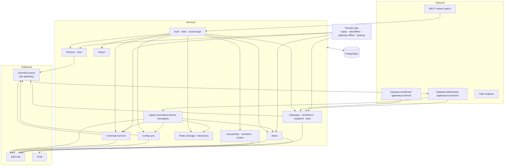
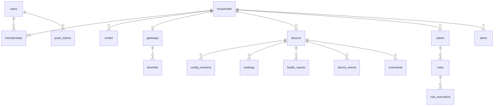
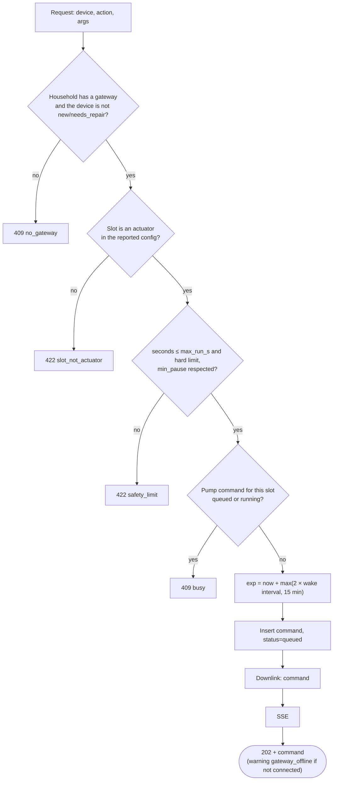
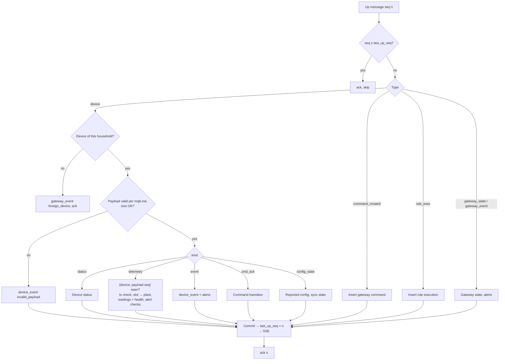
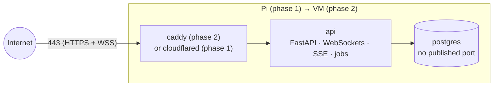

# API Server — Specification

**Status:** draft · **Last change:** 2026-09-29 (v2 architecture, D33–D39)

The API server is the **central** service: the only place with users' households, memberships and roles, the history of all devices, and the app's API. It is the only component that talks to both users (apps) and gateways, and the **only** client of the database. We operate one instance for everyone. **What** it is responsible for is defined in [`PROJECT.md`](../PROJECT.md) §4.4–4.5; this document describes **how** it is built.

Interfaces: gateways → [`contracts/gateway_api.md`](../contracts/gateway_api.md); app → OpenAPI generated from this code (`contracts/api.yaml`); login → Firebase ([`firebase/Firebase_Specs.md`](../firebase/Firebase_Specs.md)). Device payloads inside gateway messages: [`contracts/mqtt.md`](../contracts/mqtt.md).

---

## 1. Scope

In scope:

- Firebase ID token verification, households, memberships, roles, invites, sensitive-action checks.
- REST API + Server-Sent Events for the Flutter app.
- **Gateway endpoint**: enrollment, the WebSocket per gateway, acknowledgements, downlink queue.
- Ingest of normalized device messages from gateways; history.
- Device registry and device keys; gateway registry and credentials; snapshots for gateways.
- Command queue and lifecycle (commands from the app, commands reported by gateways).
- Config sync (desired vs. reported).
- Rule storage and validation; recording of rule decisions made by gateways (rules are **not** evaluated here, D36).
- Alerts and push notifications (FCM).
- Owner data export.

Out of scope: login UI and identity (Firebase), the web app (Firebase Hosting), device communication and rule evaluation (gateway), device firmware.

---

## 2. Technology

| Concern | Choice | Notes |
|---|---|---|
| Language / runtime | Python 3.13 | Same version as the gateway |
| Web framework | FastAPI + Uvicorn | OpenAPI generated from code; native WebSocket support for gateways |
| Shared code | `core/` package | Contract models (mqtt.md, gateway_api.md), command checks, pin rules, rules *validation* |
| Validation | Pydantic v2 | |
| Database | PostgreSQL 16 via SQLAlchemy 2 async + `asyncpg`, Alembic migrations | Only the API connects (D35). TimescaleDB optional later for readings. |
| SSE | `sse-starlette` | |
| Auth | `firebase-admin` (`verify_id_token`, `check_revoked` for sensitive actions) | The service account lives only here |
| Push | `firebase-admin` messaging (FCM) | |
| Key encryption at rest | `cryptography` (AES-256-GCM) | Device PSKs |
| Credential hashing | SHA-256 of 256-bit random gateway credentials | High-entropy secrets, no slow hash needed |
| IDs | ULID; `mc-…` devices, `gw-…` gateways | |
| Tests | pytest, pytest-asyncio, httpx `AsyncClient`, Postgres in Docker, a scripted fake gateway + `fake_device.py` through a real gateway | |

**Process model:** one Uvicorn process with one worker hosting the API, all gateway WebSockets, the SSE hub and the periodic jobs. Enough for the expected scale; scaling out later needs a shared bus for SSE/gateway routing and job ownership (§17).

---

## 3. Internal architecture



- **Routers are thin**: parse, auth dependency, one service call, serialize.
- **Services own logic and transactions.**
- **Every write the app should see live emits an SSE event** after commit.
- **Everything for a gateway goes through the downlink queue** (a table), written in the same transaction as the change and sent when the gateway is connected (§9.3).

---

## 4. Data model

All IDs are ULIDs unless noted; timestamps UTC. Every table with household data has `household_id`, and every query filters by it (§5.4).



| Table | Key columns | Notes |
|---|---|---|
| `users` | `uid` (Firebase UID, PK), `email` (verified only), `display_name`, `first_seen_at` | Upserted from token claims |
| `households` | `id`, `name`, `timezone`, `battery_low_mv`, `snapshot_rev`, `keys_rev`, `created_at` | `*_rev` counters for the gateway (§9.4) |
| `memberships` | (`household_id`, `user_uid`) PK, `role`, `created_at` | Exactly one `owner` per household (partial unique index) |
| `invites` | `id`, `household_id`, `code_hash`, `role`, `created_by`, `expires_at`, `used_by`, `used_at`, `revoked_at` | SHA-256 of the code only |
| `gateways` | `id` (`gw-…`), `household_id` (unique), `credential_hash`, `status` (`enrolling`/`online`/`offline`/`removed`), `connected_at`, `disconnected_at`, `last_outage_s`, `last_state` (JSON of `gateway_state`), `lan_host_override`, `adapters`, `version`, `snapshot_rev_applied`, `keys_rev_applied`, `last_up_seq`, `created_at` | One per household (D30) |
| `gateway_enrollments` | `id`, `secret_sha256`, `user_code_hash`, `expires_at`, `claimed_household_id`, `claimed_by`, `gateway_id`, `consumed_at`, `last_poll_at`, `ip`, `version`, `arch`, `adapters` | Cleaned up after 24 h |
| `downlink` | `id` (ULID = message `id`), `gateway_id`, `type`, `body`, `created_at`, `sent_at`, `acked_at`, `result`, `error` | §9.3 |
| `devices` | `id` (`mc-…`), `household_id`, `adapter`, `name`, `psk_enc`, `hw_mac`, `fw`, `board`, `status`, `last_seen_at`, `next_expected_at`, `wake_interval_s`, `batt_mv`, `rssi`, `last_seq`, `last_boot`, `desired_rev`, `desired_config`, `reported_rev`, `reported_config`, `rejected_rev`, `config_error`, `sensor_error_streak`, `created_at`, `deleted_at` | `status` ∈ `new`, `online`, `sleeping`, `late`, `offline`, `service`; `needs_repair` after a gateway replacement |
| `config_revisions` | `device_id`, `rev`, `kind`, `body`, `result`, `error`, `created_at`, `created_by` | Full history |
| `plants` | `id`, `household_id`, `name`, `notes`, `sensor_device_id`, `sensor_slot`, `pump_device_id`, `pump_slot`, `archived_at` | |
| `readings` | `id` (bigint), `device_id`, `slot`, `plant_id`, `type`, `value`, `raw`, `error`, `ts`, `ts_source`, `seq` | Indexes (`plant_id`, `ts`), (`device_id`, `slot`, `ts`); partitioned by month once volume grows |
| `health_reports`, `device_events` | as before | |
| `commands` | `id`, `household_id`, `device_id`, `plant_id`, `action`, `args`, `status`, `reason`, `source` (`manual`/`rule`/`local`), `origin` (`api`/`gateway`), `created_by`, `rule_id`, `created_at`, `exp`, `sent_at`, `delivered_at`, `finished_at`, `ends_at`, `cancel_of` | `sent_at` = handed to the gateway |
| `rules` | `id`, `household_id`, `plant_id`, `enabled`, `threshold`, `water_s`, `cooldown_s`, `max_per_day`, `quiet_from`, `quiet_to`, `created_by`, `updated_at` | |
| `rule_executions` | `id`, `household_id`, `rule_id`, `plant_id`, `ts`, `reading_ref`, `decision`, `skip_reason`, `command_id` | Reported by the gateway (`rule_exec`) |
| `alerts` | `id`, `household_id`, `kind`, `subject_type`, `subject_id`, `subject_name`, `severity`, `opened_at`, `resolved_at`, `acked_by`, `acked_at`, `detail` | One open alert per (`kind`, `subject`) |
| `push_tokens` | `token` PK, `user_uid`, `platform`, `updated_at` | |
| `audit_log` | `id`, `household_id`, `actor`, `action`, `detail`, `ts`, `ip` | Role changes, invites, devices, gateway add/remove, export, deletes |

**Keys at rest:** device PSKs are stored encrypted (`psk_enc`, AES-256-GCM with `MC_KEY_ENCRYPTION_KEY`), decrypted only to build pairing bundles and the `keys` message for the household's gateway. Gateway credentials are stored only as hashes.

---

## 5. Authentication and authorization

### 5.1 Firebase ID tokens

Every app request carries `Authorization: Bearer <Firebase ID token>`. The API verifies it with `firebase_admin.auth.verify_id_token`, takes `uid`, upserts the `users` row (`email` only if verified). Accounts with e-mail/password need a verified e-mail before creating or joining households.

### 5.2 Roles

Matrix in [PROJECT.md §3.2](../PROJECT.md). One FastAPI dependency per minimum role. Not a member → **404**; role too low → **403**. Admins may invite/assign up to `member` and remove `member`/`viewer`; only the owner changes admins, transfers ownership, renames/deletes the household and exports. The owner cannot leave.

### 5.3 Sensitive actions

For: delete household, transfer ownership, promote/demote admin, export, claim/remove the gateway, delete device. Token `auth_time` ≤ 5 min → otherwise **401 `reauth_required`**; `verify_id_token(check_revoked=True)`.

### 5.4 Tenant isolation

- App data under `/api/v1/households/{household_id}/…`; resources always loaded by household **and** ID.
- Gateway messages are accepted only for devices whose `household_id` equals the gateway's household.
- A test suite calls every household route as a non-member (404) and with each lower role (403), and sends gateway messages for foreign devices (dropped).

### 5.5 Gateway authentication

`Authorization: Gateway <gateway_id>:<credential>` on the WebSocket upgrade; constant-time comparison of SHA-256(credential) with `credential_hash`; `status = removed` → 401. Failed attempts are rate-limited per IP (20 / 5 min → 15 min block).

### 5.6 Public exposure

| Measure | Detail |
|---|---|
| Rate limits (per IP / user / gateway) | unauthenticated 30/min/IP · invalid tokens 20/5 min/IP → 15 min block · authenticated 300/min/user · water/actions 30/min/household · invites 20/day/household · gateway claim 10/h/user · enrollment start 10/h/IP · poll ≥ interval · gateway messages 50/s/gateway (burst 500 for replays) |
| Request limits | JSON body ≤ 64 KB; WebSocket frame ≤ 256 KB; SSE and WebSockets exempt from write timeouts |
| Headers | HSTS, `nosniff`, `Referrer-Policy: no-referrer`, `Content-Security-Policy: default-src 'none'` |
| CORS | Only the official web-app origin (`MC_CORS_ORIGINS`) |
| Docs | `/docs` and `/openapi.json` disabled in production |
| Database | No published port; only on the container network |

---

## 6. REST API

Base `/api/v1`, JSON, ISO 8601 UTC timestamps, errors as RFC 9457 problem+json with stable `type`s. The app sends `X-MC-App: <platform>/<version>`; below `MC_MIN_APP_VERSION` → **426**.

### 6.1 Endpoints

**Me**

| Method | Path | Purpose |
|---|---|---|
| GET / DELETE | `/me` | Profile / delete account data (409 `sole_owner` while owning a shared household) |
| GET | `/me/households` | Households with my role and gateway state — the household switcher |
| PUT / DELETE | `/me/push-tokens/{token}` | Register / remove an FCM token |
| POST | `/events/ticket` | Short-lived SSE ticket (§6.2) |
| GET | `/meta/boards/{board}` | Board description from `core/pins.py` |

**Households, members, invites** — unchanged from v1:

| Method | Path | Min. role |
|---|---|---|
| POST | `/households` | logged in (verified) |
| GET / PATCH / DELETE | `/households/{h}` | viewer / owner / owner* |
| POST | `/households/{h}/transfer-ownership` | owner* |
| GET | `/households/{h}/members` | viewer |
| PATCH / DELETE | `/households/{h}/members/{uid}` | admin, owner* for admins |
| GET / POST | `/households/{h}/invites` | admin |
| DELETE | `/households/{h}/invites/{id}` | admin |
| GET | `/invites/{code}` | logged in |
| POST | `/invites/{code}/accept` | logged in (verified) |
| GET | `/households/{h}/audit` | admin |

**Gateway**

| Method | Path | Min. role | Purpose |
|---|---|---|---|
| GET | `/households/{h}/gateway` | viewer | State: online / offline since, version (+ update notice), adapters, in sync, outbox depth, clock, LAN address |
| POST | `/households/{h}/gateway` | admin* | `{user_code}` → claim an enrolling gateway |
| PATCH | `/households/{h}/gateway` | admin | `{lan_host_override}` |
| DELETE | `/households/{h}/gateway` | admin* | Remove (§9.6) |

**Devices, config, plants, readings, commands, rules, alerts, live, export** — same resources and semantics as v1:

| Method | Path | Min. role |
|---|---|---|
| GET / POST | `/households/{h}/devices` | viewer / admin — POST `{name, adapter}` returns the pairing bundle once (§8.1) |
| GET / PATCH / DELETE | `/households/{h}/devices/{d}` | viewer / admin / admin* |
| POST | `/households/{h}/devices/{d}/rekey` | admin |
| GET / PUT | `/households/{h}/devices/{d}/config` | viewer / admin |
| GET | `/households/{h}/devices/{d}/health`, `…/events` | viewer |
| POST | `/households/{h}/devices/{d}/actions` | member (identify) / admin |
| GET / POST | `/households/{h}/plants` | viewer / member |
| GET / PATCH / DELETE | `/households/{h}/plants/{p}` | viewer / member |
| GET | `/households/{h}/plants/{p}/readings?from&to&bucket` | viewer |
| POST | `/households/{h}/plants/{p}/water` | member |
| GET | `/households/{h}/plants/{p}/commands` | viewer |
| GET / POST / PATCH / DELETE | `/households/{h}/plants/{p}/rules[/{r}]` | viewer / member |
| GET | `/households/{h}/plants/{p}/rules/{r}/executions` | viewer |
| GET / POST | `/households/{h}/commands[/{c}]`, `…/{c}/cancel` | viewer / member |
| GET / POST | `/households/{h}/alerts`, `…/{a}/ack` | viewer / member |
| GET | `/households/{h}/stream?ticket=` | viewer — SSE |
| POST | `/households/{h}/export` | owner* |

\* = sensitive action (§5.3)

**Gateway endpoints** (no user auth, [gateway_api.md](../contracts/gateway_api.md)): `POST /gateway/v1/enroll/start`, `POST /gateway/v1/enroll/poll`, `GET /gateway/v1/connect` (WebSocket).

### 6.2 Live updates (SSE)

1. `POST /events/ticket` → random ticket, 60 s, single use, bound to the user.
2. `GET /households/{h}/stream?ticket=…` → ticket + membership checked, then stream.
3. `Last-Event-ID` replay from a ring buffer (200 events per household); too old or from a previous process → `resync`.
4. `ping` every 25 s. Streams of removed members are closed.

Events: `reading`, `device`, `command`, `config`, `plant`, `rule`, `alert`, `gateway`, `household`, `resync`.

### 6.3 OpenAPI

`mc-api openapi > ../contracts/api.yaml`; CI fails on drift; the Dart client is generated from it.

---

## 7. Commands

### 7.1 Creating a command (app)



The checks come from `core/` and are the same ones the gateway runs again before publishing. The device remains the final authority.

### 7.2 Lifecycle and acks

| Incoming | From state | → New state |
|---|---|---|
| `down_ack` `applied` for the command | queued | queued, `sent_at` set (handed to the device's session) |
| `down_ack` `rejected` (gateway check failed) | queued | `failed`, reason = check code |
| `command_created` from the gateway (rule/CLI) | — | insert with `origin = gateway`, `queued` (idempotent by ID) |
| device `cmd_ack` `running` (with `ends_at`) | queued | `delivered` |
| device `cmd_ack` `done` | queued / delivered / cancelling | `done` |
| device `cmd_ack` `rejected`, reason `expired` | queued | `expired` |
| device `cmd_ack` `rejected` / `failed` (other) | queued / delivered | `failed` (+ `command_failed` alert for pump runs) |
| device `cmd_ack` `cancelled` | queued / cancelling | `cancelled` |
| job: `now > exp + 2 × wake interval`, no ack | queued / cancelling | `expired` |
| job: `now > ends_at + 2 × wake interval` | delivered | `failed`, `no_final_ack` |

The expiry job **pauses for a household while its gateway is offline** (acks may be buffered in its outbox) and resumes with a grace period of one wake interval after reconnect. An ack for an unknown command ID is held 10 min waiting for the matching `command_created` (both come through the ordered outbox, so this only happens after data loss).

### 7.3 Cancel

On a `queued` command: status `cancelling`, downlink `command` with `cmd.cancel`/`target`; final state from the device's acks. On a `delivered` long run: `pump.stop`. If the original command was never handed to the gateway (`sent_at` null), the downlink entry is simply withdrawn and the command becomes `cancelled` immediately.

---

## 8. Devices, keys and config

### 8.1 Adding a device

1. The admin scans the device's PoP label; the app calls `POST /households/{h}/devices {name, adapter: "esp32-mqtt"}`.
2. The household must have a gateway that is **online** and supports the adapter (409 `gateway_offline` / 422 `adapter_unsupported`).
3. The API generates the device ID (`mc-` + 16 Crockford base32) and a 32-byte PSK, stores the key encrypted, increments `keys_rev` and queues the complete `keys` set for the gateway; it waits (≤ 30 s) for the gateway's `down_ack`.
4. Returns the **pairing bundle** once: `{device_id, mqtt: {host, port, psk}}`, with `host`/`port` = the gateway's `lan_host` (or the admin's override) and `lan_port`.
5. The app pairs over BLE ([contracts/ble.md](../contracts/ble.md)). Devices still `new` after 24 h are deleted with their keys.
6. Queues the initial `config_desired` (rev 1).

**Removing a device:** downlink `device_removed` + new `keys` set, cancel open commands, keep history.

**Replacing the gateway** (removed, new one claimed): all devices get `needs_repair`; `rekey` issues a new key through the new gateway and a new bundle for BLE re-pairing.

### 8.2 Config sync

- `PUT …/config` with `base_rev` (409 on mismatch); validation from `core/pins.py` → 422 with the contract's codes.
- Valid → `rev + 1`, store, downlink `config_desired`.
- Reported `config_state` (device message) → store; `sync_state` = `in_sync` / `pending` / `rejected` (+ alert).
- Changes to actuator limits or wake interval in the **reported** config bump the household's `snapshot_rev` (§9.4).

### 8.3 Device status

| Trigger | Status | Side effects |
|---|---|---|
| `status` online / sleeping / service | as reported | `last_seen_at`, `next_expected_at` |
| `status` offline (LWT) | `offline` | `device_crashed` alert |
| job: `> next_expected + 1 interval` | `late` | — |
| job: `> next_expected + 3 intervals` | `offline` | `device_offline` alert |

These jobs are **suspended while the household's gateway is offline** — the app shows "gateway offline" instead, and a single `gateway_offline` alert is raised after 15 min.

---

## 9. Gateways

### 9.1 Enrollment

Implements [gateway_api.md §3](../contracts/gateway_api.md): `enroll/start` stores the secret hash and the hashed user code; the claim (admin, recent login, no existing gateway) creates the `gateways` row and queues the initial `snapshot` and `keys`; `enroll/poll` with the right secret returns gateway ID and credential **once**. Audit log entries for claim and removal.

### 9.2 WebSocket sessions

- On connect: authenticate (§5.5), close an older connection of the same gateway, mark `online`, record outage duration, send `welcome {ack_seq: last_up_seq}`.
- Process up messages strictly in `seq` order, each in its own transaction (§9.5); after commit update `last_up_seq` and send cumulative `ack`s.
- On disconnect: mark `offline` with `disconnected_at`; `gateway_offline` alert after 15 min.

### 9.3 Downlink queue

- Every message for a gateway (`snapshot`, `keys`, `command`, `config_desired`, `device_removed`, `rotate_credential`, `removed`) is inserted into `downlink` in the same transaction as the change that caused it.
- A sender per connected gateway sends unsent rows in order and marks `sent_at`; `down_ack` sets `acked_at`/`result`. Rows without ack are re-sent after reconnect unless `id` ≤ the `last_down_id` from `hello`.
- Superseded rows are skipped: only the newest `snapshot` and `keys` are sent; commands that expired while waiting are marked `expired` instead of being sent.

### 9.4 Snapshot and keys

- **Snapshot** (gateway_api.md §6.1): rebuilt and queued whenever plants, rules, reported actuator limits, wake intervals, timezone or battery threshold change (`snapshot_rev + 1`). `rule_state` from the commands table (last rule command per plant, count today in the household timezone).
- **Keys** (§6.2): the full set of the household's device keys; `keys_rev + 1` on every device add/remove/rekey.
- `down_ack` updates `snapshot_rev_applied` / `keys_rev_applied`; the app shows "gateway in sync" when both match; `rejected` → `gateway_sync_failed` alert.

### 9.5 Ingest pipeline



- **Device sequence:** lower payload `seq` with lower `boot` → device restarted, accept; otherwise duplicate → drop.
- **Timestamps:** device `ts` accepted within [`received_at` − 2 h − gateway outage, `received_at` + 5 min]; otherwise `received_at`.
- **No rules here:** rules run on the gateway; the API only stores `rule_exec` reports.

### 9.6 Removal

Sensitive action. Queue `removed`, close the socket, revoke the credential, set `status = removed`, mark all devices `needs_repair`, audit log. The household can then claim a new gateway.

---

## 10. Rules

- Stored and validated (`core/rules.py` validation: thresholds, quiet-hour format, water time ≤ pump limits) by the API; every change bumps the snapshot.
- Evaluated **only on the gateway** (D36); every decision arrives as `rule_exec` and is shown in the app ("why did / didn't it water?").
- `rule_limit_reached` alert when a rule hits its daily limit on 2 consecutive days (from the reported executions).

---

## 11. Alerts

| `kind` | Opened when | Resolved when |
|---|---|---|
| `device_offline` | Status job → offline (not while the gateway is offline) | Device online |
| `device_crashed` | LWT | Next online |
| `battery_low` | `batt_mv` < threshold on 3 reports, or `low_battery` event | > threshold + 100 mV |
| `sensor_error` | Slot error on 3 consecutive cycles | Slot reports a value |
| `command_failed` | Command → failed | Acked |
| `config_rejected` | Device rejected desired config | In sync |
| `safety_stop` | `safety_stop` event | Acked |
| `rule_limit_reached` | Daily limit hit on 2 consecutive days | Acked |
| `gateway_offline` | Gateway disconnected > 15 min | Reconnected |
| `gateway_sync_failed` | Gateway rejected snapshot/keys | In sync |
| `gateway_buffer_overflow` | `gateway_event buffer_overflow` | Acked |

On opening: FCM push to all members' tokens; invalid tokens are deleted; failures retried 3×.

---

## 12. Export

`POST /households/{h}/export` (owner, sensitive): ZIP with `manifest.json`, `household.json`, `members.json` (display names + roles), `devices.json` (no keys), `plants.json`, `rules.json`, `readings.ndjson.gz`, `health.ndjson.gz`, `events.ndjson.gz`, `commands.ndjson.gz`, `rule_executions.ndjson.gz`. No import (D27).

---

## 13. Configuration and deployment

### 13.1 Environment variables

| Variable | Meaning |
|---|---|
| `MC_PUBLIC_API_URL` | e.g. `https://api.example.com` (also the base of `ws_url` for gateways) |
| `MC_APP_URL` | e.g. `https://app.example.com` (invite and claim links) |
| `MC_DATABASE_URL` | PostgreSQL DSN (`{password}` placeholder + `MC_DATABASE_PASSWORD_FILE`) |
| `MC_KEY_ENCRYPTION_KEY` | 32 bytes, encrypts device PSKs. Secret file, never in the repo. |
| `MC_FIREBASE_CREDENTIALS` | Service account JSON (Auth verification + FCM). Secret file. |
| `MC_CORS_ORIGINS` | Official web-app origin |
| `MC_MAX_HOUSEHOLDS_PER_USER` | Quota (default 10) |
| `MC_LATEST_GATEWAY_VERSION` | Update notices |
| `MC_MIN_APP_VERSION`, `MC_MIN_GATEWAY_VERSION` | Oldest versions still accepted |
| `MC_AUTH_MODE` | `firebase` (default) or `dev` (unsigned `dev:<uid>` tokens — local development only) |

### 13.2 Docker Compose (central instance)



- Only 443 (+80 for ACME in phase 2) is reachable; Postgres only on the container network (D35). **No MQTT port** is public anymore.
- Images multi-arch (arm64 + amd64). Alembic migrations on start. Nightly `pg_dump` to a second disk / object storage, 30 days retention; restore tested regularly.
- Phase 1 (Raspberry Pi at home, D32): `api.<domain>` via Cloudflare Tunnel (WebSockets supported). Phase 2: cloud VM with Caddy + Let's Encrypt. Move = backup/restore + DNS change; gateways and apps only know `api.<domain>`; `MC_KEY_ENCRYPTION_KEY` must move along.

### 13.3 Code layout

```
core/                         # shared with gateway/
api/
├── Api_Specs.md
├── pyproject.toml            # depends on mc-core
├── Dockerfile · docker-compose.yml · .env.example
├── src/mc_api/
│   ├── main.py · config.py · cli.py
│   ├── db/ · migrations/ · auth/ · api/
│   ├── gateway/              # enrollment, websocket sessions, downlink, ingest
│   ├── services/             # households, invites, devices, gateways, config,
│   │                         # commands, rules, alerts, export, snapshot
│   └── realtime/ · notify/ · jobs/
└── tests/
```

---

## 14. Testing

| Level | What |
|---|---|
| Unit | Command state machine, config validation, seq/timestamp handling, role checks, snapshot/rule_state building, downlink supersession, ack/replay bookkeeping. |
| Contract | Every JSON example in `contracts/mqtt.md` and `contracts/gateway_api.md` parses with the `core/contract` models. |
| API | Tenant isolation suite (404/403), foreign-device messages from a gateway, `reauth_required`, rate limits (429). |
| Integration | Postgres + a real gateway stack + `fake_device.py`: enrollment, readings end-to-end, watering to a sleeping device, gateway offline with buffered data and replay after reconnect, duplicate replays, API restart mid-stream without losing or duplicating data. |

---

## 15. Milestones (API part)

| # | API work |
|---|---|
| **M1** | Gateway WebSocket with a static dev credential; ingest of `status` + `telemetry`; one fixed household; `GET` plants/readings/devices; OpenAPI export. |
| **M2** | Command service + downlink + acks + expiry, `POST …/water`, SSE. |
| **M3** | Late/offline and gateway-offline handling, health history, events, alerts. |
| **M4** | Config sync. |
| **M5** | Rule storage, snapshot, rule executions, FCM push. |
| **M6** | Firebase auth, households/members/roles/invites, gateway enrollment + claim, device creation with keys via the gateway, rate limits, deployment. |

---

## 16. Security summary

- People: Firebase ID tokens, verified only here; roles on every request; recent login + revocation for sensitive actions.
- Gateways: 256-bit credentials (hashed at rest), one household each, outbound WSS only.
- Devices: per-device 256-bit PSKs, encrypted at rest, delivered only via BLE pairing and to the household's own gateway.
- Database: no network exposure beyond the API container.
- Secrets (Firebase service account, key encryption key, DB password) only as secret files on the host.

---

## 17. Open points

- **Hosting provider** for phase 2 (PROJECT §10).
- **Data retention:** raw readings forever, or downsample after N months.
- **Scaling** beyond one process: shared bus (Redis) for SSE and for routing downlink to the process holding a gateway's WebSocket; TimescaleDB or partitioning for readings.
- **Account deletion** for accounts deleted directly in Firebase.
- **Notification preferences** per user / household / alert kind.
