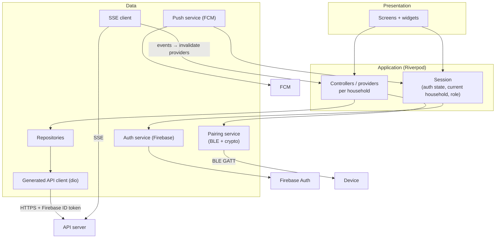
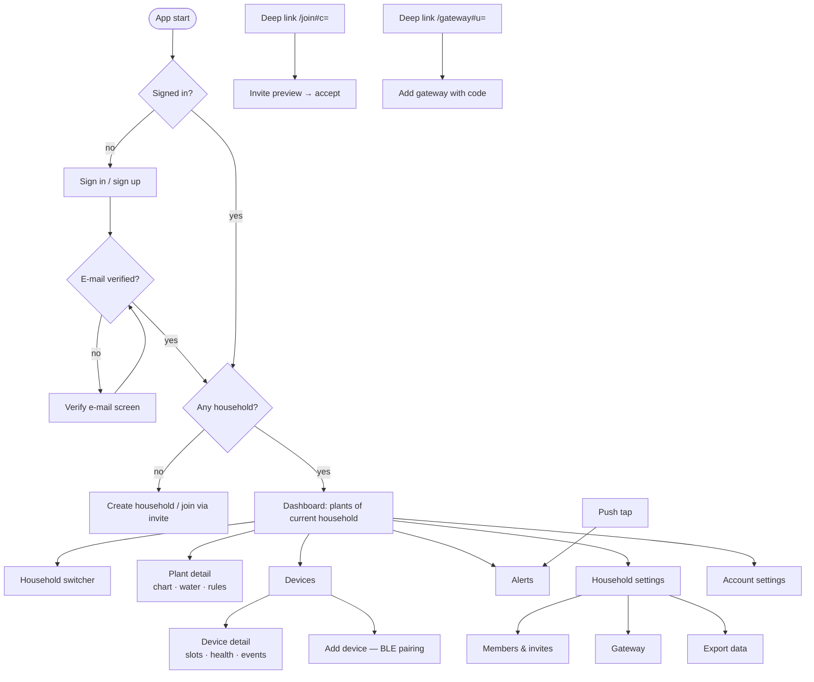
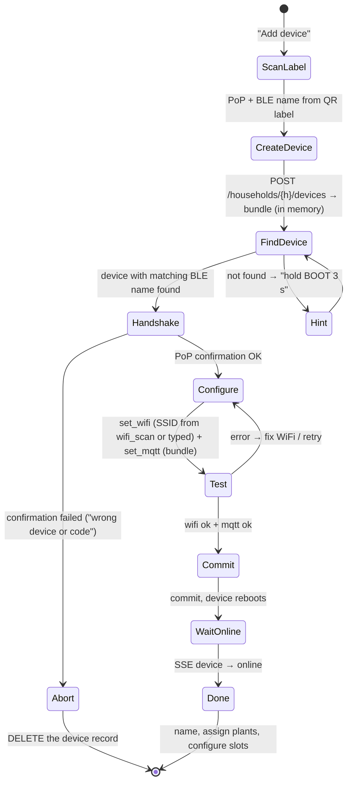

# Client App — Specification

**Status:** draft · **Last change:** 2026-09-29 (v2 architecture: API server + gateway, D33–D39)

The Flutter app is the only user interface of the system: Android, iOS and web from one codebase. It talks to **Firebase** (login, push) and to the central **API server** (everything else) — never to a gateway, a broker or the database (D39). **What** it is responsible for is defined in [`PROJECT.md`](../PROJECT.md) §4.6; this document describes **how** it is built.

Interfaces: API server REST/SSE → `contracts/api.yaml` (generated from the API server, [Api_Specs §6](../api/Api_Specs.md)); device pairing → [`contracts/ble.md`](../contracts/ble.md); login/push/hosting → [`firebase/Firebase_Specs.md`](../firebase/Firebase_Specs.md).

---

## 1. Platforms

| Platform | Minimum | Notes |
|---|---|---|
| Android | 8.0 (API 26) | Full feature set incl. BLE pairing |
| iOS | 15 | Full feature set incl. BLE pairing |
| Web | Current Chrome, Edge, Firefox, Safari (last 2 versions) | Served **only** from `https://app.<domain>` (Firebase Hosting). **No BLE pairing** — shows "use the mobile app". Push where the browser supports it. |

Phones first; tablets and desktop browsers get a two-pane layout on wide screens (§9).

---

## 2. Technology

| Concern | Choice | Notes |
|---|---|---|
| Framework | Flutter (stable channel), Dart 3 | |
| State management | **Riverpod** (`flutter_riverpod`; code generation planned — v1 uses hand-written providers) | Providers per household scope; easy invalidation on SSE events |
| Routing | `go_router` | Deep links `/join`, `/gateway`, notification taps |
| API client | Generated from `contracts/api.yaml` (`openapi-generator`, `dart-dio`) | Never hand-written; regenerated in CI when the spec changes |
| HTTP | `dio` with interceptors (auth, errors, app version) | |
| SSE | Own small client: `EventSource` on web, streamed `dio` response on mobile | Ticket-based (§6) |
| Firebase | `firebase_core`, `firebase_auth`, `firebase_messaging`, `firebase_app_check` (optional) | |
| Social login | `google_sign_in`, `sign_in_with_apple` | |
| BLE | `flutter_blue_plus` | Mobile only |
| Crypto (pairing) | `cryptography` | X25519, HKDF-SHA256, HMAC-SHA256, AES-GCM |
| QR scanning | `mobile_scanner` | PoP labels, gateway codes, invite QR codes |
| QR display | `qr_flutter` | Invite QR |
| Charts | `fl_chart` | |
| UI components / catalog | Material 3 + own `lib/ui/` layer; **Widgetbook** catalog | See [Design_System.md](Design_System.md) |
| i18n | `flutter_localizations` + ARB files | German + English from the start |
| Local prefs | `shared_preferences` | Last opened household, UI prefs only — no secrets |

---

## 3. Architecture



Rules:

- **Screens never call the API directly** — only through controllers → repositories.
- **All data is scoped to the current household.** Switching household disposes the household scope (providers, SSE stream) and creates a new one.
- **The API server is the authority.** The app hides or disables actions the user's role doesn't allow (§8), but never relies on that for security.
- **Generated models are used as-is** in repositories; small view models only where a screen needs derived data (e.g. "next expected wake").

---

## 4. Screens and navigation



| Screen | Content | Min. role for actions |
|---|---|---|
| **Sign in / sign up** | E-mail + password, Google, Apple (iOS). Password reset. | — |
| **Verify e-mail** | Resend, "I verified" re-check. Required before creating/joining households (Api_Specs §5.1). | — |
| **Household switcher** | `GET /me/households` with role badges; create household. | — |
| **Dashboard** | Plant cards: current moisture, trend, last reading age, battery, device state (online / sleeping / late / offline), pending commands. Banner "gateway offline since …" when the household's gateway is disconnected; empty state "add a gateway first" for households without one. | viewer |
| **Plant detail** | Chart (24 h / 7 d / 30 d / 1 y buckets), **Water now** (seconds picker within the pump's limits), command history, rules list + editor, rule executions ("why did / didn't it water?" — decided on the gateway). | water, rules: member |
| **Devices** | List with status, battery, RSSI, firmware, config sync state, adapter, "needs re-pairing". | viewer |
| **Device detail** | Slot editor (§10), wake interval, health chart, events, identify / service mode / reboot, re-pair, delete. | identify: member; rest: admin |
| **Add device** | BLE pairing wizard (§11). Mobile only. | admin |
| **Alerts** | Open/closed alerts, acknowledge. | ack: member |
| **Household settings** | Name, timezone, battery threshold; delete; transfer ownership. | owner |
| **Members & invites** | Members with roles; change role / remove; create invite → link + QR + share sheet; open invites with revoke. | admin (admins: owner) |
| **Gateway** | State (online / offline since, version + update notice, adapters, in sync, outbox depth, clock, LAN address + override), add gateway (§12), remove/replace gateway. | view: viewer; change: admin |
| **Export** | Start export, download ZIP (sensitive action). | owner |
| **Account settings** | Profile, notification permission, language, theme, MFA (TOTP), sign out, delete account. | — |

---

## 5. Authentication

- Firebase Auth: e-mail/password (verification required), Google, Apple (required on iOS whenever Google is offered).
- The **auth interceptor** adds `Authorization: Bearer <Firebase ID token>` (SDK handles refresh) to every API call.
- **Sensitive actions** (Api_Specs §5.3): when the API answers `401 reauth_required`, the app shows a re-authentication dialog (password or provider re-sign-in), then retries the original request once. For known sensitive actions the app asks *before* sending, to save a round trip.
- **Sign out:** remove the FCM token from the API (`DELETE /me/push-tokens/{token}`), sign out of Firebase, clear all household scopes.
- **Delete account:** call the API first (leave/transfer households — blocked with a clear message while the user is the sole owner of a shared household), then delete the Firebase account.

---

## 6. API access, errors and live updates

### 6.1 Requests

- Base URL per flavor (§14). Header `X-MC-App: <platform>/<version>`; the API may answer `426 Upgrade Required` → "please update the app" screen.
- Errors are RFC 9457 problem+json; the app maps the stable `type` to localized messages (`safety_limit`, `busy`, `gateway_offline`, `no_gateway`, `adapter_unsupported`, `config_rev_conflict`, `reauth_required`, …). Unknown types → generic message + `detail`.
- Network errors: GETs retried with backoff (max 3); writes never retried automatically except after re-auth.
- `409 config_rev_conflict` on the slot editor → reload and show "someone else changed this device's configuration".

### 6.2 Live updates (SSE)

1. When a household is opened: `POST /events/ticket` → `GET /households/{h}/stream?ticket=…`.
2. Each event invalidates the matching providers (`reading` → plant + dashboard, `command` → command lists, `device`, `config`, `plant`, `rule`, `alert`, `gateway`, `household` → members/settings); `resync` → invalidate the whole household scope.
3. Reconnect with exponential backoff (1 s → 30 s) and `Last-Event-ID`; a new ticket each time.
4. **Mobile lifecycle:** the stream is closed when the app goes to the background and reopened (with a refresh) on resume; background changes arrive as push notifications.

### 6.3 Offline

No offline cache in v1: without connectivity the app shows the last loaded data greyed out with "offline — showing data from HH:MM" and disables actions.

---

## 7. Asynchronous device actions in the UI

Devices sleep; nothing happens instantly (PROJECT rule 2). The UI makes that explicit:

- **Water now** → the command appears immediately as *Queued* with "device expected ~14:32" (from `next_expected_at`) and updates live: *Delivered / Running until … / Done / Failed (reason) / Expired / Cancelled*. A queued command can be cancelled ("best effort — may already have run").
- **Config changes** → device shows *Pending (rev 8)* until the device reports; *Rejected* shows the device's error (e.g. "GPIO 34 is input-only") with a button to revert the form to the reported config.
- **Gateway offline** → banner on all screens of that household ("gateway offline since 14:05 — data will arrive when it's back"); watering is still accepted with the warning "will be delivered when the gateway is back online"; devices are not marked offline meanwhile.
- **Late / offline devices** → status chip with "last seen 2 h ago".

---

## 8. Role-aware UI

The current role comes from `GET /me/households` (refreshed on `household` events). A single `can(action)` helper mirrors the matrix in [PROJECT.md §3.2](../PROJECT.md): actions the user can't perform are hidden (navigation entries) or disabled with a tooltip (buttons). If the role changes while a screen is open, the SSE `household` event refreshes it. A 403 from the API shows "your role no longer allows this" and refreshes the role.

---

## 9. Design

Component library, catalog and colour palette: [Design_System.md](Design_System.md).

- Material 3, light and dark theme (system default), one accent colour; moisture shown with a consistent colour scale (dry → wet) and always with the number (not colour alone).
- Responsive: single column < 600 dp; list + detail two-pane ≥ 840 dp (tablets, desktop web).
- Accessibility: semantic labels on all icon buttons and chart summaries, minimum touch target 48 dp, text scaling up to 200 % without clipping, contrast ≥ 4.5:1.
- Localization: German and English; dates, times and numbers via `intl`; household timezone used for everything shown about that household (rules, quiet hours, charts).

---

## 10. Slot configuration editor

- Loads `GET /households/{h}/devices/{d}/config` (desired, reported, sync state, detected modules, limits) and the board description `GET /meta/boards/{board}` (allowed pins per module type, reserved pins — served by the API from `core/`, so the app never duplicates pin rules).
- Per slot: module picker (from the contract's module list), pin picker filtered to valid pins for that module and not used by another slot, module options (calibration dry/wet, `active_high`, `max_run_s` ≤ hard limit, `min_pause_s`).
- **Detected modules** (I2C / 1-Wire auto-detect) are offered as one-tap suggestions.
- Calibration helper for moisture sensors: shows the live `raw` value from the latest reading; "sensor in air" → dry, "sensor in water" → wet (values arrive on the next wake).
- Save = `PUT …/config` with `base_rev`; validation errors (422) are shown on the affected slot.

---

## 11. Device pairing (BLE)

Implements [`contracts/ble.md`](../contracts/ble.md). Mobile only.



- **Permissions:** Android 12+: `BLUETOOTH_SCAN` (with `neverForLocation`) + `BLUETOOTH_CONNECT`; Android 8–11: location permission for scanning; iOS: `NSBluetoothAlwaysUsageDescription`. Asked at the start of the wizard with an explanation.
- **Secrets in memory only:** the PoP, the pairing bundle (device key) and the session keys are never persisted, logged or sent anywhere except over the encrypted BLE session; they are dropped when the wizard ends.
- **Gateway required:** the bundle points to the gateway's LAN address (reported by the gateway, overridable on the Gateway screen); if the household has no gateway or it is offline, `POST …/devices` fails with `no_gateway` / `gateway_offline` and the wizard says so before touching the device. The phone must be on the same Wi-Fi the device should use, not necessarily online at the gateway.
- **Re-pair** (gateway replaced or moved, `POST …/rekey`) uses the same wizard, starting at FindDevice with a new bundle.
- Test vectors for the handshake (shared with the firmware, to be added to ble.md) are part of the app's unit tests.

---

## 12. Gateway enrollment

Implements the app side of [contracts/gateway_api.md §3](../contracts/gateway_api.md).

- Entry points: Gateway screen → "Add gateway" (type the 8-character code) or scan the QR code shown by the gateway, or open the deep link `https://app.<domain>/gateway#u=<code>`. New households without a gateway show this as their first step.
- Sensitive action → re-authentication first, then `POST /households/{h}/gateway {user_code}`.
- The screen then follows the gateway via SSE: *enrolling → online → in sync*.
- Removing or replacing the gateway: confirmation dialog explaining that all devices need re-pairing afterwards; devices then show "needs re-pairing" with the re-pair wizard.
- Implemented in `lib/features/gateway/gateway_screen.dart` (route `/settings/gateway`, deep link `/gateway#u=<code>`), including adapters and outbox depth.

---

## 13. Invites and push

**Invites**

- Create: role + expiry → the app builds `https://app.<domain>/join#c=<code>`, shows it as QR (`qr_flutter`) and offers the platform share sheet. The code is shown only once.
- Join: the deep link opens the app (App Links / Universal Links) or the web app; if not signed in → sign in / sign up first, keep the code in memory; then preview (`GET /invites/{code}`) → explicit "Join" (`POST …/accept`) → switch to the new household.

**Push**

- Ask for notification permission after the user has at least one household (not on first launch).
- Register the FCM token with `PUT /me/push-tokens/{token}` after sign-in and on token refresh; remove on sign-out.
- Notification payload contains `household_id` and `alert_id`; tapping opens that household's alert. Foreground messages are shown as an in-app banner.
- Web: FCM service worker on the official origin; the permission prompt is offered from account settings only.

---

## 14. Flavors, build and release

| Flavor | Firebase project | API | Purpose |
|---|---|---|---|
| `dev` | dev project | `https://api.<domain>` of the Raspberry Pi phase (or a local API stack) | Development, internal testing |
| `prod` | prod project | production API | Store + official web origin |

- Config via `--dart-define-from-file` per flavor (API URL, web origin); Firebase options via FlutterFire CLI per flavor.
- CI (on every PR): `dart format --set-exit-if-changed`, `flutter analyze`, unit + widget tests, API client regeneration check against `contracts/api.yaml`.
- Web release: `flutter build web --release` → `firebase deploy --only hosting` ([Firebase_Specs §5](../firebase/Firebase_Specs.md)).
- Mobile release: Play Store internal testing track / TestFlight first; store listing and privacy labels (data collected: e-mail, sensor data linked to account).
- Versioning: semantic version + build number; the API's minimum supported app version is enforced via `426` (§6.1).

---

## 15. Code layout

```
app/
├── App_Specs.md
├── pubspec.yaml
├── lib/
│   ├── main_dev.dart · main_prod.dart
│   ├── app/                 # router, theme, localization setup
│   ├── ui/                  # shared components (Design_System.md §4)
│   ├── core/                # session, can(), error mapping, formatting
│   ├── data/
│   │   ├── api/             # generated client (do not edit) + interceptors
│   │   ├── live/            # SSE client
│   │   ├── pairing/         # BLE transport + ble.md protocol + crypto
│   │   ├── push/            # FCM
│   │   └── repositories/
│   └── features/
│       ├── auth/ · households/ · dashboard/ · plants/ · rules/
│       ├── devices/ · pairing/ · gateway/ · members/ · alerts/
│       └── settings/ · export/
├── l10n/                    # app_de.arb, app_en.arb
└── test/                    # unit, widget, pairing test vectors
```

---

## 16. Testing

| Level | What |
|---|---|
| Unit | Controllers (with fake repositories), `can()` against the role matrix, error mapping, SSE reconnect/resync logic, pairing crypto against shared test vectors, pairing state machine with a fake BLE transport. |
| Widget | Key screens in each role (viewer sees no water button, …), pending/queued command states, gateway-offline banner, slot editor validation. |
| Integration | Against a local API stack + a gateway + `fake_device.py` (from `gateway/tools`): sign in (Firebase Auth emulator), create household, add simulated device data, water → queued → done, invite + join with a second account. |
| Manual | BLE pairing with real hardware on Android and iOS before each release. |

---

## 17. Milestones (app part)

| # | App work |
|---|---|
| **M1** | Project setup, flavors, generated client, one screen: plant list + chart for the fixed household. |
| **M2** | Water now, command states, SSE. |
| **M3** | Device list, battery / last seen / late / offline states. |
| **M4** | Slot editor, config sync states. |
| **M5** | Rule editor, rule executions, alerts, push. |
| **M6** | Firebase login, household switcher, members & invites, deep links, re-auth, gateway screen + enrollment, re-pair flow, BLE pairing wizard, account deletion. |
| **M7** | More device types from new gateway adapters. |

---

## 18. Open points

- **Offline cache** of the last loaded data (e.g. `drift`/`hive`) — v1 shows only what was loaded in the current session.
- **Home-screen widgets** (Android/iOS) for "plants that need attention".
- **Notification preferences** per household / alert kind (needs API support, Api_Specs §17).
- **Onboarding tutorial** for first-time users (flashing + label printing is a maker step; later a pre-flashed device could skip it).
