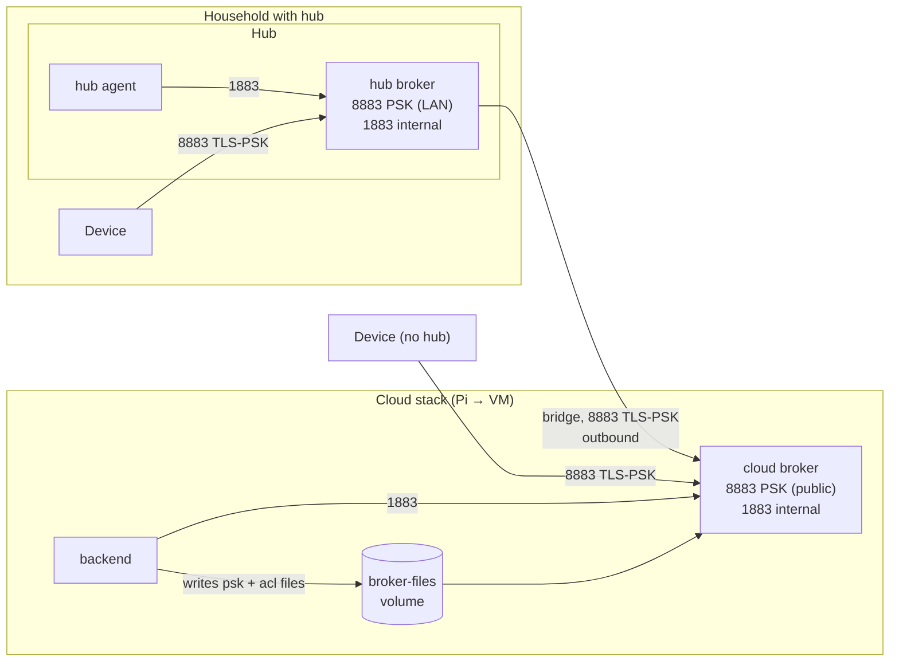
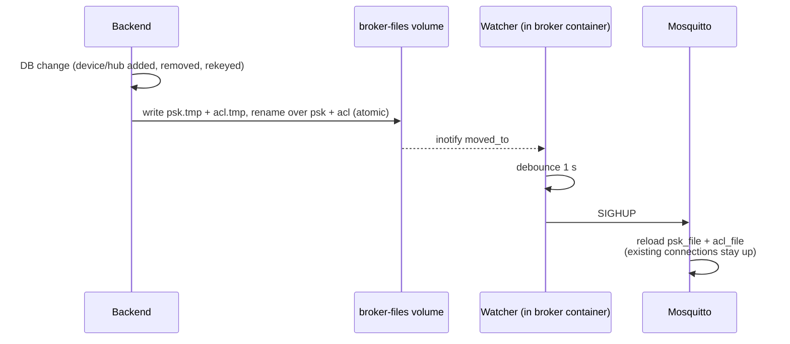

# MQTT Brokers — Specification

**Status:** draft · **Last change:** 2026-09-28

Configuration of the two Mosquitto deployments: the **cloud broker** (part of the cloud stack — on the Raspberry Pi in phase 1, on a cloud VM later, PROJECT D32) and the **hub broker** (on each optional home hub). No own broker code — only configuration, a small container image with a reload watcher, and files generated by the backend or the hub agent.

Wire formats: [`contracts/mqtt.md`](../contracts/mqtt.md) (devices), [`contracts/hub.md`](../contracts/hub.md) (hubs). Who generates which file: [`server/Server_Specs.md`](../server/Server_Specs.md) §10.3, [`hub/Hub_Specs.md`](../hub/Hub_Specs.md) §4.

---

## 1. Overview



| | Cloud broker | Hub broker |
|---|---|---|
| Clients on 8883 (TLS-PSK) | Devices without hub, hub bridges | The household's devices |
| Clients on 1883 (internal, password) | Backend (`mc-backend`) | Hub agent (`mc-agent`) |
| PSK file written by | Backend (from the DB) | Hub agent (from `down/keys`) |
| ACL file | Generated by the backend (device patterns + one block per hub) | Static (device patterns only) |
| Bridge | — | To the cloud broker, config generated by the agent |
| Exposure | Phase 1: LAN (+ optional port forward of 8883). Phase 2: public 8883 | LAN only |

**Version:** Mosquitto 2.x, official `eclipse-mosquitto` image, pinned by digest, multi-arch (arm64 + amd64).

---

## 2. Common settings (both brokers)

```conf
per_listener_settings true

persistence true
persistence_location /mosquitto/data/
autosave_interval 60

max_queued_messages 100000
max_inflight_messages 20
max_packet_size 262144           # 256 KB: hub snapshots (hub.md §5)
persistent_client_expiration 30d
max_keepalive 120
allow_zero_length_clientid false
retain_available true

log_dest stdout
log_type error
log_type warning
log_type notice
connection_messages true
log_timestamp_format %Y-%m-%dT%H:%M:%S
```

- **Persistence** is mandatory: it keeps queued commands for sleeping devices and the hub's bridge queue across restarts. Mosquitto writes it on shutdown and every 60 s, so a *crash* can lose up to 60 s of queued messages — acceptable (devices re-send telemetry with new `seq`; commands expire and can be re-issued).
- `max_queued_messages 100000` per client: covers a hub offline for weeks and the backend being down for hours.
- `persistent_client_expiration 30d`: sessions of devices/hubs that never come back are cleaned up. Devices re-subscribe on every connect (mqtt.md §3), so an expired session only loses expired commands.

### 2.1 TLS-PSK listener (8883)

```conf
listener 8883
protocol mqtt
psk_hint mc
psk_file <generated psk file>
use_identity_as_username true
tls_version tlsv1.2
ciphers PSK-AES128-GCM-SHA256
allow_anonymous false
acl_file <acl file>
max_connections 5000             # hub broker: 200
```

- **PSK file format:** one line per client, `identity:hexkey` (64 hex chars = 32 bytes). Identity = device ID (`mc-…`) or hub ID (`hub-…`).
- `use_identity_as_username`: the PSK identity becomes the MQTT username, which the ACL patterns use (`%u`). Clients send no username/password.
- A client whose identity is not in the file fails the TLS handshake — it never reaches MQTT.
- Only one cipher suite, TLS 1.2 (mqtt.md §2). No certificates.

### 2.2 Internal listener (1883)

```conf
listener 1883
protocol mqtt
allow_anonymous false
password_file /mosquitto/config/passwd
# no acl_file → authenticated clients on this listener have full access
```

- Only reachable on the container network (port not published). One user: `mc-backend` (cloud) or `mc-agent` (hub); password from a secret file, hashed into `passwd` at container start.
- No ACL on purpose: the backend and the agent need wildcard subscriptions (`mc/v1/+/#`), and they are fully trusted components of the same stack.

### 2.3 Device ACL patterns

Identical on both brokers:

```conf
pattern write mc/v1/%u/status
pattern write mc/v1/%u/telemetry
pattern write mc/v1/%u/event
pattern write mc/v1/%u/cmd/ack
pattern write mc/v1/%u/config/state
pattern read  mc/v1/%u/cmd
pattern read  mc/v1/%u/config/desired
```

Devices only ever subscribe to their two exact topics (no wildcards), so the patterns cover both the subscribe check and message delivery. The Last Will on `mc/v1/<id>/status` is covered by the `write` pattern.

---

## 3. Cloud broker

### 3.1 Files

| File | Owner | Content |
|---|---|---|
| `/mosquitto/config/mosquitto.conf` | repo (`broker/cloud/mosquitto.conf`) | §2 + both listeners |
| `/mosquitto/config/passwd` | generated at container start from the `mc-backend` secret | internal listener |
| `/broker-files/psk` | **backend** | all direct devices + all hubs |
| `/broker-files/acl` | **backend** | §2.3 patterns + one block per hub (§3.2) |

`/broker-files` is a volume shared between the backend (read-write) and the broker (read-only). Both containers run with group `mcbroker` (gid 1883); files are written with mode `0640`.

### 3.2 Hub blocks in the ACL

Generated per hub from the DB ([contracts/hub.md §6](../contracts/hub.md)) — **exact topics only, no wildcards in `read` rules**, so a hub can never subscribe to another household's topics:

```conf
user hub-4k9m2x7q1v8w3h5t
topic write mc/v1/mc-8f3kq2v7xw1m9hzt/status
topic write mc/v1/mc-8f3kq2v7xw1m9hzt/telemetry
topic write mc/v1/mc-8f3kq2v7xw1m9hzt/event
topic write mc/v1/mc-8f3kq2v7xw1m9hzt/cmd/ack
topic write mc/v1/mc-8f3kq2v7xw1m9hzt/config/state
topic read  mc/v1/mc-8f3kq2v7xw1m9hzt/cmd
topic read  mc/v1/mc-8f3kq2v7xw1m9hzt/config/desired
# … repeated for every device of the household …
topic write mc/hub/v1/hub-4k9m2x7q1v8w3h5t/up/#
topic read  mc/hub/v1/hub-4k9m2x7q1v8w3h5t/down/snapshot
topic read  mc/hub/v1/hub-4k9m2x7q1v8w3h5t/down/keys
```

`write` rules may use `#` (checked against each concrete published topic). The device patterns of §2.3 also apply to hub users but only ever match `mc/v1/hub-…/…`, which no device uses — harmless.

### 3.3 Reload



- New keys and ACLs apply to new connections immediately; ACL changes also apply to existing connections at the next publish/delivery check.
- A **removed** device or hub keeps an already open connection until it disconnects. Devices disconnect every wake anyway; for a removed hub the backend additionally clears its retained `down/*` topics and the hub's ACL block is gone, so nothing flows in either direction.
- The backend regenerates both files at startup, so they never drift from the DB.

### 3.4 Phases (PROJECT D32)

| | Phase 1: Raspberry Pi | Phase 2: cloud VM |
|---|---|---|
| 8883 | Published on the Pi's LAN IP; `mqtt.<domain>` → LAN IP. Optional router port forward of 8883 only (PSK-only, nothing else) to test devices away from home | Public, `mqtt.<domain>` → VM |
| Dev listener | During M1–M2 (before the firmware has TLS-PSK): extra `listener 1884` with `password_file`, LAN only. **Removed in M3.** | none |
| Connection protection | — | Host firewall: new-connection rate limit on 8883 per source IP (nftables `limit rate 20/minute burst 40`); fail2ban on repeated PSK handshake failures in the broker log |

---

## 4. Hub broker

### 4.1 Files

| File | Owner | Content |
|---|---|---|
| `/mosquitto/config/mosquitto.conf` | repo (`broker/hub/mosquitto.conf`) | §2 + both listeners + `include_dir /data/broker/conf.d` |
| `/mosquitto/config/acl` | repo (`broker/hub/acl`) | §2.3 patterns only (static) |
| `/mosquitto/config/passwd` | generated at start from the `mc-agent` secret | internal listener |
| `/data/broker/psk` | **hub agent** | the household's devices, from `down/keys` |
| `/data/broker/conf.d/bridge.conf` | **hub agent** | bridge to the cloud (§4.2) |

The LAN listener binds to the host's LAN interface (the hub compose publishes `8883` on the LAN IP only). Until the hub is enrolled and has received its first key set, the PSK file is empty — no device can connect.

### 4.2 Bridge

Generated by the agent after enrollment and whenever the household's device list changes:

```conf
connection cloud
address mqtt.example.com:8883
bridge_protocol_version mqttv311
bridge_identity hub-4k9m2x7q1v8w3h5t
bridge_psk <64 hex chars>
bridge_tls_version tlsv1.2
remote_clientid hub-4k9m2x7q1v8w3h5t
local_clientid bridge-cloud
cleansession false
try_private true
start_type automatic
restart_timeout 5 60
keepalive_interval 60
notifications true
notification_topic mc/hub/v1/hub-4k9m2x7q1v8w3h5t/up/bridge

# device → cloud (local wildcard subscriptions are fine; the cloud checks every
# published topic against the hub's ACL)
topic mc/v1/+/status out 1
topic mc/v1/+/telemetry out 1
topic mc/v1/+/event out 1
topic mc/v1/+/cmd/ack out 1
topic mc/v1/+/config/state out 1
topic mc/hub/v1/hub-4k9m2x7q1v8w3h5t/up/# out 1

# cloud → hub: exact topics only (they are subscriptions on the cloud broker)
topic mc/hub/v1/hub-4k9m2x7q1v8w3h5t/down/snapshot in 1
topic mc/hub/v1/hub-4k9m2x7q1v8w3h5t/down/keys in 1
topic mc/v1/mc-8f3kq2v7xw1m9hzt/cmd in 1
topic mc/v1/mc-8f3kq2v7xw1m9hzt/config/desired in 1
# … one pair per device of the household …
```

- `in` and `out` topic sets are disjoint, so nothing loops; `try_private` additionally marks the bridge connection for the cloud Mosquitto.
- Commands created by the hub's rules are published locally on `mc/v1/<dev>/cmd`, which is not an `out` topic — they never go to the cloud as commands (the agent reports them via `up/cmd`, hub.md §5.5).
- With `notifications true`, Mosquitto publishes `1` on connect and registers `0` as the bridge's Last Will on the cloud broker.

### 4.3 Reload and restart

| Change | Action by the watcher |
|---|---|
| `psk` rewritten (device key added/removed/rekeyed) | `SIGHUP` — reload, connections stay up |
| `bridge.conf` rewritten (enrollment, device added/removed) | **Restart** Mosquitto (bridge settings are not reloadable): the watcher sends `SIGTERM`, persistence is written, the container exits and Docker restarts it (`restart: unless-stopped`). ~2 s outage; sleeping devices don't notice, queues survive in persistence. |

The agent never gets access to the Docker socket; restarts happen from inside the broker container.

---

## 5. Container image

`broker/Dockerfile`: `eclipse-mosquitto:2` (pinned digest) + `inotify-tools` + `broker/entrypoint.sh`:

1. Generate `passwd` from the secret file (`mosquitto_passwd -b`).
2. Start `mosquitto -c /mosquitto/config/mosquitto.conf` in the background.
3. Watch the generated-files directory (`close_write`, `moved_to`), debounce 1 s, then `SIGHUP` or `SIGTERM` per §3.3 / §4.3.
4. Forward `SIGTERM` from Docker to Mosquitto so persistence is saved on shutdown.

Runs as the `mosquitto` user (uid 1883) with group `mcbroker`, read-only root filesystem, only the config/data volumes writable. Same image for cloud and hub; the mounted `mosquitto.conf` decides the role.

---

## 6. Layout

```
broker/
├── Broker_Specs.md
├── Dockerfile
├── entrypoint.sh
├── cloud/
│   ├── mosquitto.conf
│   └── mosquitto.dev.conf     # phase 1, M1–M2 only: adds the plain 1884 listener
└── hub/
    ├── mosquitto.conf
    └── acl
```

The compose files (`server/docker-compose.yml`, `hub/docker-compose.yml`) reference this image and these configs.

---

## 7. Things to verify early (spike in M3)

These are behaviours the design relies on; each gets an automated test in the broker integration suite:

1. The pinned `eclipse-mosquitto` image supports TLS-PSK on listeners **and** for bridges (`bridge_identity` / `bridge_psk`) with OpenSSL 3 and `PSK-AES128-GCM-SHA256`.
2. `SIGHUP` reloads `psk_file` and `acl_file` with `per_listener_settings true`, without dropping connections.
3. A hub user with the §3.2 ACL: subscribing to another device's `cmd` is refused; publishing another household's telemetry is dropped; wildcard subscribe `mc/v1/+/cmd` is refused.
4. Bridge queueing: with the cloud unreachable, 10 000 device messages queue on the hub and all arrive in order after reconnect, including across a hub broker restart.
5. The ESP32 (Zephyr + Mbed TLS) completes a TLS-PSK handshake with Mosquitto; measure handshake time and total wake time vs. plain TCP.

If (1) or (2) fails, fallback: the Mosquitto dynamic-security plugin for ACLs, or restart instead of reload.

---

## 8. Open points

- **Hub bridge key rotation** (also listed in Hub_Specs).
- **Monitoring:** expose `$SYS` metrics (connected clients, dropped messages, queue sizes) via the backend's admin health endpoint.
- **High availability** of the cloud broker — not needed at this scale; one instance with persistence and backups.
