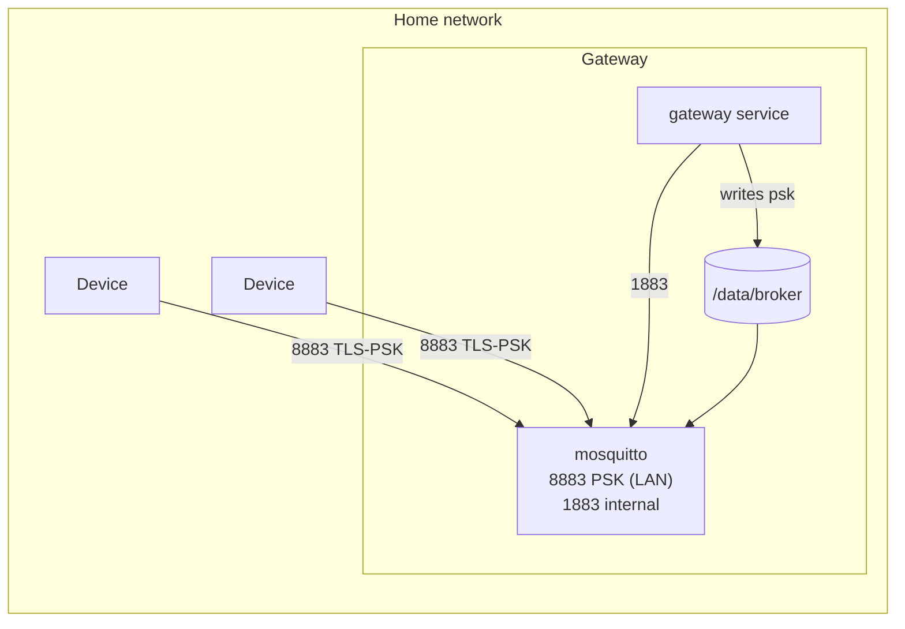
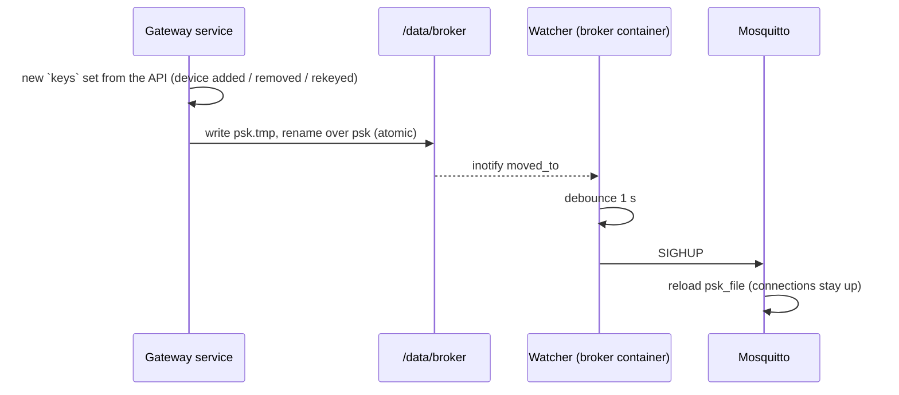

# MQTT Broker — Specification

**Status:** draft · **Last change:** 2026-09-29 (D33: gateway broker only — no cloud broker, no bridge)

Configuration of the **Mosquitto broker inside each gateway**. It serves the `esp32-mqtt` adapter (and later possibly Zigbee2MQTT / a LoRaWAN network server on the internal listener). No own broker code — only configuration, a small container image with a reload watcher, and the PSK file written by the gateway service from the keys the API sends.

Wire format: [`contracts/mqtt.md`](../contracts/mqtt.md). Who writes which file: [`gateway/Gateway_Specs.md`](../gateway/Gateway_Specs.md) §5.2.

---

## 1. Overview



| | Gateway broker |
|---|---|
| Clients on 8883 (TLS-PSK) | The household's devices |
| Clients on 1883 (internal, password) | The gateway service (`mc-gateway`) |
| PSK file | Written by the gateway service from the `keys` set the API sends ([gateway_api.md §6.2](../contracts/gateway_api.md)) |
| ACL file | Static (device patterns + the internal user) |
| Exposure | LAN only; never port-forwarded |

**Version:** Mosquitto 2.x, official `eclipse-mosquitto` image, pinned, multi-arch (arm64 + amd64).

---

## 2. Settings

```conf
# Global security settings on purpose: with `per_listener_settings true`
# Mosquitto can't ACL-check messages for *disconnected* clients and drops
# them instead of queueing — sleeping devices would never get commands.
per_listener_settings false

allow_anonymous false
allow_zero_length_clientid false
psk_file /data/broker/psk                 # devices, written by the gateway service
password_file /mosquitto/data/passwd      # internal user, hashed at container start
acl_file /mosquitto/config/acl            # static, §2.3

persistence true
persistence_location /mosquitto/data/
autosave_interval 60

max_queued_messages 100000                # per client — mainly the gateway service while it restarts
max_inflight_messages 20
max_packet_size 16384
persistent_client_expiration 30d
max_keepalive 120
retain_available true

log_dest stdout
log_type error
log_type warning
log_type notice
connection_messages true
log_timestamp_format %Y-%m-%dT%H:%M:%S

# Devices, LAN only (compose publishes 8883 on the LAN address).
listener 8883
protocol mqtt
psk_hint mc
use_identity_as_username true
tls_version tlsv1.2
ciphers PSK-AES128-GCM-SHA256
max_connections 200

# Gateway service, container network only (not published).
listener 1883
protocol mqtt
```

- **Global security settings (`per_listener_settings false`)** — found in the first end-to-end test (2026-09-29): with per-listener settings, messages for sleeping devices were dropped instead of queued. PSK clients can't authenticate by password and vice versa, since the PSK identity always becomes the username on 8883.
- **Persistence** keeps queued commands for sleeping devices across broker restarts. A crash can lose up to 60 s of queued messages — acceptable (commands expire and can be re-issued).
- `max_queued_messages 100000` per client: devices never have more than a few pending commands, but the gateway service's own session queues all telemetry while it restarts or is updated (days of data for a typical household).
- `max_packet_size 16384`: device messages are ≤ 2 KB (mqtt.md §9); snapshots now travel over the gateway WebSocket, not MQTT.

### 2.1 TLS-PSK listener (8883)

- **PSK file format:** one line per device, `identity:hexkey` (64 hex chars = 32 bytes). Identity = device ID (`mc-…`).
- `use_identity_as_username`: the PSK identity becomes the MQTT username, which the ACL patterns use (`%u`). Devices send no username/password.
- A client whose identity is not in the file fails the TLS handshake — it never reaches MQTT. Until the first device is added the file is empty.
- One cipher suite, TLS 1.2 (mqtt.md §2). No certificates.

### 2.2 Internal listener (1883)

- Only reachable on the container network. One user: `mc-gateway`; its password is generated by the gateway service on first start (`/data/secrets`) and hashed into `passwd` at container start.

### 2.3 ACL (static)

```conf
pattern write mc/v1/%u/status
pattern write mc/v1/%u/telemetry
pattern write mc/v1/%u/event
pattern write mc/v1/%u/cmd/ack
pattern write mc/v1/%u/config/state
pattern read  mc/v1/%u/cmd
pattern read  mc/v1/%u/config/desired

user mc-gateway
topic readwrite mc/#
```

Devices only ever subscribe to their two exact topics, so the patterns cover the subscribe check and message delivery. The Last Will on `mc/v1/<id>/status` is covered by the `write` pattern.

---

## 3. Reload



- New keys apply to new connections immediately. A removed device keeps an open connection until it disconnects — devices disconnect every wake anyway, and the gateway service clears the removed device's retained topics.
- The gateway service rewrites the PSK file at startup from its last applied key set, so it never drifts from what the API sent.

---

## 4. Container image

`broker/Dockerfile`: `eclipse-mosquitto:2` (pinned) + `inotify-tools` + `broker/entrypoint.sh`:

1. Generate `passwd` from the secret file (`mosquitto_passwd -b`, needs a writable `/tmp`).
2. Wait until the gateway service has created `/data/broker/psk`.
3. Start `mosquitto -c /mosquitto/config/mosquitto.conf` in the background.
4. Watch `/data/broker` (`close_write`, `moved_to`), debounce 1 s, `SIGHUP`.
5. Forward `SIGTERM` from Docker to Mosquitto so persistence is saved on shutdown.

Runs as the `mosquitto` user (uid 1883, group `mcbroker`), read-only root filesystem with a tmpfs on `/tmp`, only the data volume writable. The gateway service writes the PSK file with mode `0640` and group `mcbroker`.

---

## 5. Layout

```
broker/
├── Broker_Specs.md
├── Dockerfile
├── entrypoint.sh
└── gateway/
    ├── mosquitto.conf
    └── acl
```

The former `broker/cloud/` configuration is removed with D33.

---

## 6. Things to verify early

1. The pinned image supports TLS-PSK listeners with OpenSSL 3 and `PSK-AES128-GCM-SHA256` — ✔ verified 2026-09-29 with the device simulator.
2. `SIGHUP` reloads `psk_file` with global security settings without dropping connections — ✔ observed; add an automated test.
3. Queueing for sleeping devices across a broker restart (persistence) — test in the gateway integration suite.
4. The ESP32 (Zephyr + Mbed TLS) completes a TLS-PSK handshake with Mosquitto; measure handshake and total wake time vs. plain TCP.

---

## 7. Open points

- **Monitoring:** report `$SYS` metrics (connected clients, dropped messages, queue sizes) in `gateway_state`.
