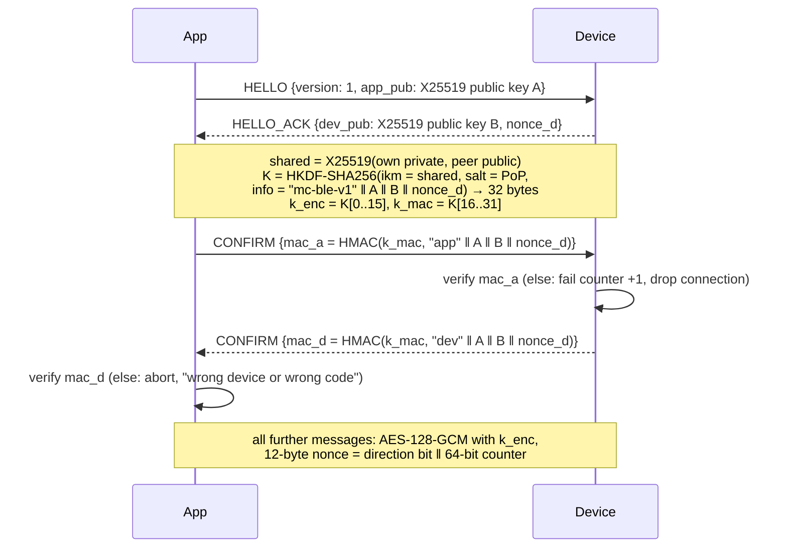
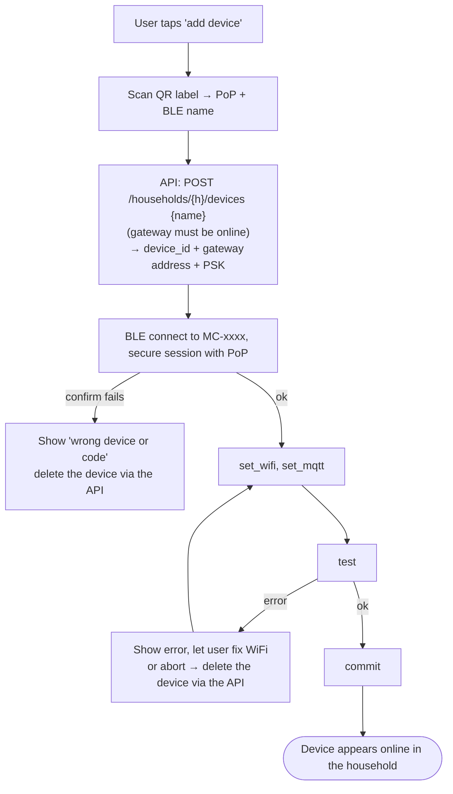

# BLE Pairing Contract — App ↔ Device

**Version:** v1 · **Status:** reference implementation in `core/src/mc_core/ble.py`, firmware in `firmware/src/core/mc_ble*.c`, both checked against `contracts/ble_vectors.json`; app pending · **Last change:** 2026-09-30 (wire format, UUIDs, error codes)

How the Flutter app hands WiFi and gateway broker credentials to an ESP32 plant device over Bluetooth Low Energy, and how this is protected against a neighbour taking over or eavesdropping on the device. Firmware and app both implement this document.

Context: [`PROJECT.md`](../PROJECT.md) §3.8, [`contracts/mqtt.md`](mqtt.md) §2.

---

## 1. Threats this protects against

| Threat | Protection |
|---|---|
| Someone in BLE range pairs the device before the owner, or re-pairs it later and moves it to their own household | Pairing needs the device's **proof-of-possession code (PoP)** from its label, *and* the device only listens for pairing on first boot or after a **button press** (§3). |
| Someone sniffs the WiFi password or the device's MQTT key over the air | All payloads are encrypted with a session key derived from an ECDH exchange **authenticated by the PoP** (§4). BLE link-layer pairing is not relied on. |
| Man-in-the-middle between app and device | The MITM does not know the PoP, so it cannot compute a matching session key; the key confirmation fails on both sides. |
| Guessing the PoP online | 128-bit PoP, and the device closes the pairing window after 5 failed handshakes. |
| Squatting a device ID | Device IDs are random and assigned by the API server (mqtt.md §2), not derived from the MAC. |

Out of scope: an attacker with physical access **and** the label. Physical access is treated as ownership.

---

## 2. Proof-of-possession code (PoP)

- 16 random bytes, generated **when the device is flashed** by `firmware/tools/make_label.py`, written to a dedicated NVS "factory" partition, never changed by a factory reset.
- Printed on a label on the device as a QR code: `MCPOP1:<ble-name>:<pop-base32>` (e.g. `MCPOP1:MC-3F9A:K7Q2…`), plus the base32 text for manual entry.
- Recoverable only via the USB console (`mc pop show`) — i.e. again with physical access.
- Never sent over BLE, never sent to the gateway or the API server.

---

## 3. When the device accepts pairing

| Situation | Pairing window |
|---|---|
| Unprovisioned (first boot, or after factory reset) | Advertises on every boot until provisioned. Window closes after 10 min without a successful pairing and reopens on the next boot / wake. |
| Provisioned | **Only** after the BOOT button is held for **3 s** → *maintenance mode*: device stays awake, BLE window open for **5 min**, LED pattern shows it. |
| Factory reset | BOOT held for **10 s** → WiFi, broker credentials, device ID and slot config are wiped (PoP stays). Device is unprovisioned again. |
| 5 failed handshakes in one window | Window closes immediately; needs a new button press (or reboot if unprovisioned). |

There is no way to open the pairing window remotely (no MQTT command, no BLE command).

Advertised name: `MC-` + last 4 hex digits of the BLE MAC — only for picking the right device in a list, not an identity.

---

## 4. Secure session

All crypto primitives are available in Zephyr (PSA Crypto / Mbed TLS) and in Dart (`cryptography` package).

- Fresh key pairs on both sides for every session (no static device key needed).
- Both sides reject any counter that is not exactly previous + 1 (no replay, no reordering).
- Session ends on disconnect; nothing from it is reused.

---

## 5. Messages inside the session

GATT: one custom service, one write characteristic (app → device) and one notify characteristic (device → app); exact UUIDs, framing and encodings in §7. Messages are JSON, at most 1024 bytes.

| Request (app → device) | Response | Meaning |
|---|---|---|
| `info` | `{hw_mac, fw, provisioned, device_id?}` | What is this device. |
| `wifi_scan` | `{networks: [{ssid, rssi, secure}]}` | Optional, helps the user pick the network. |
| `set_wifi` `{ssid, password}` | `{ok}` | Stored in RAM only until `commit`. |
| `set_mqtt` `{device_id, host, port, psk}` | `{ok}` | Pairing bundle from the API server (Api_Specs §8.1): the gateway's broker address on the LAN and the 32-byte TLS-PSK key (hex), which the API has already installed on the gateway. RAM only until `commit`. |
| `test` | `{wifi: ok/err, mqtt: ok/err, detail}` | Device joins WiFi and connects to the gateway's broker with the new settings (TLS-PSK), publishes `status online`, disconnects. |
| `commit` | `{ok}` | Persist everything to NVS, close BLE, reboot into normal operation. |
| `abort` | `{ok}` | Discard, stay in the previous state. |

`device_id` and `psk` sent in `set_mqtt` replace any previous ones — this is how a device moves to a new gateway address, a replaced gateway or another household.

---

## 6. App flow

---

## 7. Wire format

### 7.1 GATT

| | UUID | Properties |
|---|---|---|
| Service | `6d630001-8a3f-4b6e-9d2c-7f1e5a9b0c01` | advertised in the scan response |
| RX (app → device) | `6d630002-8a3f-4b6e-9d2c-7f1e5a9b0c01` | write (with response) |
| TX (device → app) | `6d630003-8a3f-4b6e-9d2c-7f1e5a9b0c01` | notify |

Advertising: connectable, local name `MC-XXXX` (§3), the service UUID. The app subscribes to TX before sending anything.

### 7.2 Framing

The byte stream in each direction is a sequence of **frames**: `length` (2 bytes, big endian) followed by `length` bytes of body. A frame is cut into chunks of at most `ATT_MTU − 3` bytes, one write / notification each; the receiver concatenates until a frame is complete. Bodies are at most 1024 + 16 bytes; a longer frame closes the connection.

### 7.3 Handshake frames (plaintext JSON, UTF-8)

Binary values are standard base64 with padding.

| Frame | Direction | Body |
|---|---|---|
| HELLO | app → device | `{"t":"hello","v":1,"pub":"<A, 32 bytes>"}` |
| HELLO_ACK | device → app | `{"t":"hello_ack","pub":"<B, 32 bytes>","nonce":"<nonce_d, 16 bytes>"}` |
| CONFIRM | app → device | `{"t":"confirm","mac":"<mac_a, 32 bytes>"}` |
| CONFIRM | device → app | `{"t":"confirm","mac":"<mac_d, 32 bytes>"}` |

An unsupported `v` is answered with a `{"t":"error","error":"unsupported_version"}` frame and a disconnect. `A`, `B` are raw X25519 public keys (32 bytes, RFC 7748). The key schedule is exactly §4: `HKDF-SHA256` with `salt` = the 16 raw PoP bytes, `info` = the ASCII bytes `mc-ble-v1` followed by `A`, `B` and `nonce_d` (32 + 32 + 16 bytes), 32 output bytes; `mac_a` / `mac_d` are the full 32-byte HMAC-SHA256 over `"app"` / `"dev"` followed by `A ‖ B ‖ nonce_d`. A device that does not receive a valid CONFIRM within 10 s of the HELLO drops the connection (counts as a failed handshake).

### 7.4 Encrypted frames

After both CONFIRM frames every frame body is `ciphertext ‖ tag` (AES-128-GCM, 16-byte tag, no associated data) of one JSON message. The 12-byte nonce is `direction` (1 byte: `0x00` app → device, `0x01` device → app), three zero bytes, then the 64-bit big-endian message counter of that direction. Both counters start at 0 and go up by one per frame; a frame whose tag does not verify, or which is not the next in sequence (the nonce is implied by the receiver's counter, so replays and reordering simply fail), closes the session.

### 7.5 Messages

Requests are `{"id": <int>, "op": "<name>", …}`; every request gets exactly one response `{"id": <same>, "ok": true, …}` or `{"id": <same>, "ok": false, "error": "<code>", "detail": "<text>"}`. One request at a time.

| `op` | Request fields | Response fields |
|---|---|---|
| `info` | – | `hw_mac` (string, `AA:BB:…`), `fw` (semver), `provisioned` (bool), `device_id` (only if provisioned) |
| `wifi_scan` | – | `networks`: up to 16 × `{ssid, rssi, secure}` (strongest first, 2.4 GHz) |
| `set_wifi` | `ssid` (1–32 bytes), `password` (0–64 bytes; empty = open network) | – |
| `set_mqtt` | `device_id` (`mc-…`), `host` (≤ 63 chars), `port` (1–65535), `psk` (64 hex chars) | – |
| `test` | – | `wifi` (`"ok"` \| `"err"`), `mqtt` (`"ok"` \| `"err"`), `detail` |
| `commit` | – | – (the device persists, closes BLE and restarts 1 s after sending the response) |
| `abort` | – | – (RAM settings dropped; the session stays open) |

Error codes: `bad_request` (malformed / missing field / out of range), `unknown_op`, `not_ready` (`test` or `commit` before both `set_wifi` and `set_mqtt`), `busy` (a `test` is running), `failed` (`test` could not run at all), `too_large`.

`set_wifi` / `set_mqtt` answer `ok` right away and only touch RAM. `test` blocks until it is done (up to ~40 s: WiFi join, TLS-PSK handshake, publish); the app shows a spinner and must not send anything meanwhile.

### 7.6 Label

`MCPOP1:<ble-name>:<pop>` with `<pop>` the 16 PoP bytes in Crockford base32 (26 characters, no padding), e.g. `MCPOP1:MC-3F9A:000G40R40M30E209185GR38E1W`. The app's QR scanner accepts exactly this; for manual entry it asks for the 26 characters.

### 7.7 Factory partition

The PoP lives in a dedicated 4 KB flash partition (`factory`), outside the settings partition: `magic "MCFP"` (4) · `version 1` (1) · `pop` (16) · `crc32` (4, IEEE over the preceding 21 bytes), little endian, rest erased (0xFF). `firmware/tools/make_label.py` writes it and prints the label.

## 8. Test vectors

`contracts/ble_vectors.json` holds a complete session with fixed keys and nonce: inputs (PoP, both private keys as RFC 7748 clamped scalars, `nonce_d`), every intermediate value (public keys, shared secret, `K`, `k_enc`, `k_mac`, both MACs) and the byte-exact frames of a scripted exchange (`info`, `set_wifi`, `set_mqtt`, `commit` plus an error case). The Python reference generates it (`core/tests/test_ble.py` fails if the file is out of date); the firmware tests replay the app's frames and expect the device's exact answers; the app's tests do the same in Dart.
