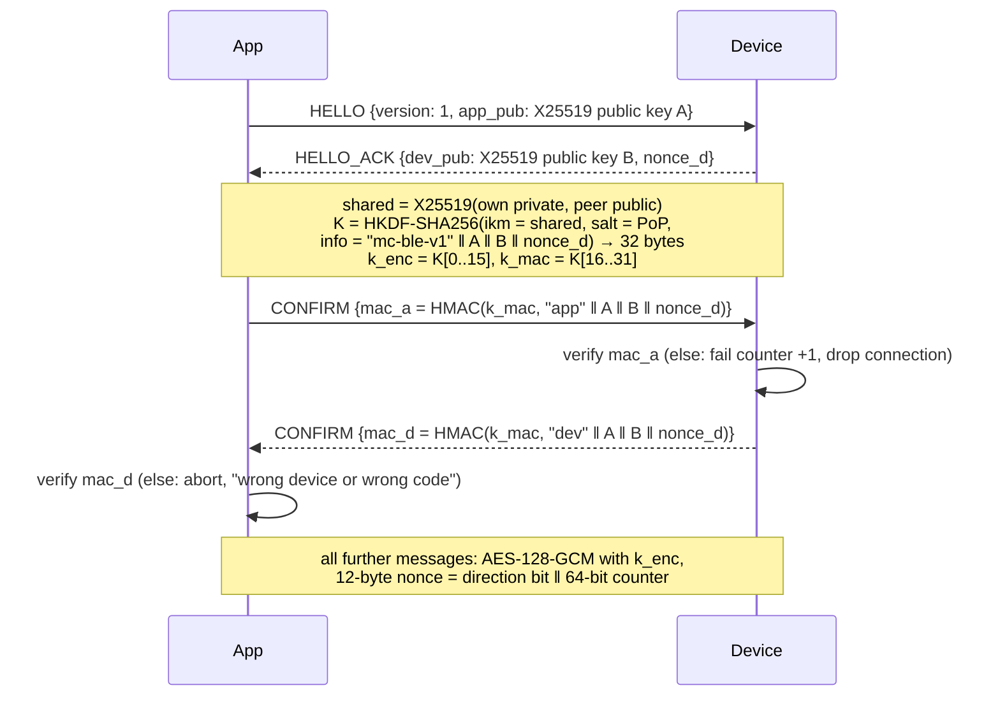
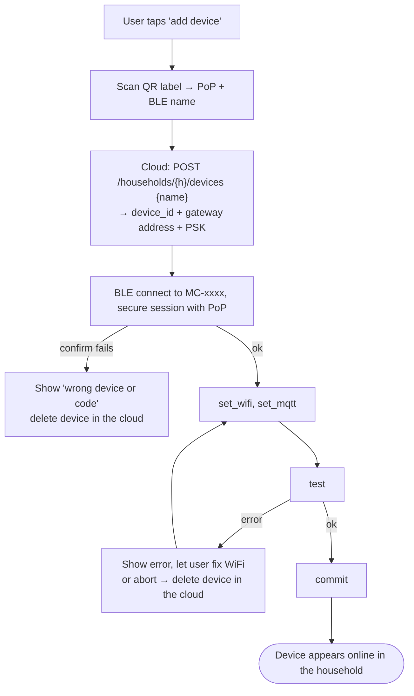

# BLE Pairing Contract — App ↔ Device

**Version:** v1 (draft) · **Status:** proposal, not yet implemented · **Last change:** 2026-09-26

How the Flutter app hands WiFi and broker credentials to a plant device over Bluetooth Low Energy, and how this is protected against a neighbour taking over or eavesdropping on the device. Firmware and app both implement this document.

Context: [`PROJECT.md`](../PROJECT.md) §3.8, [`contracts/mqtt.md`](mqtt.md) §2.

---

## 1. Threats this protects against

| Threat | Protection |
|---|---|
| Someone in BLE range pairs the device before the owner, or re-pairs it later and moves it to their server | Pairing needs the device's **proof-of-possession code (PoP)** from its label, *and* the device only listens for pairing on first boot or after a **button press** (§3). |
| Someone sniffs the WiFi password or the device's MQTT key over the air | All payloads are encrypted with a session key derived from an ECDH exchange **authenticated by the PoP** (§4). BLE link-layer pairing is not relied on. |
| Man-in-the-middle between app and device | The MITM does not know the PoP, so it cannot compute a matching session key; the key confirmation fails on both sides. |
| Guessing the PoP online | 128-bit PoP, and the device closes the pairing window after 5 failed handshakes. |
| Squatting a device ID | Device IDs are random and assigned by the cloud (mqtt.md §2), not derived from the MAC. |

Out of scope: an attacker with physical access **and** the label. Physical access is treated as ownership.

---

## 2. Proof-of-possession code (PoP)

- 16 random bytes, generated **when the device is flashed** by `firmware/tools/make_label.py`, written to a dedicated NVS "factory" partition, never changed by a factory reset.
- Printed on a label on the device as a QR code: `MCPOP1:<ble-name>:<pop-base32>` (e.g. `MCPOP1:MC-3F9A:K7Q2…`), plus the base32 text for manual entry.
- Recoverable only via the USB console (`mc pop show`) — i.e. again with physical access.
- Never sent over BLE, never sent to the server.

---

## 3. When the device accepts pairing

| Situation | Pairing window |
|---|---|
| Unprovisioned (first boot, or after factory reset) | Advertises on every boot until provisioned. Window closes after 10 min without a successful pairing and reopens on the next boot / wake. |
| Provisioned | **Only** after the BOOT button is held for **3 s** → *maintenance mode*: device stays awake, BLE window open for **5 min**, LED pattern shows it. |
| Factory reset | BOOT held for **10 s** → WiFi, broker credentials, device ID and slot config are wiped (PoP stays). Device is unprovisioned again. |
| 5 failed handshakes in one window | Window closes immediately; needs a new button press (or reboot if unprovisioned). |

There is no way to open the pairing window remotely (no MQTT command, no BLE command).

Advertised name: `MC-` + last 4 hex digits of the BLE MAC — only for picking the right device in a list, not an identity.

---

## 4. Secure session

All crypto primitives are available in Zephyr (PSA Crypto / Mbed TLS) and in Dart (`cryptography` package).

- Fresh key pairs on both sides for every session (no static device key needed).
- Both sides reject any counter that is not exactly previous + 1 (no replay, no reordering).
- Session ends on disconnect; nothing from it is reused.

---

## 5. Messages inside the session

GATT: one custom service, one write characteristic (app → device) and one notify characteristic (device → app). Messages are JSON, framed with a 2-byte length, fragmented to the negotiated MTU. Max message 1024 bytes.

| Request (app → device) | Response | Meaning |
|---|---|---|
| `info` | `{hw_mac, fw, provisioned, device_id?}` | What is this device. |
| `wifi_scan` | `{networks: [{ssid, rssi, secure}]}` | Optional, helps the user pick the network. |
| `set_wifi` `{ssid, password}` | `{ok}` | Stored in RAM only until `commit`. |
| `set_mqtt` `{device_id, host, port, psk}` | `{ok}` | Pairing bundle from the cloud (Server_Specs §8.1): gateway address (hub on the LAN or cloud broker) and the 32-byte TLS-PSK key (hex). RAM only until `commit`. |
| `test` | `{wifi: ok/err, mqtt: ok/err, detail}` | Device joins WiFi and connects to the gateway with the new settings (TLS-PSK), publishes `status online`, disconnects. |
| `commit` | `{ok}` | Persist everything to NVS, close BLE, reboot into normal operation. |
| `abort` | `{ok}` | Discard, stay in the previous state. |

`device_id` and `psk` sent in `set_mqtt` replace any previous ones — this is how a device moves to a new gateway (hub added or removed) or a new household.

---

## 6. App flow

