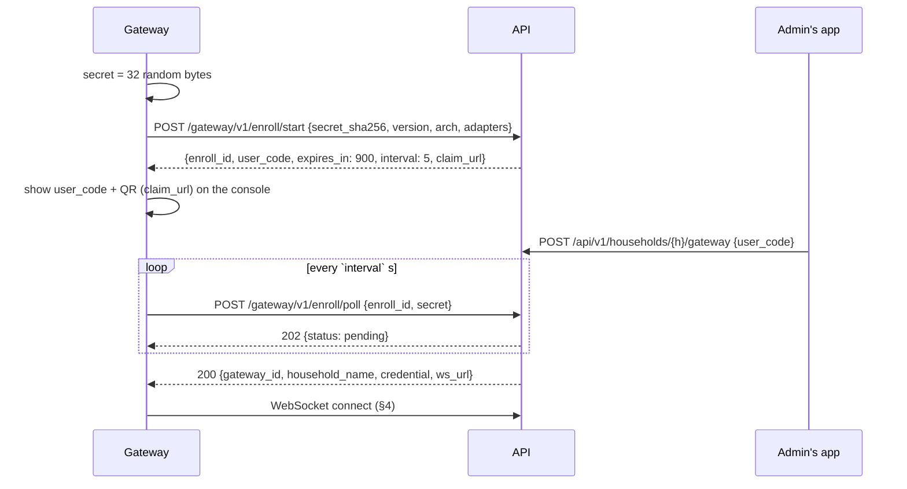
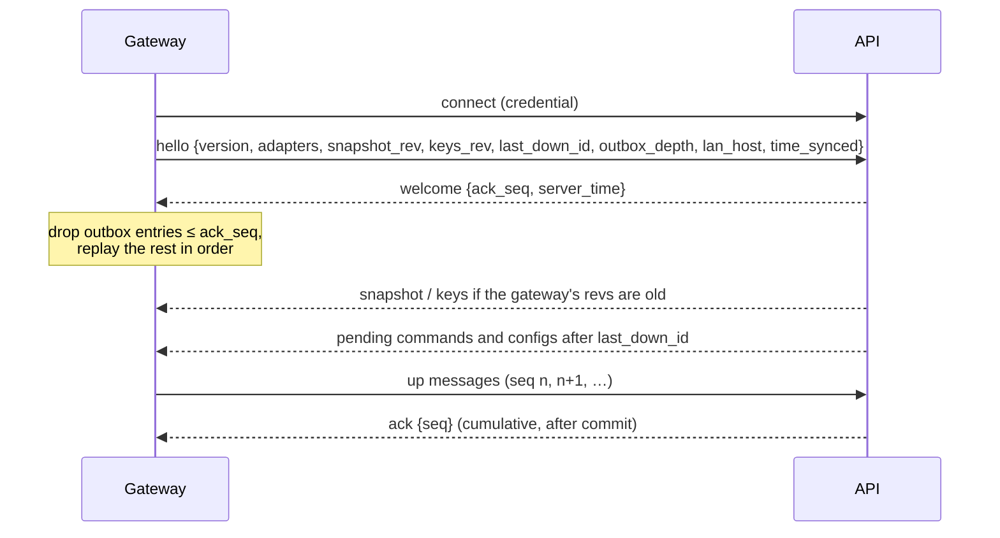

# Gateway Contract — Gateway ↔ API Server

**Version:** v1 (draft) · **Status:** proposal, not yet implemented · **Last change:** 2026-09-29

Everything between a household's **gateway** and the central **API server**: enrollment over HTTPS, the WebSocket, acknowledgements and replay, the normalized device messages, and what the API sends down. The gateway and the API server both implement this document; if code and contract disagree, the code is wrong.

Context: [`PROJECT.md`](../PROJECT.md) §2, §3.5 (D33–D37), [`gateway/Gateway_Specs.md`](../gateway/Gateway_Specs.md), [`api/Api_Specs.md`](../api/Api_Specs.md). Device-side payloads of ESP32 devices: [`mqtt.md`](mqtt.md).

---

## 1. Principles

1. **Outbound only.** The gateway opens every connection (HTTPS for enrollment, one WebSocket afterwards). The API never connects to a gateway.
2. **One gateway = one household.** The API accepts messages from a gateway only for devices of its own household.
3. **Nothing is lost while offline.** Every message from the gateway gets a sequence number, is stored in the gateway's outbox first, and is deleted only after the API acknowledged it. After a reconnect the gateway replays everything unacknowledged, in order.
4. **Everything is idempotent.** Messages carry sequence numbers or IDs; the API deduplicates uploads, the gateway deduplicates downloads.
5. **Protocol-independent.** The API never sees MQTT, Zigbee or LoRaWAN. It sees **normalized device messages** (§5). For ESP32 devices their payloads are the [`mqtt.md`](mqtt.md) payloads, unchanged.
6. **The API owns intent.** Plants, rules, device configs and device keys come down as complete, versioned sets; the gateway never edits them — it only reports what it did.

---

## 2. Identifiers and credentials

| Item | Value |
|---|---|
| Gateway ID | `gw-` + 16 lowercase Crockford-base32 chars (80 random bits), assigned by the API at enrollment |
| Gateway credential | 32 random bytes (base64url, 43 chars), generated by the API at enrollment, delivered once in the poll response, stored **hashed** (SHA-256) in the database and in `/data/secrets/credential` (mode 600) on the gateway |
| Rotation | `rotate_credential` message (§6.6); the old credential stays valid until the gateway confirms the new one |
| Transport | HTTPS / WSS only, TLS 1.2+, certificate validated against the system's trust store (`api.<our-domain>` has a public certificate) |

---

## 3. Enrollment (HTTPS)

Device-code flow (D25). Base URL: `https://api.<our-domain>`. No authentication on the gateway side — possession of the enrollment secret proves it is the same gateway.



### 3.1 `POST /gateway/v1/enroll/start`

Request:
```json
{ "secret_sha256": "9f2c…64 hex…", "version": "0.2.0", "arch": "arm64", "adapters": ["esp32-mqtt"] }
```
Response `201`:
```json
{ "enroll_id": "01J9ENR0000000000000000000", "user_code": "K7QM-2XPA", "expires_in": 900, "interval": 5,
  "claim_url": "https://app.example.com/gateway#u=K7QM-2XPA" }
```

- `user_code`: 8 Crockford base32 characters (40 bits), shown with a dash; valid 15 min, single use.
- `secret_sha256`: SHA-256 over the **raw 32 bytes** of the secret, hex.
- Rate limit: 10 starts / hour / IP.

### 3.2 Claim (app side, for reference)

`POST /api/v1/households/{h}/gateway {user_code}` — admin role, recent login; the household must not have a gateway yet (replacing one: remove the old one first, then re-pair devices). 10 attempts / hour / user.

### 3.3 `POST /gateway/v1/enroll/poll`

Request: `{ "enroll_id": "…", "secret": "<64 hex chars of the raw secret>" }`

| Response | Meaning |
|---|---|
| `202 {status: "pending"}` | Not claimed yet; poll again after `interval`. |
| `200` (below) | Claimed. Returned **once**; the enrollment is consumed. |
| `410` | Expired or consumed → start a new enrollment. |
| `429` | Polling too fast. |

```json
{ "gateway_id": "gw-4k9m2x7q1v8w3h5t", "household_name": "Alice's flat",
  "credential": "q2Yx…43 chars…", "ws_url": "wss://api.example.com/gateway/v1/connect" }
```

---

## 4. WebSocket

- URL: `wss://api.<our-domain>/gateway/v1/connect`, header `Authorization: Gateway <gateway_id>:<credential>`. Wrong or revoked credential → HTTP 401 before the upgrade; the gateway then retries with backoff and, after 3 × 401 in a row, treats itself as **removed** (Gateway_Specs §3).
- One connection per gateway; a second connection with the same credential closes the first (code 4000).
- Messages are JSON text frames: `{"t": "<type>", …}`. Max 256 KB per frame (snapshots), 16 KB otherwise.
- Keep-alive: WebSocket ping every 30 s from the gateway; the API marks the gateway offline after 90 s without traffic.
- Reconnect: exponential backoff 1 s → 60 s with jitter.

### 4.1 Session start



### 4.2 Up (gateway → API): sequencing

Every up message except `hello` and `down_ack` carries `seq`: a 64-bit counter, strictly increasing per gateway, never reused (persisted with the outbox). The API:

- processes messages in `seq` order, commits, then sends `{"t": "ack", "seq": n}` meaning "everything ≤ n is stored" (at least every 100 messages or 1 s);
- ignores messages with `seq` ≤ the last committed one (replays after a lost ack);
- answers a message it can't process (invalid payload, unknown device) with an ack as well — the reason is recorded server-side (`gateway_event invalid_message`) so the outbox never blocks.

### 4.3 Down (API → gateway): IDs

Every down message except `welcome`, `ack` and `ping` carries `id` (ULID). The gateway applies it idempotently and confirms with `{"t": "down_ack", "id": "…", "result": "applied" | "rejected", "error": "…"}`. Unconfirmed down messages are re-sent after reconnect (`last_down_id` in `hello` lets the API skip what was already applied).

---

## 5. Up messages

### 5.1 `device` — normalized device message

```json
{ "t": "device", "seq": 18422, "device": "mc-8f3kq2v7xw1m9hzt", "adapter": "esp32-mqtt",
  "kind": "telemetry", "received_at": 1790412306,
  "payload": { "seq": 311, "ts": 1790412305, "cfg_rev": 8,
               "readings": [ { "slot": 0, "type": "soil_moisture", "value": 41.5, "unit": "%", "raw": 2143 } ],
               "health": { "batt_mv": 3910, "rssi": -67, "wake": "timer" } } }
```

| Field | Meaning |
|---|---|
| `device` | Device ID (assigned by the API) |
| `adapter` | Adapter that received it (`esp32-mqtt`, later `zigbee`, …) |
| `kind` | `status` · `telemetry` · `event` · `cmd_ack` · `config_state` |
| `received_at` | Gateway receive time (Unix s) — the API uses it when the payload has no trustworthy `ts` |
| `payload` | The device payload in the canonical shape of [`mqtt.md`](mqtt.md) §4–§6 (status, telemetry, event, cmd/ack, config/state). ESP32 payloads pass through unchanged; other adapters map into the same shapes (new `module`/`type` values are added to mqtt.md §8 first). |

### 5.2 `command_created` — command made by the gateway (rules or CLI)

Sent **before** the command is published to the device, so the API has the record when the device's ack arrives.

```json
{ "t": "command_created", "seq": 18423, "id": "01J9C0000000000000000000CM", "device": "mc-8f3kq2v7xw1m9hzt",
  "action": "pump.run", "args": { "slot": 2, "seconds": 10 }, "exp": 1790414100,
  "source": "rule", "rule_id": "01J8R000000000000000000RUL", "created_at": 1790412305 }
```

`source` ∈ `rule`, `local` (CLI).

### 5.3 `rule_exec` — rule decision

```json
{ "t": "rule_exec", "seq": 18424, "id": "01J9E000000000000000000EXC", "rule_id": "01J8R000000000000000000RUL",
  "plant_id": "01J8P000000000000000000PLT", "ts": 1790412305,
  "reading": { "device": "mc-8f3kq2v7xw1m9hzt", "slot": 0, "seq": 311, "value": 27.5 },
  "decision": "water", "skip_reason": null, "command_id": "01J9C0000000000000000000CM" }
```

`decision` ∈ `water`, `skip`; `skip_reason` ∈ `sensor_error`, `no_pump`, `quiet_hours`, `cooldown`, `daily_limit`, `pending_command`, `clock_not_synced`.

### 5.4 `gateway_state`

On connect (after `hello`), after applying a snapshot or key set, and every 10 minutes.

```json
{ "t": "gateway_state", "seq": 18425, "version": "0.2.0", "arch": "arm64", "uptime_s": 86400,
  "adapters": { "esp32-mqtt": { "ok": true, "clients": 3 } },
  "snapshot_rev": 42, "keys_rev": 7, "lan_host": "192.168.1.20", "lan_port": 8883,
  "outbox_depth": 0, "outbox_oldest_s": 0, "disk_free_mb": 18234, "time_synced": true }
```

`lan_host`/`lan_port` are what the API puts into ESP32 pairing bundles (the admin can override the host in the app).

### 5.5 `gateway_event`

`{ "t": "gateway_event", "seq": …, "kind": "buffer_overflow" | "adapter_error" | "clock_jump" | "restarted", "detail": "…", "ts": … }` — e.g. when the outbox limit forced dropping the oldest readings (Gateway_Specs §6).

### 5.6 Control messages

`hello` (§4.1) and `down_ack` (§4.3) have no `seq` and are not stored in the outbox.

---

## 6. Down messages

### 6.1 `snapshot` — everything the gateway needs to run rules

```json
{ "t": "snapshot", "id": "01J9S000000000000000000SNP", "rev": 42,
  "household_id": "01J8H000000000000000000HSH", "timezone": "Europe/Berlin",
  "settings": { "battery_low_mv": 3500 },
  "devices": [ { "id": "mc-8f3kq2v7xw1m9hzt", "adapter": "esp32-mqtt", "wake_interval_s": 600,
                 "actuators": [ { "slot": 2, "max_run_s": 60, "min_pause_s": 600 } ],
                 "limits": { "max_run_s_hard": 300 } } ],
  "plants": [ { "id": "01J8P000000000000000000PLT", "sensor": { "device": "mc-8f3kq2v7xw1m9hzt", "slot": 0 },
                "pump": { "device": "mc-8f3kq2v7xw1m9hzt", "slot": 2 } } ],
  "rules": [ { "id": "01J8R000000000000000000RUL", "plant_id": "01J8P000000000000000000PLT", "enabled": true,
               "threshold": 30.0, "water_s": 10, "cooldown_s": 21600, "max_per_day": 2,
               "quiet_from": "22:00", "quiet_to": "07:00" } ],
  "rule_state": [ { "plant_id": "01J8P000000000000000000PLT", "last_rule_cmd_at": 1790400000, "rule_cmds_today": 1 } ],
  "latest_gateway_version": "0.2.1" }
```

- Complete, not a diff. Sent when any part changes (`rev + 1`) and on connect if the gateway's `snapshot_rev` is older.
- The gateway ignores snapshots with `rev` ≤ its current one; an invalid snapshot is rejected (`down_ack` `rejected`) and the previous one stays active.
- `rule_state` lets a new or restored gateway respect cooldowns and daily limits; the gateway uses `max(snapshot, local history)`.
- **No user data** (no members, names of people, e-mails).

### 6.2 `keys` — device credentials per adapter

```json
{ "t": "keys", "id": "01J9K000000000000000000KEY", "rev": 7,
  "devices": [ { "id": "mc-8f3kq2v7xw1m9hzt", "adapter": "esp32-mqtt", "psk": "<64 hex chars>" } ] }
```

The complete set for the household. A device missing from the list is removed from its adapter (e.g. the broker's PSK file). Full set instead of add/remove → self-healing after any lost message.

### 6.3 `command`

```json
{ "t": "command", "id": "01J9D000000000000000000DWN", "device": "mc-8f3kq2v7xw1m9hzt",
  "command": { "id": "01J8ZQ6H7K2M4N5P6Q7R8S9T0V", "action": "pump.run", "exp": 1790414100,
               "args": { "slot": 2, "seconds": 10 } } }
```

`command` has the [`mqtt.md`](mqtt.md) §5.1 shape. The gateway runs the same checks as the API (`core/commands.py`) and rejects (`down_ack rejected`, `error` = check code) instead of publishing if a check fails — the API then marks the command failed. Otherwise it hands it to the adapter (ESP32: publish on `mc/v1/<dev>/cmd`, QoS 1) and tracks it for busy/cooldown checks.

### 6.4 `config_desired`

`{ "t": "config_desired", "id": "…", "device": "mc-…", "config": { …mqtt.md §6.1… } }` — the gateway passes it to the adapter (ESP32: retained `config/desired`). The device's `config_state` comes back as a `device` message.

### 6.5 `device_removed`

`{ "t": "device_removed", "id": "…", "device": "mc-…" }` — clear the device's retained data and pending commands in its adapter (the key disappears with the next `keys`).

### 6.6 `rotate_credential`, `removed`

- `{ "t": "rotate_credential", "id": "…", "credential": "…" }` — store the new credential, reconnect with it, then `down_ack`; the API revokes the old one after the first successful connect with the new one.
- `{ "t": "removed", "id": "…" }` — the gateway was removed in the app: the API closes the socket; the gateway deletes its credential, keys and snapshot, keeps its outbox for inspection, and returns to enrollment (Gateway_Specs §3).

### 6.7 Control messages

`welcome {ack_seq, server_time}`, `ack {seq}`, `ping`.

---

## 7. Errors and limits

| Situation | Behaviour |
|---|---|
| Up message for a device of another household | Acked, dropped, `gateway_event` recorded server-side, alert to the household owner after repeated occurrences |
| Invalid JSON / schema | Acked, `invalid_message` recorded; the gateway logs the ack reason if given |
| Frame too large | Connection closed with 1009; the gateway drops that message from the outbox with a log entry |
| Outbox full on the gateway | Oldest `telemetry` entries dropped first, never `command_created`, `rule_exec`, `cmd_ack`; `buffer_overflow` reported |
| Clock not synced on the gateway | No rule commands (`rule_exec` skip `clock_not_synced`); `received_at` still sent |
| API overload | The API may delay acks; the gateway keeps at most 1 000 unacknowledged messages in flight |

---

## 8. Versioning

`/gateway/v1/…` is the contract version. Receivers ignore unknown JSON fields and unknown message types (logged). Breaking changes → `/gateway/v2`, and the API serves both during a gateway rollout. `latest_gateway_version` in the snapshot drives the update notice in the app.
