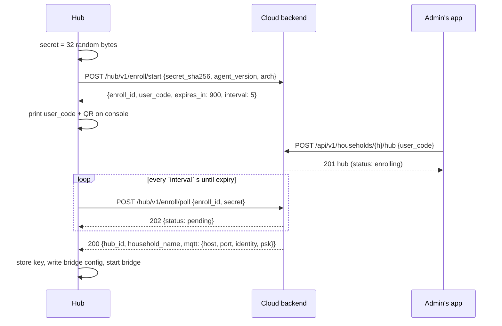

# Hub Contract — Hub ↔ Cloud

**Version:** v1 (draft) · **Status:** proposal, not yet implemented · **Last change:** 2026-09-28

Everything that goes between a home hub and the cloud backend: enrollment over HTTPS, the MQTT bridge, and the hub-specific topics. The hub agent and the cloud backend both implement this document.

Context: [`PROJECT.md`](../PROJECT.md) §3.5–3.7, [`hub/Hub_Specs.md`](../hub/Hub_Specs.md), [`server/Server_Specs.md`](../server/Server_Specs.md) §9, device topics in [`mqtt.md`](mqtt.md).

---

## 1. Principles

1. **Outbound only.** The hub initiates every connection (HTTPS for enrollment, MQTT bridge afterwards). The cloud never connects to a hub.
2. **The hub is a gateway for exactly one household.** The cloud broker's ACL lets a hub reach only the device topics of its own household plus its own hub topics.
3. **Device traffic is bridged unchanged.** Device messages keep their `mc/v1/<device-id>/…` topics and payloads ([`mqtt.md`](mqtt.md)); the backend processes bridged and direct devices identically.
4. **The cloud owns intent.** Plants, rules, device configs and device keys are sent to the hub as complete, versioned, retained snapshots. The hub never edits them — it only reports what it did.
5. **Idempotent everything.** Snapshots carry a `rev`, reports carry IDs; duplicates after reconnects are harmless.

---

## 2. Identifiers and keys

| Item | Value |
|---|---|
| Hub ID | `hub-` + 16 lowercase Crockford-base32 chars (80 random bits), assigned by the cloud at enrollment. |
| Bridge identity | = hub ID (TLS-PSK identity and MQTT username on the cloud broker). |
| Bridge key | 32 random bytes, generated by the cloud at enrollment, delivered once in the enrollment poll response (§3). Stored on the hub in `/data/bridge.psk` (mode 600). |
| Bridge client ID on the cloud broker | = hub ID |
| Transport | TLS 1.2, cipher `PSK-AES128-GCM-SHA256`, cloud broker port 8883 |

---

## 3. Enrollment (HTTPS)

Base URL: the cloud API (`https://api.<our-domain>`). No authentication on the hub side — possession of the enrollment secret proves it's the same hub.



### 3.1 `POST /hub/v1/enroll/start`

Request: `{ "secret_sha256": "<hex>", "agent_version": "0.3.0", "arch": "arm64" }`

Response `201`:

```json
{ "enroll_id": "01J9…", "user_code": "K7QM-2XPA", "expires_in": 900, "interval": 5,
  "claim_url": "https://app.<our-domain>/hub#u=K7QM-2XPA" }
```

- `user_code`: 8 characters from the Crockford base32 alphabet (40 bits), shown with a dash. Valid 15 min, single use.
- `claim_url` is what the hub encodes in its console QR code; it opens the official app on the "add hub" screen.
- Rate limit: 10 starts / hour / IP.

### 3.2 Claim (app side, for reference)

`POST /api/v1/households/{h}/hub {user_code}` — admin role, recent login (PROJECT D28), household must not already have a hub. Rate limit: 10 attempts / hour / user; 5 wrong codes in a row → 15 min block for that user. On success the cloud creates the hub record, its bridge key, and its broker ACL (§6), and binds the enrollment.

### 3.3 `POST /hub/v1/enroll/poll`

Request: `{ "enroll_id": "01J9…", "secret": "<hex>" }` — the cloud checks `sha256(secret) == secret_sha256`. `secret` is the 32 random bytes as 64 hex chars; the hash is taken over the **raw bytes**, and `secret_sha256` is its hex digest.

| Response | Meaning |
|---|---|
| `202 {status: "pending"}` | Not claimed yet. Poll again after `interval`. |
| `200 {hub_id, household_name, mqtt: {host, port, identity, psk}}` | Claimed. Returned **once**; the enrollment is then consumed. |
| `410` | Expired or already consumed → hub starts a new enrollment. |
| `429` | Polling too fast. |

---

## 4. Bridge topics

The hub's Mosquitto bridges exactly these topics to the cloud broker (QoS 1 both ways, `cleansession false`, retained flags preserved):

| Topic | Direction | Content |
|---|---|---|
| `mc/v1/+/status` | out (hub → cloud) | Device status, [mqtt.md §4.1](mqtt.md) |
| `mc/v1/+/telemetry` | out | [mqtt.md §4.2](mqtt.md) |
| `mc/v1/+/event` | out | [mqtt.md §4.3](mqtt.md) |
| `mc/v1/+/cmd/ack` | out | [mqtt.md §5.3](mqtt.md) |
| `mc/v1/+/config/state` | out | [mqtt.md §6.3](mqtt.md) |
| `mc/hub/v1/<hub-id>/up/#` | out | Hub reports (§5) |
| `mc/v1/<dev>/cmd` — **one line per device** | **in** (cloud → hub) | Commands created in the cloud (manual, API) |
| `mc/v1/<dev>/config/desired` — one line per device | in | Desired device config |
| `mc/hub/v1/<hub-id>/down/snapshot`, `…/down/keys` | in | Snapshots for the hub (§5) |

`in` topics are subscriptions on the cloud broker, so they are always **exact topics, never wildcards** — the cloud broker's ACL only grants a hub read access to its own devices' topics ([Broker_Specs §3.2](../broker/Broker_Specs.md)). The agent regenerates the bridge config (and the hub broker restarts, ~2 s) whenever the household's device list changes in `down/keys`.

Commands created **by the hub's rules** are published only on the hub broker (`mc/v1/<dev>/cmd` is `in` only, so they never go up as commands); the hub reports them via `up/cmd` (§5.5), and the device's `cmd/ack` goes up as usual.

**Bridge state:** the bridge uses Mosquitto's notifications with `notification_topic mc/hub/v1/<hub-id>/up/bridge` (retained, `1` = connected, `0` = disconnected — the `0` is set as the bridge's Last Will on the cloud broker). The cloud uses it for "hub online/offline".

**Offline queueing:** while the bridge is down, outgoing messages queue on the hub broker (limit: `max_queued_messages 100000`, persisted to disk); incoming messages queue in the hub's persistent session on the cloud broker. Both are delivered on reconnect.

---

## 5. Hub topics

Prefix `mc/hub/v1/<hub-id>/`. JSON, UTF-8, compact. Max payload 256 KB (snapshots), 16 KB (everything else).

### 5.1 `down/snapshot` — cloud → hub, retained

The complete household state the hub needs to run rules. Sent whenever any part of it changes. **No user data** (no members, names of people, e-mails).

```json
{
  "rev": 42,
  "household_id": "01J8…",
  "timezone": "Europe/Berlin",
  "settings": { "battery_low_mv": 3500 },
  "devices": [
    { "id": "mc-8f3kq2v7xw1m9hzt", "wake_interval_s": 600,
      "actuators": [ { "slot": 2, "max_run_s": 60, "min_pause_s": 600 } ],
      "limits": { "max_run_s_hard": 300 } }
  ],
  "plants": [
    { "id": "01J8P…", "sensor": { "device": "mc-8f3kq2v7xw1m9hzt", "slot": 0 },
      "pump": { "device": "mc-8f3kq2v7xw1m9hzt", "slot": 2 } }
  ],
  "rules": [
    { "id": "01J8R…", "plant_id": "01J8P…", "enabled": true, "threshold": 30.0,
      "water_s": 10, "cooldown_s": 21600, "max_per_day": 2,
      "quiet_from": "22:00", "quiet_to": "07:00" }
  ],
  "rule_state": [
    { "plant_id": "01J8P…", "last_rule_cmd_at": 1790400000, "rule_cmds_today": 1 }
  ],
  "latest_agent_version": "0.3.1"
}
```

- `rule_state` lets a freshly started or re-enrolled hub respect cooldowns and daily limits without local history. The hub uses `max(snapshot value, own local value)`.
- The hub ignores snapshots with `rev` ≤ its current one.

### 5.2 `down/keys` — cloud → hub, retained

The complete set of TLS-PSK keys for the household's devices. The hub rewrites its broker's PSK file from it and reloads the broker.

```json
{ "rev": 7, "devices": [ { "id": "mc-8f3kq2v7xw1m9hzt", "psk": "<64 hex chars>" } ] }
```

- A device missing from the list is removed from the hub broker (e.g. device deleted in the app).
- Full set instead of add/remove requests → self-healing after any lost message or hub restore.

### 5.3 `up/state` — hub → cloud, retained

Published on every bridge connect, after applying a snapshot or key set, and every 10 minutes.

```json
{ "agent_version": "0.3.0", "arch": "arm64", "uptime_s": 86400,
  "snapshot_rev": 42, "keys_rev": 7, "lan_host": "192.168.1.20", "lan_port": 8883,
  "queue_depth": 0, "disk_free_mb": 18234, "time_synced": true }
```

`lan_host`/`lan_port` are what the cloud puts into device pairing bundles for this household. The admin can override `lan_host` in the app (e.g. when the hub has several interfaces).

### 5.4 `up/rule_exec` — hub → cloud

One message per rule evaluation that crossed the threshold (same cases the cloud logs for its own rules, [Server_Specs §11](../server/Server_Specs.md)).

```json
{ "id": "01J9E…", "rule_id": "01J8R…", "plant_id": "01J8P…", "ts": 1790412305,
  "reading": { "device": "mc-8f3kq2v7xw1m9hzt", "slot": 0, "seq": 18422, "value": 27.5 },
  "decision": "water", "skip_reason": null, "command_id": "01J9C…" }
```

`decision` ∈ `water`, `skip`; `skip_reason` ∈ `sensor_error`, `no_pump`, `quiet_hours`, `cooldown`, `daily_limit`, `pending_command`.

### 5.5 `up/cmd` — hub → cloud

Every command the hub created, **before** it is published to the device, so the cloud has the record when the device's `cmd/ack` arrives.

```json
{ "id": "01J9C…", "device": "mc-8f3kq2v7xw1m9hzt", "action": "pump.run",
  "args": { "slot": 2, "seconds": 10 }, "exp": 1790414100,
  "source": "rule", "rule_id": "01J8R…", "created_at": 1790412305 }
```

### 5.6 `up/ack` — hub → cloud

`{ "topic": "down/snapshot" | "down/keys", "rev": 42, "result": "applied" | "rejected", "error": "…" }` — so the app can show whether the hub is in sync.

---

## 6. Cloud broker ACL for a hub

Maintained by the backend, updated whenever a device is added to or removed from the household:

| Permission | Topics |
|---|---|
| write | `mc/v1/<dev>/status`, `…/telemetry`, `…/event`, `…/cmd/ack`, `…/config/state` for each device `<dev>` of the household; `mc/hub/v1/<hub-id>/up/#` |
| read | `mc/v1/<dev>/cmd`, `mc/v1/<dev>/config/desired` for each device of the household; `mc/hub/v1/<hub-id>/down/snapshot`, `…/down/keys` — exact topics only |

Anything else is denied. Messages for devices outside the household are silently dropped by the broker, so a compromised hub cannot touch other households.

---

## 7. Removal

`DELETE /api/v1/households/{h}/hub` (admin, recent login): the cloud removes the hub's key and ACL, clears its retained `down/*` topics, and marks the household's devices as "no gateway" — they must be re-paired (to the cloud broker or a new hub). The hub agent notices the rejected bridge and returns to enrollment mode.
