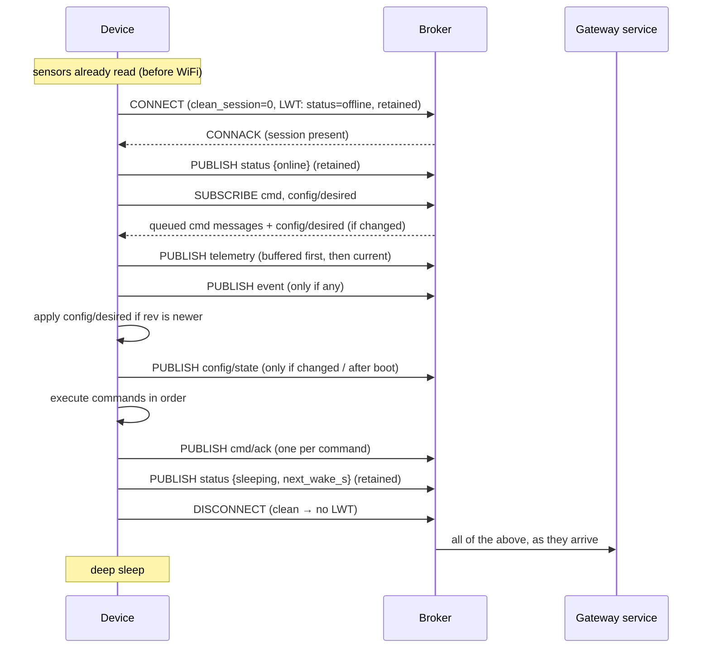

# MQTT Contract — ESP32 Device ↔ Gateway

**Version:** v1 (draft) · **Status:** implemented by the v1 backend and the device simulator; firmware pending · **Last change:** 2026-09-29 (D33: the gateway is the only counterpart)

This file is the **single source of truth** for everything that goes over MQTT between an ESP32 plant device and its household's **gateway** — the gateway service behind the gateway's broker ("server" below): topics, payloads, QoS, retained flags, ordering, and error codes. The firmware and the server both implement *this document*; if code and contract disagree, the code is wrong.

Context: [`PROJECT.md`](../PROJECT.md) (system overview), [`firmware/Firmware_Specs.md`](../firmware/Firmware_Specs.md) (device internals).

**Broker.** A device connects to the Mosquitto broker inside its household's **gateway**, on the LAN ([`broker/Broker_Specs.md`](../broker/Broker_Specs.md)). The gateway service (adapter `esp32-mqtt`) is the only other client; it forwards the payloads of §4–§6 **unchanged** to the API server inside normalized device messages ([`gateway_api.md`](gateway_api.md) §5.1) and publishes what the API sends down. There is no cloud broker (PROJECT D33).

These payload shapes are also the **canonical device model** of the whole system: adapters for other technologies (Zigbee, LoRaWAN, …) map their devices into the same status / telemetry / event / ack / config shapes, adding new `module` and `type` values in §8 first.

---

## 1. Design principles

1. **Every wake costs battery.** A normal wake cycle is: connect → a handful of publishes → receive whatever is queued → disconnect. No request/response round trips initiated by the device, no waiting for the server to answer.
2. **The device never waits for the server.** Anything the server wants the device to do is already queued at the broker (persistent session) or retained, so it is delivered right after connect.
3. **Everything is idempotent.** QoS 1 means "at least once": both sides must tolerate duplicates (command IDs, telemetry sequence numbers, config revisions).
4. **Desired vs. reported.** The server publishes the *desired* config, the device publishes the config it is *actually* running. They are separate topics and never mixed.
5. **Forward compatible.** Receivers ignore unknown JSON fields. Adding optional fields is not a breaking change; anything else requires `v2` topics (§9).

---

## 2. Identity, connection and credentials

| Item | Value |
|---|---|
| Device ID | `mc-` + 16 lowercase Crockford-base32 characters (80 random bits), e.g. `mc-8f3kq2v7xw1m9hzt`. **Assigned by the API server** when the device is added to the household and sent to the device during BLE pairing ([`ble.md`](ble.md)). Not derived from the MAC, so it cannot be guessed or pre-registered by others. Changes when the device is re-paired to another household. |
| MQTT client ID | = device ID |
| TLS-PSK identity | = device ID. The broker uses it as the MQTT username (`use_identity_as_username`), so the device sends **no** username/password in CONNECT. |
| TLS-PSK key | 32 random bytes per device, generated by the API server when the device is added (or re-keyed), delivered to the gateway in its key set, delivered only over the encrypted BLE pairing session, stored in NVS. |
| Protocol | MQTT 3.1.1 (widest support in Zephyr's MQTT client and Mosquitto). |
| Session | `clean_session = false` — required so the broker queues QoS 1 messages while the device sleeps. |
| Keep-alive | 60 s |
| Transport | **TLS 1.2 with pre-shared key**, cipher suite `TLS_PSK_WITH_AES_128_GCM_SHA256` (OpenSSL name `PSK-AES128-GCM-SHA256`), port **8883** on the gateway's LAN address. No certificates on the device; no public-key operations in the handshake. |
| Server client | The gateway service: client ID `mc-gateway`, on the broker's internal listener, `clean_session = false` so no telemetry is lost while it restarts. |

The device registers the **Last Will** at connect time (see `status`, §4.1).

### Provisioning note

A device's ID and key exist **before** it first connects: when an admin adds a device in the app, the API server creates the device record with a new random ID and PSK and sends the key to the household's gateway, which writes it into its broker's PSK file; the app then sends ID, key and the gateway's LAN address over the PoP-authenticated BLE session ([`ble.md`](ble.md)) together with the WiFi credentials. A client without a known PSK identity fails the TLS handshake — the broker never even sees an MQTT CONNECT from it.

---

## 3. Topic overview

All topics start with **`mc/v1/<device-id>/`**. Short prefix on purpose — it is sent in every packet.

| Topic (suffix) | Direction | QoS | Retained | Payload | When |
|---|---|:-:|:-:|---|---|
| `status` | device → server | 1 | **yes** | §4.1 | Right after connect (`online`), right before disconnect (`sleeping`), LWT (`offline`), service mode (`service`) |
| `telemetry` | device → server | 1 | no | §4.2 | Once per wake cycle (+ one per buffered older cycle) |
| `event` | device → server | 1 | no | §4.3 | Only when something noteworthy happened |
| `cmd/ack` | device → server | 1 | no | §5.3 | For every command received |
| `config/state` | device → server | 1 | **yes** | §6.3 | After boot, after every config change attempt, and whenever `rev` differs from what was last published |
| `cmd` | server → device | 1 | no | §5.1 | Whenever the server has a command (queued by broker while device sleeps) |
| `config/desired` | server → device | 1 | **yes** | §6.1 | Whenever the desired config changes |

The device **subscribes** to `mc/v1/<id>/cmd` and `mc/v1/<id>/config/desired` (QoS 1). With a persistent session the subscription survives sleep; the device still re-subscribes after every connect (cheap, and it recovers from a broker that lost the session).

The server subscribes to `mc/v1/+/status`, `mc/v1/+/telemetry`, `mc/v1/+/event`, `mc/v1/+/cmd/ack`, `mc/v1/+/config/state`.

---

## 4. Device → server

### 4.1 `status` (retained)

```json
{ "state": "online", "fw": "0.4.0", "boot": 5521 }
```
```json
{ "state": "sleeping", "next_wake_s": 600 }
```
```json
{ "state": "offline" }
```
```json
{ "state": "service", "until_s": 900 }
```

| Field | Type | Meaning |
|---|---|---|
| `state` | enum | `online` · `sleeping` · `offline` · `service` |
| `next_wake_s` | int | Only with `sleeping`: seconds until the device intends to connect again. The server uses this to compute *late* / *offline*. |
| `until_s` | int | Only with `service`: how long the device will stay awake. |
| `fw` | string | Firmware version (semver). |
| `boot` | int | Boot counter (deep-sleep wakes included). |

- `offline` is **only** ever sent as Last Will, i.e. the device vanished without saying `sleeping` (crash, brownout, WiFi lost mid-cycle). A normal sleep publishes `sleeping` and then does a clean MQTT DISCONNECT, which does *not* trigger the Last Will.
- Retained, so a (re)starting server immediately knows the last state of every device.

### 4.2 `telemetry`

One message per wake cycle: all readings plus device health. One publish instead of one per sensor saves wake time.

```json
{
  "seq": 18422,
  "ts": 1790412305,
  "cfg_rev": 8,
  "readings": [
    { "slot": 0, "type": "soil_moisture", "value": 41.5, "unit": "%",  "raw": 2143 },
    { "slot": 1, "type": "soil_moisture", "error": "no_signal", "raw": 4095 },
    { "slot": 3, "type": "temperature",   "value": 21.3, "unit": "°C" }
  ],
  "health": {
    "batt_mv": 3910,
    "rssi": -67,
    "wake": "timer",
    "cycle_ms": 2140,
    "wifi_ms": 1450
  }
}
```

| Field | Type | Req. | Meaning |
|---|---|:-:|---|
| `seq` | uint32 | ✔ | Monotonic per device, kept across deep sleep (RTC memory) and persisted periodically. Server uses it to drop duplicates and detect gaps. Resets only on full power loss → server detects a reset by `seq` going down together with `boot` going down. |
| `ts` | int | – | Unix time (s) when the readings were taken. **Omitted if the device clock is not synced** — the server then uses its receive time. |
| `cfg_rev` | int | ✔ | Config revision the readings were taken with. |
| `readings[]` | array | ✔ | One entry per configured sensor slot. Actuator slots are not listed. |
| `readings[].slot` | int | ✔ | Slot index 0…N-1. |
| `readings[].type` | enum | ✔ | Measurement type, §8.1. |
| `readings[].value` | number | – | Calibrated value. Absent if `error` is set. |
| `readings[].unit` | string | – | Unit of `value`, §8.1. |
| `readings[].raw` | int | – | Uncalibrated value (e.g. ADC counts), so the server can re-calibrate history. |
| `readings[].error` | enum | – | Per-slot sensor error, §8.3. |
| `health.batt_mv` | int | ✔ | Battery voltage in mV. |
| `health.rssi` | int | ✔ | WiFi RSSI in dBm at connect. |
| `health.wake` | enum | ✔ | `timer` · `pump_stop` · `button` · `power_on` · `reset` |
| `health.cycle_ms` | int | – | Duration of the **previous** wake cycle (current one isn't finished yet). |
| `health.wifi_ms` | int | – | Time from WiFi start to MQTT connected, this cycle. |

**Buffered cycles.** If a cycle fails to connect, the device keeps that cycle's telemetry in RTC memory (max **6** cycles, oldest dropped first) and publishes the buffered messages **before** the current one on the next successful connect, each with its own `seq` and `ts`.

### 4.3 `event`

For things that should not wait for — or don't fit into — telemetry.

```json
{ "seq": 18423, "ts": 1790412306, "kind": "safety_stop", "slot": 2, "detail": "max_run_s reached" }
```

| `kind` | Meaning |
|---|---|
| `boot` | Cold boot (not a deep-sleep wake). `detail` = reset reason. |
| `safety_stop` | A pump was stopped by a local safety limit. |
| `sensor_fault` | A sensor went from OK to error (sent once per transition, not every cycle). |
| `low_battery` | Battery below the firmware's threshold; device may lengthen its wake interval. |
| `config_error` | Stored config was invalid at boot and a safe default was used. |
| `service_mode` | Service mode entered (button or command). |

`seq` shares the counter with `telemetry`.

---

## 5. Commands

### 5.1 `cmd` (server → device)

```json
{ "id": "01J8ZQ6H7K2M4N5P6Q7R8S9T0V", "action": "pump.run", "exp": 1790414100, "args": { "slot": 2, "seconds": 10 } }
```

| Field | Type | Req. | Meaning |
|---|---|:-:|---|
| `id` | string ≤ 26 | ✔ | Unique command ID (ULID). |
| `action` | enum | ✔ | See table below. |
| `exp` | int | ✔ | Unix time (s) after which the device must **not** execute the command. |
| `args` | object | – | Action-specific. |

| `action` | `args` | Effect |
|---|---|---|
| `pump.run` | `slot`, `seconds` | Switch the actuator on `slot` on for `seconds`. Never silently shortened — if `seconds` exceeds the slot's `max_run_s` or the firmware hard limit, the command is **rejected**, not shortened. |
| `pump.stop` | `slot` | Switch the actuator off immediately (also ends a run that is holding across sleep). |
| `cmd.cancel` | `target` (command id) | If `target` has not been executed yet, drop it and ack it as `cancelled`. If it already ran, ack this cancel as `rejected` / `already_done`. |
| `device.identify` | `seconds` (default 10) | Blink the status LED, to find the device physically. |
| `device.service` | `minutes` (1–30) | Stay awake and connected (service mode). |
| `device.reboot` | – | Reboot after acking. |

### 5.2 Device rules for commands

- **Order:** commands are processed in the order received.
- **Expiry:** the device needs a synced clock to check `exp`. If its clock is not synced, it runs SNTP **before** processing commands; if that fails, every command is rejected with `no_time` (a stale watering is worse than a missed one — the server will retry via a new command). `pump.stop` and `cmd.cancel` are the exception: they never wait for a clock (switching a pump off must not depend on SNTP).
- **Duplicates:** the device remembers the IDs of the last **16** commands (RTC memory). A repeated ID is acked again with the stored result and not executed twice.
- **Safety first:** local limits (§6.2 `max_run_s`, firmware hard limit, minimum pause between runs) are always checked; a violating command is rejected with `safety_limit`.
- **Long runs:** if a pump run ends after the device would normally sleep, the device acks `running` with `ends_at`, holds the pump pin through deep sleep and schedules a wake at `ends_at` (a `pump_stop` wake, which is a normal full wake cycle). It then acks `done`. Only RTC GPIOs can hold a level through deep sleep; on other pins the device stays awake for the whole run instead. A `pump.stop` for a held run acks the run's command `cancelled`.

### 5.3 `cmd/ack` (device → server)

```json
{ "id": "01J8ZQ6H7K2M4N5P6Q7R8S9T0V", "status": "done", "ts": 1790412318 }
```
```json
{ "id": "01J8ZQ6H7K2M4N5P6Q7R8S9T0V", "status": "running", "ends_at": 1790413500 }
```
```json
{ "id": "01J8ZQ6H7K2M4N5P6Q7R8S9T0V", "status": "rejected", "reason": "expired" }
```

| `status` | Final? | Meaning |
|---|:-:|---|
| `running` | no | Accepted and started; a final ack follows (long pump runs). |
| `done` | ✔ | Executed successfully. |
| `rejected` | ✔ | Not executed. `reason` ∈ §8.2. |
| `failed` | ✔ | Started but went wrong. `reason` ∈ §8.2. |
| `cancelled` | ✔ | Dropped because of a `cmd.cancel`. |

Mapping to the server's command lifecycle ([`PROJECT.md` §6.4](../PROJECT.md)): first ack of any kind → *Delivered*; `done` → *Done*; `rejected` / `failed` → *Failed* (`reason: expired` → *Expired*); `cancelled` → *Cancelled*. If no ack arrives until `exp` + 2 wake intervals, the server marks the command *Expired* on its own.

---

## 6. Configuration

### 6.1 `config/desired` (server → device, retained)

The **complete** desired configuration, not a diff. Retained, so the device gets it after any reconnect even if the queued copy was lost.

```json
{
  "rev": 8,
  "wake_interval_s": 600,
  "slots": [
    { "slot": 0, "module": "moisture_capacitive", "pin": 34, "cal": { "dry": 3000, "wet": 1200 } },
    { "slot": 1, "module": "moisture_capacitive", "pin": 35, "cal": { "dry": 3050, "wet": 1180 } },
    { "slot": 2, "module": "pump_relay", "pin": 25, "active_high": true, "max_run_s": 60, "min_pause_s": 600 },
    { "slot": 3, "module": "ds18b20", "pin": 27 }
  ]
}
```

| Field | Type | Meaning |
|---|---|---|
| `rev` | int | Increases by 1 on every change (server-owned). |
| `wake_interval_s` | int | 60 – 86400. |
| `slots[]` | array | Every configured slot. Slots not listed are **empty** (unconfigured). |
| `slots[].module` | enum | Module driver, §8.1. The bus (ADC / GPIO / 1-Wire / I2C) follows from the module. |
| `slots[].pin` | int | GPIO number (ADC/GPIO/1-Wire modules). |
| `slots[].addr` | int | I2C address (I2C modules). |
| `slots[].cal` | object | Module-specific calibration. |
| other | – | Module-specific options (e.g. `active_high`, `max_run_s`, `min_pause_s`). |

### 6.2 Device rules for config

- If `rev` ≤ the device's applied `rev`: ignore (duplicate / old).
- Otherwise validate the **whole** document (pin allowed for that module — e.g. no outputs on GPIO 34–39, no reserved pins, no pin used twice; values in range). Invalid → nothing is applied.
- Valid → apply atomically, persist to NVS, then publish `config/state`.
- `max_run_s` can never exceed the firmware hard limit (compile-time constant); a higher value makes the document invalid.

### 6.3 `config/state` (device → server, retained)

What the device is **actually** running, plus the result of the last attempt.

```json
{
  "rev": 8,
  "result": "applied",
  "wake_interval_s": 600,
  "slots": [ "… same shape as desired …" ],
  "detected": [ { "bus": "i2c", "addr": 68, "module": "sht3x" }, { "bus": "onewire", "pin": 27, "module": "ds18b20" } ],
  "limits": { "max_run_s_hard": 300, "slots_max": 6 }
}
```
```json
{
  "rev": 7,
  "result": "rejected",
  "rejected_rev": 8,
  "error": { "slot": 2, "code": "pin_not_output", "detail": "GPIO 34 is input-only" },
  "wake_interval_s": 600,
  "slots": [ "… config rev 7, still active …" ]
}
```

| Field | Meaning |
|---|---|
| `rev` | Revision currently active on the device. |
| `result` | `applied` · `rejected` · `boot` (published after boot without a new desired config). |
| `rejected_rev`, `error` | Only with `rejected`. `error.code` ∈ §8.2. |
| `detected` | Modules found by auto-detect (I2C scan, 1-Wire search), whether configured or not — lets the app suggest a config. |
| `limits` | Firmware capabilities the server/app need for validation. |

Server: desired `rev` == reported `rev` → *in sync*; reported `rejected_rev` == desired `rev` → *rejected, show error*; otherwise → *pending*.

---

## 7. One wake cycle on the wire



- The device waits for **PUBACKs** of its own QoS 1 publishes before DISCONNECT, and for a short **drain window (≈ 300 ms)** after SUBACK to receive queued messages. Both are the main tunables for wake time and belong in the firmware spec.
- Config is applied **before** commands, so a command that refers to a newly configured slot works in the same cycle.

---

## 8. Enumerations

### 8.1 Modules and measurement types

| `module` | Bus | Produces `type` | `unit` | Auto-detect |
|---|---|---|---|---|
| `moisture_capacitive` | ADC | `soil_moisture` | `%` | presence only |
| `moisture_resistive` | ADC | `soil_moisture` | `%` | presence only |
| `pump_relay` | GPIO out | – (actuator) | – | no |
| `ds18b20` | 1-Wire | `temperature` | `°C` | yes |
| `sht3x` | I2C | `temperature`, `air_humidity` | `°C`, `%` | yes |
| `water_level_float` | GPIO in | `water_level_ok` | `bool` (0/1) | no |

New modules are added here first, then implemented. Adding a module is non-breaking.

### 8.2 Reason / error codes

| Code | Used in | Meaning |
|---|---|---|
| `expired` | cmd | `exp` passed before execution. |
| `no_time` | cmd | Clock not synced, cannot check `exp`. |
| `invalid_args` | cmd | Missing / out-of-range arguments. |
| `unknown_action` | cmd | Action not supported by this firmware. |
| `slot_not_actuator` | cmd | Slot is empty or a sensor. |
| `safety_limit` | cmd | Would exceed `max_run_s`, hard limit, or `min_pause_s`. |
| `busy` | cmd | Actuator already running a different command. |
| `already_done` | cmd | `cmd.cancel` target already executed. |
| `hw_error` | cmd | Driver error during execution. |
| `pin_reserved` | config | Pin is reserved (flash, UART, strapping, LED). |
| `pin_not_output` | config | Output module on an input-only pin. |
| `pin_conflict` | config | Same pin used twice. |
| `unknown_module` | config | Module not supported by this firmware. |
| `out_of_range` | config | A value is outside its allowed range. |

### 8.3 Sensor errors (`readings[].error`)

| Code | Meaning |
|---|---|
| `no_signal` | Nothing connected / floating input. |
| `out_of_range` | Raw value outside the plausible range for the module. |
| `bus_error` | I2C / 1-Wire communication failed. |
| `not_found` | Configured I2C / 1-Wire device not present. |

---

## 9. Encoding, limits and versioning

- Payloads are **UTF-8 JSON**, compact (no whitespace). Times are Unix seconds (int). No floats where an int works.
- Max payload size: **1024 bytes** server → device, **2048 bytes** device → server. The firmware can use fixed buffers; the server rejects/logs larger messages.
- Receivers **ignore unknown fields** and treat unknown enum values as errors for that message only (never crash).
- `v1` in the topic is the contract version. Breaking changes (renaming/removing fields, changing semantics) → `mc/v2/...`; the server may speak both versions during a firmware rollout.

---

## 10. Broker ACLs

The PSK identity is the MQTT username, so Mosquitto's `%u` pattern gives every device access to its own subtree only:

| Client | Publish | Subscribe |
|---|---|---|
| Device `<id>` | `mc/v1/<id>/status`, `…/telemetry`, `…/event`, `…/cmd/ack`, `…/config/state` | `mc/v1/<id>/cmd`, `mc/v1/<id>/config/desired` |
| Gateway service (`mc-gateway`, internal listener) | `mc/v1/+/cmd`, `mc/v1/+/config/desired`, clearing retained messages when a device is removed | `mc/v1/+/#` |
| Anyone else | – (fails the TLS-PSK handshake) | – |

Exact broker configuration goes into `broker/Broker_Specs.md`.

---

## 11. Open points

- **Clock sync cost:** how often to run SNTP (every wake vs. every N wakes, relying on the RTC in between). Measure drift of the ESP32 RTC during deep sleep on the DevKit (no 32 kHz crystal) first.
- **Payload format:** JSON for now (debuggable). CBOR could cut size and parse cost later — would be a `v2` change.
- **Remote re-pointing** of a device to a new gateway address or a replaced gateway — would add a `device.migrate` command with the new address and key; v1 re-pairs over BLE instead.
- **Forward secrecy:** plain PSK cipher suites have none (a leaked device key exposes that device's recorded traffic). `ECDHE-PSK` would add it at the cost of one X25519 operation per wake — measure on the ESP32 before deciding.
