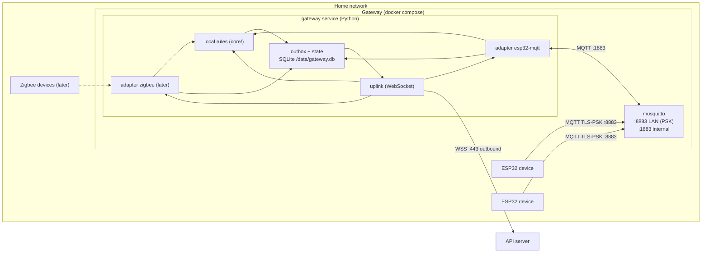
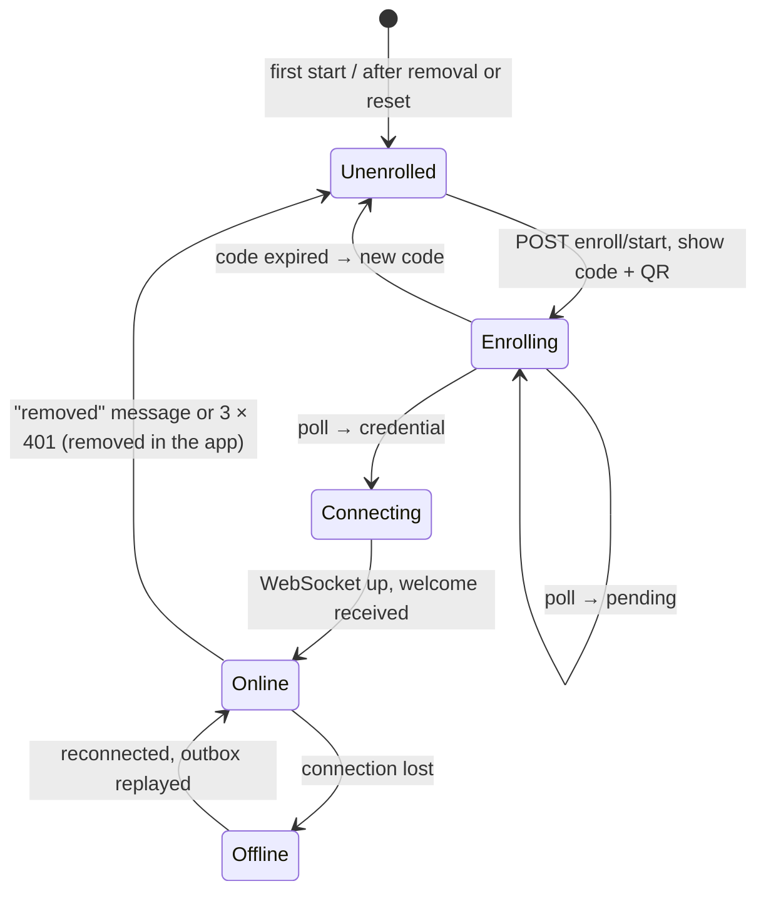

# Gateway — Specification

**Status:** draft · **Last change:** 2026-09-29 (v2 architecture, D33–D39)

The gateway is the household's box at home. It **talks to the edge devices**, **runs the household's watering rules locally**, and **forwards everything to the central API server** over one outbound WebSocket, buffering while offline. It has no users, no web pages and no inbound internet ports. **What** it is responsible for is defined in [`PROJECT.md`](../PROJECT.md) §4.2; the wire formats are in [`contracts/gateway_api.md`](../contracts/gateway_api.md) (towards the API) and [`contracts/mqtt.md`](../contracts/mqtt.md) (towards ESP32 devices).

---

## 1. Requirements

| Item | Requirement |
|---|---|
| Hardware | Any 64-bit machine: Raspberry Pi 3B+/4/5, NAS with Docker, mini PC, old laptop. ≥ 1 GB RAM, ≥ 4 GB free disk (buffer). Later radios need their USB sticks (Zigbee coordinator, LoRa concentrator). |
| OS | 64-bit Linux with Docker Engine + Compose plugin. |
| Images | Multi-arch: `linux/arm64` and `linux/amd64`. |
| Network | Same LAN as the devices; outbound HTTPS/WSS to `api.<our-domain>` (443). **No** port forwarding. **Fixed LAN IP** (DHCP reservation) — ESP32 devices store it at pairing. |
| Time | NTP on the host. The gateway reports `time_synced` and refuses to create rule commands while the clock is not synced. |

---

## 2. Components



| Container | Image | Purpose |
|---|---|---|
| `mosquitto` | `mc-broker` (Broker_Specs §4) | LAN broker for ESP32 devices; reloads its PSK file when the gateway service rewrites it. |
| `gateway` | `mc-gateway` (ours, multi-arch) | The gateway service: adapters, local rules, outbox, uplink, enrollment, `mc-gateway` CLI. Uses `core/` (contract models, rules engine, command checks). |

Volumes: `gateway-data` (`/data`: SQLite, credential, generated broker files), `mosquitto-data` (broker persistence, including commands queued for sleeping devices).

Installation: download `docker-compose.yml` + `.env`, `docker compose up -d`, enter the shown code in the app. A ready-to-flash Raspberry Pi image may come later.

### 2.1 Adapters (D37)

An adapter connects one device technology to the gateway's normalized model:

| Adapter | Status | Devices | Transport | Pairing | Keys from the API |
|---|---|---|---|---|---|
| `esp32-mqtt` | v1 | Our ESP32 plant devices | MQTT over TLS-PSK via the local Mosquitto | BLE by the app ([ble.md](../contracts/ble.md)) | PSK per device → broker PSK file |
| `zigbee` | later | Off-the-shelf Zigbee sensors/valves | Zigbee2MQTT on the same Mosquitto (internal only) | Permit-join started from the app via the API | — |
| `lorawan` | later | LoRaWAN sensors | Local network server (e.g. ChirpStack) via MQTT | LoRaWAN keys | Device keys |

Adapter interface (Python): `start()`, `stop()`, `on_keys(devices)`, `send_command(device, command)`, `send_config(device, config)`, `remove_device(device)`, and a callback `emit(device, kind, payload)` that produces normalized device messages ([gateway_api.md §5.1](../contracts/gateway_api.md)). Adding a technology = one new adapter + new module/reading types in mqtt.md §8; API and app need no protocol knowledge.

---

## 3. Lifecycle



- **Unenrolled / Enrolling:** device-code enrollment ([gateway_api.md §3](../contracts/gateway_api.md)); the code and a QR of the `claim_url` are printed to the container log and `mc-gateway status`. Adapters don't start yet (the PSK file stays empty).
- **Online:** after `welcome`, the gateway replays the outbox, receives snapshot/keys if outdated, then pending commands. Adapters start once the first keys and snapshot are applied.
- **Offline:** everything local keeps running (§7); up messages accumulate in the outbox.
- **Removed:** delete credential, keys (PSK file emptied → devices can no longer connect) and snapshot; keep the outbox file for inspection; back to Unenrolled.

---

## 4. Local state (SQLite, `/data/gateway.db`)

| Table | Content | Retention |
|---|---|---|
| `meta` | gateway ID, API URL, `snapshot_rev`, `keys_rev`, `next_seq`, `last_down_id`, clock/sync info | — |
| `outbox` | Up messages: `seq`, `type`, `body`, `created_at` | Until acked by the API; limits §6 |
| `snapshot` | Current snapshot JSON + rev | Current only |
| `down_log` | IDs of applied down messages | 7 days (idempotency) |
| `readings_recent` | Latest readings per device slot | 7 days (rules, CLI) |
| `commands` | Commands seen or created (id, device, slot, source, status, times) | 7 days (busy / cooldown / min-pause checks) |
| `rule_decisions` | Decisions made locally | 7 days |

The gateway is **not** a history store: the API server keeps the full history. The local tables serve the rules engine, the checks and the CLI.

The credential lives in `/data/secrets/credential` (mode 600), device PSKs only in the broker's PSK file (`/data/broker/psk`, mode 640, group `mcbroker`).

---

## 5. Responsibilities

### 5.1 Device traffic (adapter `esp32-mqtt`)

The adapter connects to the local broker's internal listener (`mc-gateway`, persistent session) and subscribes to `mc/v1/+/#`:

- device → gateway topics (`status`, `telemetry`, `event`, `cmd/ack`, `config/state`): validate against `core/` models, wrap as a `device` message (payload unchanged, `received_at`), append to the outbox, and feed telemetry to the rules engine; track `next_wake_s` and command state.
- Messages from unknown device IDs are impossible (no PSK), except after a `device_removed` race — dropped and logged.

### 5.2 Down messages

| Message | Handling |
|---|---|
| `snapshot` | Validate with `core/` models; `rev` ≤ current → just ack; invalid → `down_ack rejected`, keep the old one; else store and swap the in-memory rule set atomically, ack, send `gateway_state`. |
| `keys` | Per adapter: `esp32-mqtt` rewrites the PSK file atomically (broker reloads via SIGHUP); devices missing from the set are removed. Ack, `gateway_state`. |
| `command` | Run `core/commands.py` checks with the snapshot's limits and local command history; fail → `down_ack rejected` with the check code; ok → hand to the adapter (ESP32: publish `mc/v1/<dev>/cmd`, QoS 1 — queued by Mosquitto while the device sleeps), record locally, ack. |
| `config_desired` | Hand to the adapter (ESP32: retained `config/desired`), ack. |
| `device_removed` | Adapter clears retained topics and local state, ack. |
| `rotate_credential` / `removed` | [gateway_api.md §6.6](../contracts/gateway_api.md). |

Every down message is applied idempotently (`down_log`).

### 5.3 Rules engine

Exactly the engine from `core/rules.py`, fed with the snapshot's rules and device limits, on every new moisture reading:

1. Evaluate each rule of the reading's plant → `water` / `skip` + reason (or nothing if above threshold).
2. For `water`: create a command (ULID, `exp = now + max(2 × wake interval, 15 min)`), run the command checks (actuator slot, `max_run_s`, `min_pause_s`, hard limit, busy) → append **`command_created`** to the outbox, then hand the command to the adapter.
3. Append **`rule_exec`** for every decision.
4. Cooldown and daily limit use `max(snapshot rule_state, local history)`; "today" uses the household timezone from the snapshot.
5. **Clock not synced** → no command, decision `skip` / `clock_not_synced`.

### 5.4 Uplink

- One WebSocket ([gateway_api.md §4](../contracts/gateway_api.md)); on connect `hello` with revs, `last_down_id`, outbox depth, LAN address.
- Sends outbox entries in `seq` order (max 1 000 unacknowledged in flight); deletes them on the API's cumulative `ack`.
- `gateway_state` on connect, after applying snapshot/keys, and every 10 min.
- Reconnect with exponential backoff (1 s → 60 s, jitter).

---

## 6. Outbox limits (open point, default proposal)

| Limit | Default | When reached |
|---|---|---|
| Size | 200 MB on disk or 30 days of data | Drop the oldest `device` messages of kind `telemetry` first; never drop `command_created`, `rule_exec`, `cmd_ack`, `config_state`, `status` |
| Report | — | `gateway_event buffer_overflow` with the number of dropped messages and their time range |

A typical household (5 devices, 10-min interval) produces ~1 MB/day of up messages, so 200 MB ≈ half a year offline.

---

## 7. Offline behaviour

| What | While the API is unreachable |
|---|---|
| Devices | Connect to the gateway as usual; nothing changes for them. |
| Rules | Keep running on the last applied snapshot. |
| Up data | Accumulates in the outbox (§6) and is replayed in order after reconnect; the API deduplicates by `seq`. |
| Commands from the app | Stay queued at the API (the app shows a warning) and come down after reconnect; expired ones are dropped by the API. |
| Manual watering at home | `mc-gateway water <plant> <seconds>` (reported as `command_created` with `source: local`). |

---

## 8. CLI

`docker compose exec gateway mc-gateway <command>` — requires shell access to the gateway, which is treated as physical ownership.

| Command | Purpose |
|---|---|
| `mc-gateway status` | Enrollment state / code + QR, connection, snapshot + keys rev, outbox depth and oldest entry, clock, adapters, devices with last seen / next expected wake |
| `mc-gateway plants` | Plants with latest reading and rule state |
| `mc-gateway water <plant> <seconds>` | Local manual command (same checks as rules), reported via the outbox |
| `mc-gateway logs` | Recent rule decisions and commands |
| `mc-gateway outbox [--peek N]` | Inspect buffered up messages |
| `mc-gateway reset [--yes]` | Forget enrollment, credential and keys (remove the gateway in the app too) |

---

## 9. Configuration and deployment

### 9.1 Environment variables

| Variable | Meaning |
|---|---|
| `MC_API_URL` | `https://api.<our-domain>` |
| `MC_LAN_HOST` | Fixed LAN IP/hostname for ESP32 pairing bundles (reported in `gateway_state`) |
| `MC_LAN_PORT` | Published MQTT port (default 8883) |
| `MC_ADAPTERS` | Enabled adapters (default `esp32-mqtt`) |
| `MC_OUTBOX_MAX_MB`, `MC_OUTBOX_MAX_DAYS` | §6 |
| `MC_DEV_CREDENTIAL` | Development only: skip enrollment and connect with a fixed credential known to a dev API |

### 9.2 Docker Compose

```yaml
services:
  gateway:     # writes /data/broker/psk, connects out to the API
    volumes: [gateway-data:/data]
  mosquitto:   # mc-broker image, reads /data/broker read-only
    depends_on: [gateway]
    ports: ["${MC_LAN_BIND:-0.0.0.0}:${MC_LAN_PORT:-8883}:8883"]
    volumes: [mosquitto-data:/mosquitto/data, gateway-data:/data:ro]
```

Containers run as non-root with a read-only root filesystem (tmpfs `/tmp`); no Docker socket mounted. Updates: `docker compose pull && docker compose up -d` (the outbox survives).

### 9.3 Code layout

```
gateway/
├── Gateway_Specs.md
├── pyproject.toml            # depends on mc-core
├── Dockerfile · docker-compose.yml · .env.example
├── src/mc_gateway/
│   ├── main.py · config.py · cli.py
│   ├── store.py              # SQLite: meta, outbox, snapshot, recent data
│   ├── uplink.py             # WebSocket, acks, replay
│   ├── enrollment.py
│   ├── rules.py              # wraps core/rules.py with local state
│   └── adapters/
│       ├── base.py
│       └── esp32_mqtt.py     # MQTT client, PSK file
├── tools/fake_device.py      # ESP32 simulator (mqtt.md, TLS-PSK)
└── tests/
```

---

## 10. Security

- **No inbound internet exposure.** The only listening port is 8883 on the LAN (TLS-PSK, devices only).
- **Credential** (256 bit) and device PSKs stored with restrictive modes on the `gateway-data` volume. Root on the gateway = access to this household's devices only.
- **What a compromised gateway can do:** read this household's device data, send commands/configs to its devices (bounded by the devices' own safety limits), send fake data for its own household. It cannot see users, other households or the database; the API drops messages for foreign devices.
- **Containers** run as non-root, read-only root filesystem, no Docker socket.

---

## 11. Testing

| Level | What |
|---|---|
| Unit | Outbox sequencing, ack handling, replay order, limits and dropping policy; snapshot/keys handling; rule decisions with snapshot `rule_state`; clock-not-synced; command checks; adapter normalization. |
| Integration | Gateway compose + a real API stack + `tools/fake_device.py`: enrollment, readings end-to-end, command to a sleeping device, API unreachable for a while (buffer, local rules, replay), gateway restart during replay, removal in the app. |
| Multi-arch | CI builds and smoke-tests both images (amd64 natively, arm64 under QEMU). |

---

## 12. Open points

- **Outbox limits** (§6) — confirm defaults.
- **Second adapter** (Zigbee via Zigbee2MQTT or LoRaWAN via ChirpStack) and how its pairing is started from the app.
- **Credential rotation** schedule.
- **Ready-made Raspberry Pi image.**
