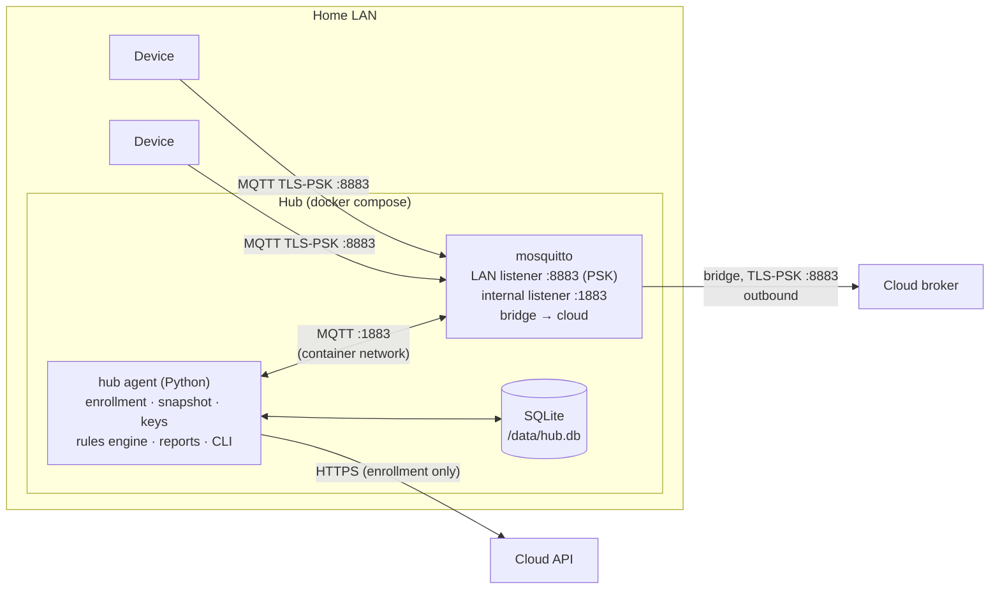
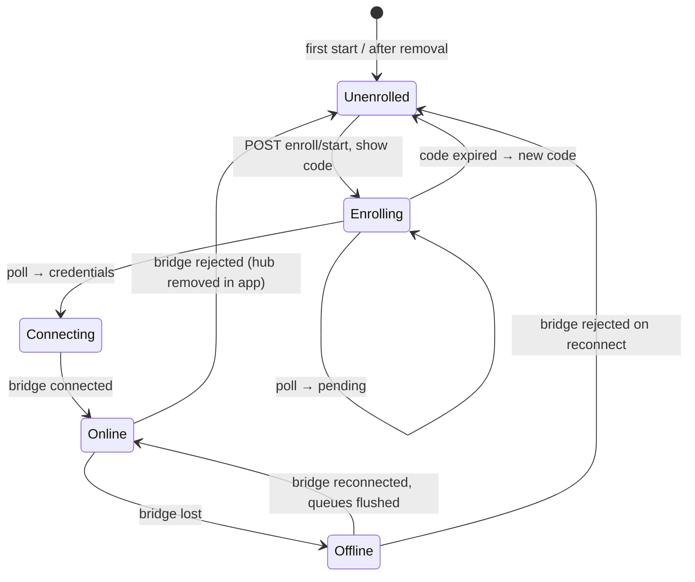

# Home Hub — Specification

**Status:** draft · **Last change:** 2026-09-28

The home hub is an **optional agent** for one household. It runs the local MQTT broker for that household's devices and executes the household's watering rules locally, so watering keeps working without internet. It connects **outbound** to the cloud and has no users, no logins, no web pages. **What** it is responsible for is defined in [`PROJECT.md`](../PROJECT.md) §3.5–3.7 and §4.4; the wire formats are in [`contracts/hub.md`](../contracts/hub.md) and [`contracts/mqtt.md`](../contracts/mqtt.md).

---

## 1. Requirements

| Item | Requirement |
|---|---|
| Hardware | Any 64-bit machine: Raspberry Pi 3B+/4/5, NAS with Docker support, mini PC, old laptop. ≥ 1 GB RAM, ≥ 4 GB free disk. |
| OS | 64-bit Linux with Docker Engine + Compose plugin (Raspberry Pi OS 64-bit, Debian, Ubuntu, …). |
| Images | Multi-arch: `linux/arm64` and `linux/amd64`. |
| Network | Same LAN as the devices; outbound internet to the cloud API (443) and cloud broker (8883). **No** port forwarding. Should have a fixed LAN IP (DHCP reservation) — devices store it at pairing. |
| Time | NTP (standard on all these OSes). The agent reports `time_synced` and refuses to create rule commands while the clock is not synced. |

---

## 2. Components

| Container | Image | Purpose |
|---|---|---|
| `mosquitto` | `eclipse-mosquitto` + small reload watcher | LAN broker for devices, bridge to the cloud. Reloads PSK/ACL/bridge config when the agent rewrites them. |
| `agent` | `mc-hub-agent` (ours, multi-arch) | Everything else. Shares the `core/` package with the cloud backend (contract models, rules engine, command checks). |

Volumes: `hub-data` (`/data`: SQLite, keys, generated broker config), `mosquitto-data` (broker persistence, including queued messages while offline).

Installation: download `docker-compose.yml` + run `docker compose up -d`. A ready-to-flash Raspberry Pi image may come later (PROJECT D31).

---

## 3. Lifecycle

- **Unenrolled / Enrolling:** the agent runs the enrollment of [contracts/hub.md §3](../contracts/hub.md), prints the user code and a QR code (the `claim_url`) to the container log and to `mc-hub status`. The LAN listener is not started yet.
- **Connecting → Online:** the agent writes `bridge.psk` and the bridge config, the broker reloads and connects. The agent waits for `down/keys` and `down/snapshot`, applies them, then starts the LAN listener.
- **Offline:** everything local keeps running (§6). Only reporting is delayed (queued in the broker).
- **Removed** (bridge authentication fails permanently, 3 attempts): the agent deletes keys and snapshot, stops the LAN listener and goes back to Unenrolled. Local history is kept until re-enrollment and then discarded.

---

## 4. Broker configuration (generated by the agent)

| Listener | Bind | Auth | Clients |
|---|---|---|---|
| `8883` | LAN interface(s) | TLS 1.2 PSK (`PSK-AES128-GCM-SHA256`), `psk_file /data/broker/psk`, `use_identity_as_username true` | Devices |
| `1883` | container network only | `password_file`, user `mc-agent` | Agent |

- ACL: pattern rules so each device (username = device ID) can only publish `mc/v1/%u/{status,telemetry,event,cmd/ack,config/state}` and subscribe `mc/v1/%u/{cmd,config/desired}`; `mc-agent` has full access.
- `persistence true`, `max_queued_messages 100000`, `max_inflight_messages 20`, `persistent_client_expiration 30d`.
- Bridge `cloud`: address/identity/key from enrollment, `bridge_tls_version tlsv1.2`, `cleansession false`, `notifications true`, `notification_topic mc/hub/v1/<hub-id>/up/bridge`, topics exactly as in [contracts/hub.md §4](../contracts/hub.md) — **`in` topics listed per device**, regenerated from every new `down/keys` set — `restart_timeout 5 60` (backoff).
- The agent writes files atomically (write temp + rename). The watcher in the mosquitto container sends `SIGHUP` when the PSK file changes (reload, connections stay up) and restarts Mosquitto when the bridge config changes (~2 s). Full details: [`broker/Broker_Specs.md`](../broker/Broker_Specs.md) §4.

---

## 5. Agent responsibilities

### 5.1 Snapshot and keys

- Subscribes to `down/snapshot` and `down/keys` (retained, so they arrive on every connect).
- `down/keys` → rewrite the broker PSK file from the full list, reload, store `keys_rev`, publish `up/ack`.
- `down/snapshot` → validate with the `core/` models, store in SQLite, swap the in-memory rule set atomically, publish `up/ack`. A snapshot that fails validation is rejected (`result: rejected`) and the previous one stays active.
- Publishes `up/state` on connect, after every apply, and every 10 min.

### 5.2 Watching device traffic

The agent subscribes on the local broker to all device topics (`mc/v1/+/#`) — both what devices publish and what arrives from the cloud (`cmd`, `config/desired`):

- `telemetry` → store the latest readings per slot (ring buffer, §5.4), run the rules engine for affected plants.
- `cmd` (from the cloud) and `cmd/ack` → keep track of queued/running pump commands per slot (needed for the `pending_command` check and for cooldowns: manual watering does **not** reset rule cooldowns, same as in the cloud).
- `status` → track the devices' `next_wake_s` for the CLI.

### 5.3 Rules engine

Exactly the engine from `core/` that the cloud uses ([Server_Specs §11.1](../server/Server_Specs.md)), fed with the snapshot's rules and limits:

1. For each rule evaluation that crosses the threshold, build a decision (`water` / `skip` + reason).
2. For `water`: create a command (ULID, `exp = now + max(2 × wake interval, 15 min)`), run the same command checks as the cloud (actuator slot, `max_run_s`, `min_pause_s`, hard limit, busy), then:
   1. publish `up/cmd` (goes to the cloud, queued if offline),
   2. publish `mc/v1/<dev>/cmd` on the **local** broker (reaches the device on its next wake).
3. Publish `up/rule_exec` for every decision.
4. Cooldown and daily limit use `max(snapshot rule_state, local history)`; "today" uses the household timezone from the snapshot.

No rule command is created while the clock is not synced (`time_synced: false`) — a wrong clock would break expiry, cooldowns and quiet hours.

### 5.4 Local storage (SQLite)

| Table | Content | Retention |
|---|---|---|
| `snapshot` | Current snapshot JSON + rev | current only |
| `readings_recent` | Last readings per device slot | 7 days |
| `commands` | Commands seen or created (id, device, slot, source, status, times) | 7 days |
| `rule_decisions` | Decisions made locally | 7 days |
| `meta` | hub_id, enrollment state, `keys_rev`, … | — |

The hub is **not** a history store: the cloud keeps the full history. The local tables only serve the rules engine and the CLI.

---

## 6. Offline behaviour

| What | While offline |
|---|---|
| Devices | Connect to the hub as usual; nothing changes for them. |
| Rules | Keep running on the last applied snapshot. |
| Device messages to the cloud | Queued by the broker bridge (up to 100 000 messages, persisted) — about months of data for a typical household. |
| Hub reports (`up/*`) | Queued the same way. |
| Commands from the cloud | Queued on the cloud side in the hub's persistent session; delivered on reconnect (devices drop expired ones). |
| App | Shows "hub offline since …"; manual watering is still accepted and queued, with a warning. |

On reconnect the broker flushes both queues in order; the cloud deduplicates by device `seq` and command/report IDs.

---

## 7. CLI

`docker compose exec agent mc-hub <command>` — requires shell access to the hub, which is treated as physical ownership.

| Command | Purpose |
|---|---|
| `mc-hub status` | Enrollment state / user code, bridge state, snapshot + keys rev, queue depth, time sync, devices with last seen / next expected wake. |
| `mc-hub plants` | Plants with latest reading and rule state. |
| `mc-hub water <plant> <seconds>` | Create a manual command locally (same checks as rules, `source: "local"`), reported via `up/cmd`. For use when the internet is down. |
| `mc-hub logs` | Recent rule decisions and commands. |
| `mc-hub reset` | Forget enrollment and all keys (the hub must also be removed in the app). |

---

## 8. Security

- **No inbound internet exposure.** The only listening port is 8883 on the LAN, TLS-PSK, devices only. No HTTP server at all.
- **Keys at rest:** `bridge.psk` and the broker PSK file are mode 600, owned by the container user, on the `hub-data` volume. Whoever has root on the hub has them — which only gives access to this household's device topics (cloud ACL, [contracts/hub.md §6](../contracts/hub.md)).
- **What a compromised hub can do:** read this household's telemetry, send commands/config to this household's devices (still bounded by the devices' own safety limits), send fake reports for this household. It cannot see users, other households, or the API.
- **Containers** run as non-root, read-only root filesystem, no Docker socket mounted.
- **Updates:** the snapshot carries `latest_agent_version`; the cloud shows an update notice in the app. Updating = `docker compose pull && docker compose up -d`. No auto-update in v1.

---

## 9. Testing

| Level | What |
|---|---|
| Unit | Snapshot/keys handling, rule decisions with snapshot `rule_state`, clock-not-synced behaviour, command checks (shared with `core/` tests). |
| Integration | Hub compose + cloud compose + `tools/fake_device.py` (from `server/`): enrollment, bridge, queued data during a simulated outage (block the bridge), cloud command via bridge, rule command created offline and reported later, hub removal. |
| Multi-arch | CI builds and smoke-tests both images (amd64 natively, arm64 under QEMU). |

---

## 10. Open points

- **Bridge key rotation** without re-enrollment (a `down/rotate` message with a new key, confirmed before the old one is dropped).
- **Ready-made Raspberry Pi image** (D31 mentions it as "later").
- **LAN status page** on the hub (read-only, no login) — deliberately not in v1 (D26).
