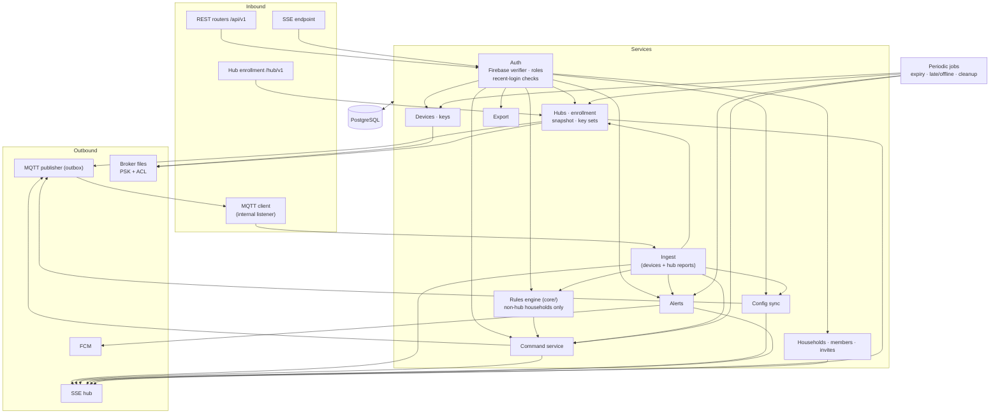
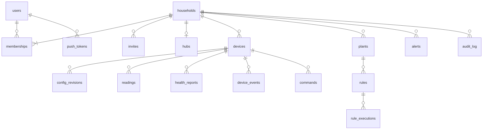
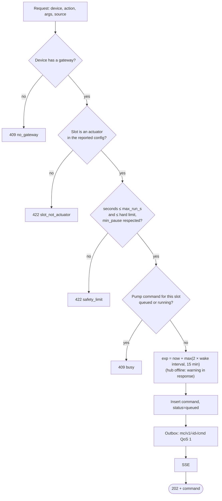
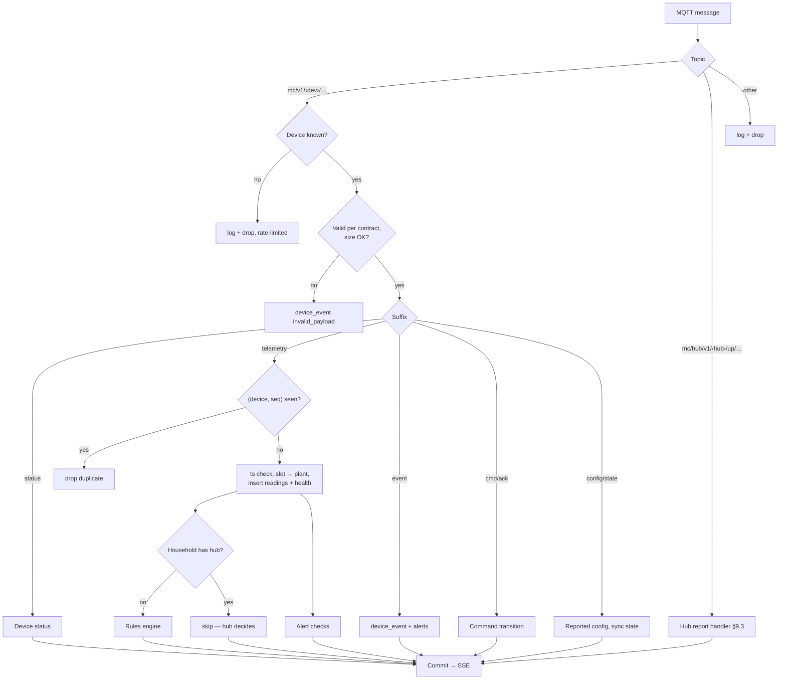
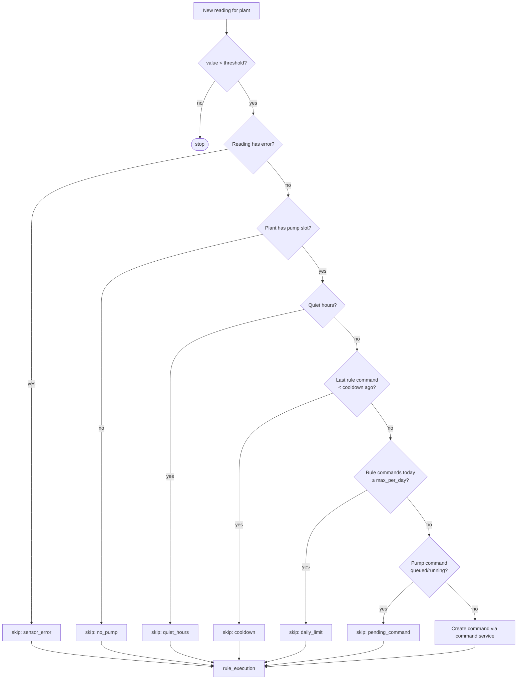
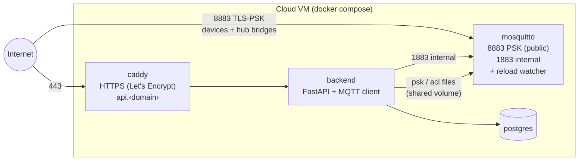

# Cloud Backend — Specification

**Status:** draft · **Last change:** 2026-09-28

The cloud backend is the only place with users, households and the app's API, and the only component that talks to both users and devices. We operate it for everyone. **What** it is responsible for is defined in [`PROJECT.md`](../PROJECT.md); this document describes **how** it is built.

Interfaces: devices → [`contracts/mqtt.md`](../contracts/mqtt.md); hubs → [`contracts/hub.md`](../contracts/hub.md); app → the OpenAPI spec generated from this code (`contracts/api.yaml`); login → Firebase ([`firebase/Firebase_Specs.md`](../firebase/Firebase_Specs.md)).

---

## 1. Scope

In scope:

- Firebase ID token verification, households, memberships, roles, invites, sensitive-action checks.
- REST API + Server-Sent Events for the Flutter app.
- MQTT ingest from the cloud broker — devices connected directly **and** devices bridged through hubs.
- Device and hub registry; MQTT keys and ACLs of the cloud broker; hub enrollment; household snapshots and key sets for hubs.
- Command queue and lifecycle (commands from the API, from cloud rules, and those reported by hubs).
- Config sync (desired vs. reported).
- Rules engine for households **without** a hub; recording of hub rule decisions.
- Alerts and push notifications (FCM).
- Owner data export.

Out of scope: login UI and identity (Firebase), the web app (Firebase Hosting), the hub agent (`hub/`), device firmware.

---

## 2. Technology

| Concern | Choice | Notes |
|---|---|---|
| Language / runtime | Python 3.13 | 3.13 for `ssl` TLS-PSK support, which `tools/fake_device.py` needs; backend and hub use the same version. |
| Web framework | FastAPI + Uvicorn | OpenAPI generated from code. |
| Shared code | `core/` package | Contract models (mqtt.md, hub.md), rules engine, command checks, pin rules — identical on backend and hub. |
| Validation | Pydantic v2 | |
| Database | PostgreSQL 16 via SQLAlchemy 2 async + `asyncpg`, Alembic migrations | TimescaleDB extension optional later for readings. |
| MQTT client | `aiomqtt` | One connection, persistent session. |
| SSE | `sse-starlette` | |
| Auth | `firebase-admin` (`verify_id_token`, `check_revoked` for sensitive actions) | The service account lives only here. |
| Push | `firebase-admin` messaging (FCM) | |
| Key encryption at rest | `cryptography` (AES-256-GCM) | For device and hub PSKs in the DB. |
| IDs | ULID | |
| Tests | pytest, pytest-asyncio, httpx `AsyncClient`, Postgres + Mosquitto in Docker | |

**Process model:** one Uvicorn process with one worker, hosting the API, the MQTT connection, the SSE hub and the periodic jobs. Enough for the expected scale; scaling out later needs a shared bus for SSE and job ownership (§17).

---

## 3. Internal architecture



- **Routers are thin**: parse, auth dependency, one service call, serialize.
- **Services own logic and transactions.**
- **Every write the app should see live emits an SSE event** after commit.
- **Rules never publish MQTT directly**; they create commands through the command service.

---

## 4. Data model

All IDs are ULIDs unless noted; timestamps UTC. Every table with household data has `household_id`, and every query filters by it (§5.4).



| Table | Key columns | Notes |
|---|---|---|
| `users` | `uid` (Firebase UID, PK), `email` (verified only), `display_name`, `first_seen_at` | Upserted from token claims. |
| `households` | `id`, `name`, `timezone`, `battery_low_mv`, `snapshot_rev`, `keys_rev`, `created_at` | `*_rev` counters for the hub (§9). |
| `memberships` | (`household_id`, `user_uid`) PK, `role`, `created_at` | Exactly one `owner` per household (partial unique index). |
| `invites` | `id`, `household_id`, `code_hash`, `role`, `created_by`, `expires_at`, `used_by`, `used_at`, `revoked_at` | SHA-256 of the code only. |
| `hubs` | `id` (`hub-…`), `household_id` (unique), `psk_enc`, `status`, `bridge_connected`, `last_state` (JSON of `up/state`), `lan_host_override`, `snapshot_rev_applied`, `keys_rev_applied`, `created_at` | At most one per household (D30). |
| `hub_enrollments` | `id`, `secret_sha256`, `user_code_hash`, `expires_at`, `claimed_household_id`, `claimed_by`, `hub_id`, `consumed_at`, `ip`, `agent_version`, `arch` | Short-lived; cleaned up after 24 h. |
| `devices` | `id` (`mc-…`), `household_id`, `name`, `psk_enc`, `gateway` (`cloud`/`hub`/`none`), `hw_mac`, `fw`, `status`, `last_seen_at`, `next_expected_at`, `wake_interval_s`, `batt_mv`, `rssi`, `last_seq`, `last_boot`, `desired_rev`, `reported_rev`, `created_at` | `status` ∈ `new`, `online`, `sleeping`, `late`, `offline`, `service`. |
| `config_revisions` | `device_id`, `rev`, `kind` (`desired`/`reported`), `body`, `result`, `error`, `created_at`, `created_by` | Full history. |
| `plants` | `id`, `household_id`, `name`, `notes`, `sensor_device_id`, `sensor_slot`, `pump_device_id`, `pump_slot`, `archived_at` | |
| `readings` | `id` (bigint), `device_id`, `slot`, `plant_id`, `type`, `value`, `raw`, `error`, `ts`, `ts_source`, `seq` | Indexes (`plant_id`, `ts`), (`device_id`, `slot`, `ts`). Partitioned by month once volume grows. |
| `health_reports` | `device_id`, `ts`, `seq`, `batt_mv`, `rssi`, `wake`, `cycle_ms`, `wifi_ms` | |
| `device_events` | `device_id`, `ts`, `seq`, `kind`, `slot`, `detail` | |
| `commands` | `id`, `household_id`, `device_id`, `action`, `args`, `status`, `reason`, `source` (`manual`/`rule`/`local`), `origin` (`cloud`/`hub`), `created_by` (uid or rule id), `created_at`, `exp`, `delivered_at`, `finished_at`, `ends_at`, `cancel_of` | |
| `rules` | `id`, `household_id`, `plant_id`, `enabled`, `threshold`, `water_s`, `cooldown_s`, `max_per_day`, `quiet_from`, `quiet_to`, `created_by`, `updated_at` | |
| `rule_executions` | `id`, `rule_id`, `ts`, `reading_ref`, `decision`, `skip_reason`, `command_id`, `origin` (`cloud`/`hub`) | Hub decisions arrive via `up/rule_exec`. |
| `alerts` | `id`, `household_id`, `kind`, `subject_type`, `subject_id`, `severity`, `opened_at`, `resolved_at`, `acked_by`, `acked_at`, `detail` | One open alert per (`kind`, `subject`). |
| `push_tokens` | `token` PK, `user_uid`, `platform`, `updated_at` | |
| `audit_log` | `id`, `household_id`, `actor`, `action`, `detail`, `ts`, `ip` | Role changes, invites, devices, hub add/remove, export, deletes. |
| `outbox` | `id`, `topic`, `payload`, `qos`, `retain`, `created_at`, `sent_at` | §10.1 |

**Keys at rest:** device and hub PSKs are stored encrypted (`*_enc`, AES-256-GCM with `MC_KEY_ENCRYPTION_KEY`), decrypted only to write broker files and to build pairing bundles / hub key sets.

---

## 5. Authentication and authorization

### 5.1 Firebase ID tokens

Every API request carries `Authorization: Bearer <Firebase ID token>`. The backend verifies it with `firebase_admin.auth.verify_id_token` (signature against Google's cached keys, `aud` = our project, `iss`, `exp`), takes `uid` from it and upserts the `users` row (`email` only if `email_verified`). Accounts with e-mail/password must have a verified e-mail before they can create or join households.

### 5.2 Roles

Matrix in [PROJECT.md §3.2](../PROJECT.md). One FastAPI dependency per minimum role:

```python
@router.post("/households/{household_id}/plants/{plant_id}/water")
async def water(..., ctx: HouseholdCtx = Depends(require_role(Role.member))): ...
```

- Not a member → **404** (existence not revealed); role too low → **403**. Order: `viewer < member < admin < owner`.
- Admins may invite/assign up to `member` and remove `member`/`viewer`. Only the owner changes admins, transfers ownership, renames/deletes the household and exports.
- The owner cannot leave; ownership must be transferred first.

### 5.3 Sensitive actions

For: delete household, transfer ownership, promote/demote admin, export, add/remove hub, delete device.

- Token `auth_time` must be ≤ 5 min old → otherwise **401 `reauth_required`**; the app re-authenticates and retries.
- `verify_id_token(check_revoked=True)` — a disabled account or revoked sessions are refused immediately instead of after token expiry.

### 5.4 Tenant isolation

- All household data under `/api/v1/households/{household_id}/…`; resources always loaded by household **and** ID.
- A test suite calls every household route as a non-member (expect 404) and with each lower role (expect 403).

### 5.5 Public exposure

The cloud API and broker are public by design. Measures:

| Measure | Detail |
|---|---|
| Rate limits (in-app, per IP / per user) | unauthenticated 30/min/IP · invalid tokens 20/5 min/IP → 15 min block · authenticated 300/min/user · water/actions 30/min/household · invites 20/day/household · hub claim 10/h/user · enrollment start 10/h/IP · poll ≥ interval |
| Request limits | JSON body ≤ 64 KB; Caddy header/idle timeouts; SSE exempt from write timeout |
| Headers | HSTS, `nosniff`, `Referrer-Policy: no-referrer`, `Content-Security-Policy: default-src 'none'` (JSON only) |
| CORS | Only the official web-app origin (`MC_CORS_ORIGINS`) |
| Docs | `/docs` and `/openapi.json` disabled in production |
| Broker | PSK-only on 8883, no anonymous clients; connection limits in Mosquitto (`max_connections`) |

---

## 6. REST API

Base `/api/v1`, JSON, ISO 8601 UTC timestamps, errors as RFC 9457 problem+json with stable `type`s. The app sends `X-MC-App: <platform>/<version>`; below `MC_MIN_APP_VERSION` the backend answers **426 Upgrade Required**.

### 6.1 Endpoints

**Me**

| Method | Path | Purpose |
|---|---|---|
| GET | `/me` | Profile |
| DELETE | `/me` | Delete account data*: leave all households; refused (409 `sole_owner`) while the user owns a household with other members — ownership must be transferred first; owned single-member households are deleted. The app deletes the Firebase account afterwards. |
| GET | `/me/households` | Households with my role — the household switcher |
| PUT / DELETE | `/me/push-tokens/{token}` | Register / remove an FCM token |
| POST | `/events/ticket` | Short-lived SSE ticket (§6.2) |
| GET | `/meta/boards/{board}` | Board description from `core/pins.py`: allowed pins per module type, reserved pins, module list — so the app's slot editor never duplicates pin rules |

**Households, members, invites**

| Method | Path | Min. role | Purpose |
|---|---|---|---|
| POST | `/households` | logged in (verified) | Create; creator becomes owner. Quota `MC_MAX_HOUSEHOLDS_PER_USER`. |
| GET / PATCH / DELETE | `/households/{h}` | viewer / owner / owner* | Read / rename, timezone, battery threshold / delete |
| POST | `/households/{h}/transfer-ownership` | owner* | |
| GET | `/households/{h}/members` | viewer | |
| PATCH / DELETE | `/households/{h}/members/{uid}` | admin (§5.2), owner* for admins | Change role / remove; members may remove themselves |
| GET / POST | `/households/{h}/invites` | admin | List / create `{role, expires_in_h}` → code once; app builds `https://app.<domain>/join#c=<code>` |
| DELETE | `/households/{h}/invites/{id}` | admin | Revoke |
| GET | `/invites/{code}` | logged in | Preview (household name, role, inviter, expiry); never consumes |
| POST | `/invites/{code}/accept` | logged in (verified) | Join |

\* = sensitive action (§5.3)

**Hub**

| Method | Path | Min. role | Purpose |
|---|---|---|---|
| GET | `/households/{h}/hub` | viewer | Hub state: online, versions, revs in sync, queue depth, LAN address |
| POST | `/households/{h}/hub` | admin* | `{user_code}` → claim an enrolling hub ([contracts/hub.md §3.2](../contracts/hub.md)) |
| PATCH | `/households/{h}/hub` | admin | `{lan_host_override}` |
| DELETE | `/households/{h}/hub` | admin* | Remove hub (§9.4) |

**Devices & config**

| Method | Path | Min. role | Purpose |
|---|---|---|---|
| GET | `/households/{h}/devices` | viewer | List with status, battery, last seen, sync state, gateway |
| POST | `/households/{h}/devices` | admin | `{name}` → device ID + key, returns the pairing bundle **once** (§8.1) |
| GET / PATCH / DELETE | `/households/{h}/devices/{d}` | viewer / admin / admin* | |
| POST | `/households/{h}/devices/{d}/rekey` | admin | New key + bundle (for re-pairing, e.g. after a gateway change) |
| GET / PUT | `/households/{h}/devices/{d}/config` | viewer / admin | Desired + reported + sync state / new desired with `base_rev` |
| GET | `/households/{h}/devices/{d}/health` | viewer | Battery / RSSI history |
| GET | `/households/{h}/devices/{d}/events` | viewer | |
| POST | `/households/{h}/devices/{d}/actions` | member (identify) / admin (service, reboot) | |

**Plants, readings, watering, rules**

| Method | Path | Min. role | Purpose |
|---|---|---|---|
| GET / POST | `/households/{h}/plants` | viewer / member | |
| GET / PATCH / DELETE | `/households/{h}/plants/{p}` | viewer / member / member | Delete = archive |
| GET | `/households/{h}/plants/{p}/readings` | viewer | `from`, `to`, `bucket` (`raw` ≤ 7 days, `1h`, `1d`) |
| POST | `/households/{h}/plants/{p}/water` | member | `{seconds}` → 202 + command |
| GET / POST | `/households/{h}/plants/{p}/rules` | viewer / member | |
| PATCH / DELETE | `/households/{h}/plants/{p}/rules/{r}` | member | |
| GET | `/households/{h}/plants/{p}/rules/{r}/executions` | viewer | Includes where the decision ran (cloud / hub) |

**Commands, alerts, live, export**

| Method | Path | Min. role | Purpose |
|---|---|---|---|
| GET | `/households/{h}/commands` | viewer | Filter by status, device, plant, origin |
| GET | `/households/{h}/commands/{c}` | viewer | |
| POST | `/households/{h}/commands/{c}/cancel` | member | §7.3 |
| GET | `/households/{h}/alerts` | viewer | |
| POST | `/households/{h}/alerts/{a}/ack` | member | |
| GET | `/households/{h}/stream?ticket=` | viewer | SSE |
| GET | `/households/{h}/audit` | admin | |
| POST | `/households/{h}/export` | owner* | §12 |

**Hub enrollment** (`/hub/v1`, no user auth): `POST /enroll/start`, `POST /enroll/poll` — [contracts/hub.md §3](../contracts/hub.md).

### 6.2 Live updates (SSE)

1. `POST /events/ticket` (normal token) → random ticket, 60 s, single use, bound to the user.
2. `GET /households/{h}/stream?ticket=…` → ticket + membership checked, then stream.
3. `Last-Event-ID` replay from an in-memory ring buffer (200 events per household); too old → `resync`.
4. `ping` every 25 s. Streams of removed members are closed.

Events: `reading`, `device`, `command`, `config`, `alert`, `hub`, `household`, `resync`.

### 6.3 OpenAPI

`mc-server openapi > ../contracts/api.yaml`; CI fails on drift; the Dart client is generated from it.

---

## 7. Commands

### 7.1 Creating a command (API and cloud rules)



The checks come from `core/` and are the same ones the hub runs. The device remains the final authority.

### 7.2 Lifecycle and acks

| Incoming | From state | → New state |
|---|---|---|
| `up/cmd` from the hub (hub-created command) | — | insert with `origin = hub`, `queued` |
| ack `running` (with `ends_at`) | queued | `delivered` |
| ack `done` | queued / delivered | `done` |
| ack `rejected`, reason `expired` | queued | `expired` |
| ack `rejected` / `failed` (other) | queued / delivered | `failed` |
| ack `cancelled` | queued / cancelling | `cancelled` |
| job: `now > exp + 2 × wake interval`, no ack | queued / cancelling | `expired` |
| job: `now > ends_at + 2 × wake interval` | delivered | `failed`, `no_final_ack` |

For hub households the expiry job pauses while the hub is offline (acks may be queued on the hub) and resumes with a grace period after reconnect. An ack for an unknown command ID from a hub household is kept for 10 min waiting for the matching `up/cmd`, then logged and dropped.

### 7.3 Cancel

On a `queued` command: status `cancelling`, publish `cmd.cancel` with `target`; final state from the device's acks. On a `delivered` long run: publish `pump.stop`.

---

## 8. Devices, keys and config

### 8.1 Adding a device

1. The admin scans the device's PoP label; the app calls `POST /households/{h}/devices {name}`.
2. The backend requires a gateway: if the household has a hub it must be online (409 `hub_offline` otherwise); otherwise the gateway is the cloud broker.
3. It generates the device ID (`mc-` + 16 Crockford base32) and a 32-byte PSK, stores the key encrypted, and installs it:
   - **cloud gateway:** rewrites the cloud broker's PSK file (§10.3);
   - **hub gateway:** increments `keys_rev`, publishes the new `down/keys` set, extends the hub's ACL on the cloud broker, and waits (≤ 30 s) for the hub's `up/ack`.
4. Returns the **pairing bundle** once:
   ```json
   { "device_id": "mc-8f3kq2v7xw1m9hzt",
     "mqtt": { "host": "192.168.1.20", "port": 8883, "psk": "<64 hex chars>" } }
   ```
   `host`: hub `lan_host` (or override) for hub households, otherwise the public broker hostname.
5. The app pairs over BLE ([contracts/ble.md](../contracts/ble.md)). Devices still `new` after 24 h are deleted with their keys.
6. Publishes the initial `config/desired` (rev 1), retained.

**Removing a device:** remove its key (cloud PSK file or hub key set), remove it from the hub ACL, clear retained topics, cancel open commands, keep history.

**Gateway change** (hub added or removed): all devices of the household get `gateway = none` until re-paired via `rekey` (new key on the new gateway).

### 8.2 Config sync

- `PUT …/config` with `base_rev` (409 on mismatch). Validation from `core/` (pin rules for the DOIT ESP32 DevKit V1, module list, `max_run_s` ≤ reported hard limit, no pin used twice) → 422 with the contract's error codes.
- Valid → `rev + 1`, store, publish retained `config/desired` via the outbox. For hub households it travels through the bridge automatically.
- Reported `config/state` → store; `sync_state` = `in_sync` / `pending` / `rejected` (+ alert).
- Changes to actuator limits or wake interval also bump the household `snapshot_rev` (§9.2).

### 8.3 Device status

| Trigger | Status | Side effects |
|---|---|---|
| `status` online / sleeping / service | as reported | `last_seen_at`, `next_expected_at` |
| `status` offline (LWT) | `offline` | `device_crashed` alert |
| job: `> next_expected + 1 interval` | `late` | — |
| job: `> next_expected + 3 intervals` | `offline` | `device_offline` alert |

For hub households these jobs are **suspended while the hub is offline** — the app shows "hub offline" instead, and a single `hub_offline` alert is raised.

---

## 9. Hubs

### 9.1 Enrollment

Implements [contracts/hub.md §3](../contracts/hub.md):

- `enroll/start` stores `secret_sha256`, generates the user code (stored hashed), returns `enroll_id`.
- Claim (`POST /households/{h}/hub`): checks role, recent login, no existing hub, code valid → creates the `hubs` row with a 32-byte bridge PSK (encrypted), adds the hub's PSK and ACL to the cloud broker files (§10.3), publishes the initial `down/keys` and `down/snapshot` (retained) so they are waiting when the bridge connects. Audit log entry.
- `enroll/poll` with the right secret → returns hub ID and credentials once, marks the enrollment consumed.

### 9.2 Snapshot and keys

- **Snapshot** (`down/snapshot`, retained): rebuilt and republished whenever plants, rules, actuator limits, wake intervals, timezone or battery threshold change (`snapshot_rev + 1`). `rule_state` is computed from the commands table (last rule command per plant, count today in the household timezone).
- **Keys** (`down/keys`, retained): the full set of the household's device PSKs; `keys_rev + 1` on every device add/remove/rekey.
- Both go through the outbox. The hub's `up/ack` updates `snapshot_rev_applied` / `keys_rev_applied`; the app shows "hub in sync" when both match.

### 9.3 Hub reports

| Topic | Handling |
|---|---|
| `up/bridge` (`1`/`0`, retained) | `bridge_connected`; `hub_offline` alert after 15 min at `0`, resolved on `1` |
| `up/state` | Stored in `last_state`; `lan_host` used for pairing bundles; agent version vs. latest → update notice |
| `up/cmd` | Insert command with `origin = hub` (idempotent by ID) |
| `up/rule_exec` | Insert `rule_executions` with `origin = hub` (idempotent by ID) |
| `up/ack` | Applied revs; `rejected` → `hub_sync_failed` alert |

Hub reports are only accepted on the topic prefix of the hub that owns the household — enforced by the broker ACL and checked again in the handler.

### 9.4 Removal

Sensitive action. Remove the hub's PSK and ACL from the broker files, clear its `down/*` retained topics, set all household devices to `gateway = none`, audit log. Rules for the household run in the cloud again once devices are re-paired to the cloud broker.

---

## 10. MQTT

### 10.1 Connection and outbox

- One `aiomqtt` connection to the broker's **internal listener** (container network, username `mc-backend`, password), `clean_session = false`, client ID `mc-backend`.
- Subscriptions: `mc/v1/+/status|telemetry|event|cmd/ack|config/state` and `mc/hub/v1/+/up/#`.
- **Outbox:** every publish (commands, desired configs, snapshots, key sets) is written to the `outbox` table in the same transaction as the change, then sent; rows are marked sent on PUBACK. Survives backend and broker restarts.

### 10.2 Ingest pipeline



- **Sequence:** lower `seq` with lower `boot` → device restarted, accept; otherwise duplicate → drop.
- **Timestamps:** device `ts` accepted within [receive − 2 h, receive + 5 min]; for hub households the lower bound extends by the hub's last offline duration (buffered data arrives late but with correct times).

### 10.3 Cloud broker keys and ACLs

The cloud Mosquitto uses static files owned by the backend:

| File | Content |
|---|---|
| `psk` | `identity:hexkey` for every direct device and every hub |
| `acl` | Patterns for devices (`mc/v1/%u/…`, as in [mqtt.md §10](../contracts/mqtt.md)) + one `user hub-…` block per hub listing its household's device topics ([hub.md §6](../contracts/hub.md)) + `mc-backend` full access |

- The backend regenerates both files from the DB after every relevant change (debounced 1 s), writes atomically to a shared volume, and a watcher in the broker container sends `SIGHUP` — Mosquitto reloads PSK and ACL files without dropping connections.
- A full regeneration also runs at startup, so the files can never drift from the DB for long.
- Expected size: tens of thousands of lines at most — fine for Mosquitto.

---

## 11. Rules and alerts

### 11.1 Rules engine

The engine lives in `core/` and is shared with the hub. The backend runs it **only for households without a hub**; for hub households it records the hub's `up/rule_exec` reports instead.



### 11.2 Alerts

| `kind` | Opened when | Resolved when |
|---|---|---|
| `device_offline` | Status job → offline (not while hub offline) | Device online |
| `device_crashed` | LWT | Next online |
| `battery_low` | `batt_mv` < threshold ×3, or `low_battery` event | > threshold + 100 mV |
| `sensor_error` | Slot error on 3 consecutive cycles | Slot reports a value |
| `command_failed` | Command → failed | Acked |
| `config_rejected` | Device rejected desired config | In sync |
| `safety_stop` | `safety_stop` event | Acked |
| `rule_limit_reached` | Daily limit hit on 2 consecutive days | Acked |
| `hub_offline` | Bridge down > 15 min | Bridge up |
| `hub_sync_failed` | Hub rejected snapshot/keys | Hub in sync |

On opening: FCM push to all members' tokens (role ≥ viewer); invalid tokens are deleted; failures retried 3×.

---

## 12. Export

`POST /households/{h}/export` (owner, sensitive action): streams a ZIP with `manifest.json` (format, version, exported_at, counts, SHA-256 per file), `household.json`, `members.json` (display names + roles), `devices.json` (names, configs — **no keys**), `plants.json`, `rules.json`, `readings.ndjson.gz`, `health.ndjson.gz`, `events.ndjson.gz`, `commands.ndjson.gz`. For backup and GDPR access requests. There is no import (PROJECT D27).

---

## 13. Configuration and deployment

### 13.1 Environment variables

| Variable | Meaning |
|---|---|
| `MC_PUBLIC_API_URL` | e.g. `https://api.example.com` |
| `MC_BROKER_PUBLIC_HOST` / `_PORT` | What direct devices and hubs connect to (`mqtt.example.com:8883`) |
| `MC_DATABASE_URL` | PostgreSQL DSN |
| `MC_MQTT_HOST` / `_PORT` / `_PASSWORD` | Internal listener for `mc-backend` |
| `MC_BROKER_FILES_DIR` | Shared volume with the broker's `psk` and `acl` files |
| `MC_KEY_ENCRYPTION_KEY` | 32 bytes, encrypts PSKs in the DB. From a secret file, never in the repo. |
| `MC_FIREBASE_CREDENTIALS` | Service account JSON (Auth verification + FCM). Secret file. |
| `MC_CORS_ORIGINS` | Official web-app origin |
| `MC_MAX_HOUSEHOLDS_PER_USER` | Quota (default 10) |
| `MC_LATEST_HUB_VERSION` | Used for update notices |
| `MC_MIN_APP_VERSION` | Oldest app version still accepted (§6) |

### 13.2 Docker Compose (one Linux VM)



- Only 443 (+80 for ACME) and 8883 are open to the internet; 1883 and Postgres only on the container network.
- Mosquitto: `persistence true`, `per_listener_settings true`, PSK listener with `psk_hint`, `use_identity_as_username true`, `tls_version tlsv1.2`, `ciphers PSK-AES128-GCM-SHA256`.
- Images are multi-arch (arm64 + amd64), so the VM can be ARM or x86.
- Backups: nightly `pg_dump` + Mosquitto persistence file to object storage, 30 days retention; restore tested regularly.
- Updates: `docker compose pull && up -d`; Alembic migrations on start.
- The hosting provider is still open (PROJECT §10); nothing here depends on it.

### 13.4 Environments: Raspberry Pi first, cloud later (PROJECT D32)

The same `docker-compose.yml` runs in both places; only the `.env` file and secret files differ.

| | Phase 1: Raspberry Pi at home | Phase 2: cloud VM |
|---|---|---|
| Hardware | Pi 4/5 with ≥ 4 GB RAM, **SSD over USB** (PostgreSQL on an SD card wears it out and is slow) | Any arm64/amd64 VM (Oracle Always Free is arm64 like the Pi) |
| `api.<domain>` | **Cloudflare Tunnel** (`cloudflared` container, free): public HTTPS for the web app and the mobile app from anywhere, no open port on the router | DNS A/AAAA record → VM, Caddy with Let's Encrypt |
| `mqtt.<domain>` | DNS A record → **the Pi's LAN IP** (e.g. `192.168.1.10`; a public DNS record may point to a private address). Devices on the LAN connect directly on 8883 | DNS A record → VM public IP, port 8883 open |
| TLS for the API | Terminated by Cloudflare; Caddy inside the tunnel | Caddy + Let's Encrypt |
| Devices outside the LAN | Not supported in phase 1 (would need port forwarding of 8883 — optional, PSK-only, no other ports) | Supported |
| Firebase | Same project (or a separate dev project) | Prod project |

**Rules that keep the move painless — apply from day one:**

1. **Hostnames everywhere.** Pairing bundles and hub credentials contain `MC_BROKER_PUBLIC_HOST` = `mqtt.<domain>`, never an IP. Devices resolve it on every wake (DNS answer cached per the record's TTL — keep the TTL at 5 min around the move).
2. **All state in named volumes** (`postgres-data`, `mosquitto-data`, `broker-files`, `caddy-data`), all configuration in `.env` + secret files. Nothing configured by hand inside containers.
3. **Keys live in the database.** The broker's PSK/ACL files are generated from it (§10.3), so they need no separate migration.
4. **Backups from the start** (nightly `pg_dump` to a second disk or object storage) — the restore procedure *is* the migration procedure, so it gets exercised before it's needed.

**Moving to the cloud:**

1. Set up the VM: Docker, the compose file, `.env` (new hostnames stay the same), secret files copied over (`MC_KEY_ENCRYPTION_KEY` **must** be the same, or the stored keys can't be decrypted).
2. Lower the DNS TTL of `api.` and `mqtt.` to 5 min a day before.
3. Stop the backend on the Pi (devices keep sleeping; hubs queue data), take a final `pg_dump` and a copy of the Mosquitto persistence file (queued commands for sleeping devices).
4. Restore both on the VM, start the stack — the backend regenerates the broker PSK/ACL files at startup.
5. Switch DNS: `mqtt.` → VM IP, `api.` → VM (remove the tunnel route).
6. Devices and hubs reconnect on their next wake / reconnect with the same keys. Check in the app that all devices report.

Expected downtime: minutes (device data is not lost — devices buffer a few cycles, hubs queue everything).

Running a **test hub** during phase 1 needs a second machine (the hub broker also listens on 8883), e.g. an old laptop or a second Pi; its bridge connects to `mqtt.<domain>` on the LAN exactly as it will later connect to the cloud.

### 13.3 Code layout

```
core/                         # shared with hub/
└── src/mc_core/
    ├── contract/             # Pydantic models: mqtt.md + hub.md payloads
    ├── rules.py              # rules engine
    ├── commands.py           # command checks
    └── pins.py               # DOIT ESP32 DevKit V1 pin rules
server/
├── Server_Specs.md
├── pyproject.toml            # depends on mc_core
├── Dockerfile
├── docker-compose.yml        # caddy, backend, mosquitto, postgres
├── alembic/
├── src/mc_server/
│   ├── main.py · config.py · cli.py
│   ├── db/ · auth/ · api/
│   ├── mqtt/                 # connection, handlers, outbox
│   ├── broker_files/         # psk + acl generation
│   ├── services/             # households, invites, devices, hubs, config,
│   │                         # commands, ingest, rules, alerts, export
│   └── realtime/ · notify/ · jobs/
├── tools/
│   └── fake_device.py        # device simulator (mqtt.md, TLS-PSK)
└── tests/
```

---

## 14. Testing

| Level | What |
|---|---|
| Unit | Command state machine, rules (in `core/`), config validation, seq/timestamp handling, role checks, snapshot/rule_state building, PSK/ACL file generation. |
| Contract | Every JSON example in `contracts/mqtt.md` and `contracts/hub.md` parses with the `core/contract` models (extracted from the Markdown). |
| API | Tenant isolation suite (404 non-member, 403 lower roles), `reauth_required` on sensitive actions, rate limits (429). |
| Integration | Postgres + Mosquitto + `fake_device.py`: direct devices over TLS-PSK, queued commands for sleeping devices, LWT, key add/remove with broker reload, restart of broker and backend without losing commands. With the hub compose: enrollment, bridge, outage, hub rule commands. |

---

## 15. Milestones (backend part)

| # | Backend work |
|---|---|
| **M1** | Skeleton, Postgres + Alembic, ingest of `status` + `telemetry`, one fixed household, `GET` plants/readings/devices, `fake_device.py`, OpenAPI export. Auth stubbed. |
| **M2** | Command service + outbox + acks + expiry, `POST …/water`, SSE. |
| **M3** | Late/offline detection, health history, `event` topic, alerts; TLS-PSK listener in the dev broker. |
| **M4** | Config sync. |
| **M5** | Rules engine in `core/`, rule executions, FCM push. |
| **M6** | Firebase auth, households/members/roles/invites, sensitive actions, device creation with keys + broker files, rate limits, deployment on the cloud VM. |
| **M7** | Hub enrollment, snapshot + keys, hub ACLs, hub reports, hub-aware jobs and alerts. |

---

## 16. Security summary

- People: Firebase ID tokens, verified only here; roles on every request; recent login + revocation for sensitive actions.
- Devices and hubs: per-client 256-bit PSKs, encrypted at rest, delivered only via BLE pairing or enrollment; broker ACLs limit each client to its own topics (hubs: their household's devices).
- Nothing in users' homes is reachable from the internet.
- Secrets (Firebase service account, key encryption key, DB password) only as secret files on the VM.

---

## 17. Open points

- **Hosting provider** (PROJECT §10).
- **Data retention:** raw readings forever, or downsample after N months.
- **Scaling:** beyond one process — shared bus (Redis) for SSE and jobs; TimescaleDB or partitioning for readings.
- **Account deletion (GDPR):** `DELETE /me` covers the normal path; still open: accounts deleted directly in Firebase (console / support) without the app.
- **Notification preferences** per user / household / alert kind.
